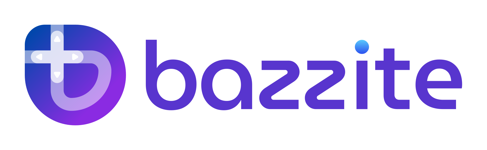

<!-- markdownlint-disable MD033 MD041 -->

<p align="center">
  <a href="https://bazzite.gg/">
    <picture>
      <source srcset="repo_content/Bazzite_Light.svg" media="(prefers-color-scheme: dark)">
      
    </picture>
  </a>
</p>

# [🇺🇸](https://github.com/ublue-os/bazzite/blob/main/README.md) [🇸🇪](https://github.com/ublue-os/bazzite/blob/main/README-SV.md)

<p align="center">
  <a href="https://download.bazzite.gg/"></a>
</p>

---

## Innehåll

- [Om Bazzite och funktioner](#om-bazzite-och-funktioner)
- [Varför Bazzite](#varför-bazzite)
- [Dokumentation](#dokumentation)
- [Verifiering](#verifiering)
- [Säker start](#säker-start)
- [Bygg en egen version](#bygg-en-egen-version)
- [Gå med i gemenskapen](#gå-med-i-gemenskapen)

## Om Bazzite och funktioner

På [webbplatsen](https://bazzite.gg/) finns en nybörjarvänlig introduktion till Bazzite. Den här README-filen beskriver projektet mer ingående.

[Bazzite](https://bazzite.gg/) är en anpassad [Fedora Atomic](https://fedoraproject.org/atomic-desktops)-avbildning, byggd med [molnbaserad](https://universal-blue.org/#cloud-native) teknik, som ger Linux-spelande på alla dina enheter — även din favorit-handhållenhet.

Bazzite bygger på [ublue-os/main](https://github.com/ublue-os/main) och [Fedora](https://fedoraproject.org/), vilket ger utökat maskinvarustöd och inbyggda drivrutiner. Bazzite lägger dessutom till följande:

- [OGC-kärnan](https://www.github.com/OpenGamingCollective/linux).
- HDR och VRR är tillgängliga som standard.
- Fullständigt maskinvaruaccelererat stöd för H.264-avkodning.
- [xone](https://github.com/medusalix/xone)-drivrutin för Xbox-kontroller.
- Fullständigt stöd för [DisplayLink](https://www.synaptics.com/products/displaylink-graphics).
- [vkBasalt](https://github.com/DadSchoorse/vkBasalt), [MangoHud](https://github.com/flightlessmango/Mangohud) och [OBS VkCapture](https://github.com/nowrep/obs-vkcapture) är förinstallerade och tillgängliga som standard.
- Skalutökningen [ROM Properties Page](https://github.com/GerbilSoft/rom-properties) ingår.
- [Distrobox](https://github.com/89luca89/distrobox) är förinstallerat.
- Den automatiska tjänsten `bees` minskar diskutrymmet som Wine-prefixens innehåll använder.
- Stöd för HDMI CEC.
- [Input Remapper](https://github.com/sezanzeb/input-remapper) är förinstallerat och aktiverat. <sub><sup>(Finns men är avstängt som standard i Deck-varianten; aktivera med `ujust restore-input-remapper`.)</sup></sub>
- [Bazzite Portal](https://github.com/ublue-os/yafti-gtk) gör det enkelt att installera många program och justeringar, däribland [LACT](https://github.com/ilya-zlobintsev/LACT) och IDE:er via Brew. Den har också knappar för att uppdatera, byta basavbildning och återställa systemavbildningen till standardvärden.
- [Waydroid](https://waydro.id/) är förinstallerat för Android-appar. Konfigurera det med denna [snabbguide](https://docs.bazzite.gg/Installing_and_Managing_Software/Waydroid_Setup_Guide/).
- Hantera program med [Flatseal](https://github.com/tchx84/Flatseal), [Warehouse](https://github.com/flattool/warehouse) och [Gear Lever](https://github.com/mijorus/gearlever).
- [OpenRazer](https://openrazer.github.io)-drivrutiner ingår. Välj OpenRazer i Bazzite Portal eller kör `ujust install-openrazer` i terminalen.
- [OpenTabletDriver](https://opentabletdriver.net/)-regler för udev ingår; hela programpaketet installeras från Bazzite Portal eller med `ujust install-opentabletdriver`.
- [Webapp Manager](https://github.com/linuxmint/webapp-manager) kan skapa program av webbplatser för flera webbläsare, bland annat Firefox.

### Skrivbord

Den vanliga varianten heter `bazzite` och är avsedd för stationära datorer.

- Automatiska uppdateringar av operativsystemet, Flatpak och mer via [uupd](https://github.com/ublue-os/uupd) och [topgrade](https://github.com/topgrade-rs/topgrade).

> [!IMPORTANT]
> **ISO-filer hämtas från vår [webbplats](https://download.bazzite.gg). En praktisk installationsguide finns [här](https://docs.bazzite.gg/General/Installation_Guide/).**

Byt basavbildning från en befintlig Fedora Atomic-uppströmsvariant till denna avbildning om du vill använda **grafikdrivrutiner med öppen källkod**. Observera att Mesas öppna NVIDIA-alternativ NVK fortfarande kan vara felbenäget. Rapportera NVK-problem till [Mesa](https://docs.mesa3d.org/bugs.html), inte till Ublue/Bazzite.

```bash
rpm-ostree rebase ostree-unverified-registry:ghcr.io/ublue-os/bazzite:stable
```

För enheter med Nvidia-GPU som vill använda **NVIDIAs proprietära drivrutiner**:

```bash
rpm-ostree rebase ostree-unverified-registry:ghcr.io/ublue-os/bazzite-nvidia:stable
```

**För användare med säker start aktiverad:** följ [dokumentationen om säker start](#säker-start) innan du byter basavbildning.

### Steam Deck och hemmabiodatorer

Varianten `bazzite-deck` är ett alternativ till SteamOS på Steam Deck och ger en konsolliknande upplevelse på HTPC:er.

- Startar direkt i spelläge med samma beteende som SteamOS.
- Automatisk `bees` minskar kraftigt storleken på compatdata.
- Nyare Mesa skapar mindre shader-cache och kräver inte cache för att undvika hack.
- Kan startas även om enheten är full.
- Stöd för alla språk som stöds av uppströms Fedora.
- Använder Wayland på skrivbordet med [stöd för Steam Input](https://github.com/Supreeeme/extest).
- Har portningar av de flesta SteamOS-paket, inklusive drivrutiner, firmwareuppdaterare och fläktstyrning, [från evlaV-förrådet](https://gitlab.com/evlaV).
- Patchad Mesa för korrekt bildfrekvensstyrning från Gamescope.
- Innehåller patchar från [SteamOS BTRFS](https://gitlab.com/popsulfr/steamos-btrfs) för BTRFS-stöd för SD-kort som standard.
- Levereras med en portad kopia av [SDGyroDSU](https://github.com/kmicki/SteamDeckGyroDSU), aktiverad som standard.
- Vid installation kan du välja [Decky Loader](https://github.com/SteamDeckHomebrew/decky-loader), [EmuDeck](https://www.emudeck.com/), [RetroDECK](https://retrodeck.net/) och [ProtonUp-Qt](https://davidotek.github.io/protonup-qt/) bland många andra användbara paket.
- Ett eget uppdateringssystem uppdaterar operativsystemet, Flatpak och mer direkt från spellägets gränssnitt via [uupd](https://github.com/ublue-os/uupd) och [topgrade](https://github.com/topgrade-rs/topgrade).
- Windows-dubbelstart stöds eftersom Fedoras GRUB-installation lämnas intakt.
- Om en uppdatering orsakar problem kan du enkelt återgå till föregående Bazzite-version med `rpm-ostree`-återställning. Du kan även välja tidigare avbildningar vid start.
- Steam och Lutris är förinstallerade som lagerpaket.
- Använder ZRAM<sub><sup>(4 GB)</sup></sub> med komprimeringsalgoritmen LZ4 som standard.
- [LAVD](https://crates.io/crates/scx_lavd)- och [BORE](https://github.com/firelzrd/bore-scheduler)-CPU-schemaläggare ger smidigt och responsivt spelande.
- Kyber I/O-schemaläggare förhindrar I/O-svält när spel installeras eller `duperemove` körs i bakgrunden.
- Tillämpar SteamOS kärnparametrar.
- Färgkalibrerade visningsprofiler för matta och blanka Steam Deck-skärmar ingår.
- Avancerade funktioner som är avstängda som standard: skonsam undervoltning via [RyzenAdj](https://github.com/FlyGoat/RyzenAdj) och [Ryzen SMU](https://gitlab.com/leogx9r/ryzen_smu), överklockning av skärmens uppdateringsfrekvens samt automatiskt högre VRAM-gräns för Steam Deck med 32 GB RAM.
- Steam Deck-specifika tjänster kan stängas av med `ujust disable-bios-updates` och `ujust disable-firmware-updates`. De är automatiskt avstängda på annan maskinvara och på Deck med DeckHD-skärm eller 32 GB RAM-modifiering.

Mer information om Steam Deck-avbildningarna finns [här](https://docs.bazzite.gg/Handheld_and_HTPC_edition/Steam_Gaming_Mode/).

> [!IMPORTANT]
> **ISO-filer hämtas från vår [webbplats](https://download.bazzite.gg). En praktisk installationsguide finns [här](https://docs.bazzite.gg/General/Installation_Guide/).**

Byt basavbildning från en befintlig Fedora Atomic-uppströmsvariant:

```bash
rpm-ostree rebase ostree-unverified-registry:ghcr.io/ublue-os/bazzite-deck:stable
```

#### Alternativa handhållna enheter

Se [Handheld Wiki](https://docs.bazzite.gg/Handheld_and_HTPC_edition/Handheld_Wiki/) för obligatoriska inställningsändringar och Decky Loader-insticksmoduler för Steam Gaming Mode på just din handhållna enhet.

### GNOME

Byggen med skrivbordsmiljön GNOME finns för både skrivbord och Deck. De innehåller dessutom:

- [Stöd för variabel uppdateringsfrekvens och fraktionell skalning i Wayland](https://gitlab.gnome.org/GNOME/mutter/-/merge_requests/1154).
- En egen meny i övre panelen för att återgå till spelläge, starta Steam och öppna användbara verktyg.
- [GSConnect](https://extensions.gnome.org/extension/1319/gsconnect/) är förinstallerat och klart att använda.
- Många valfria utökningar är förinstallerade, inklusive [viktiga förbättringar av användarupplevelsen](https://www.youtube.com/watch?v=nbCg9_YgKgM).
- Automatiska uppdateringar av [Firefox GNOME-temat](https://github.com/rafaelmardojai/firefox-gnome-theme) och [Thunderbird GNOME-temat](https://github.com/rafaelmardojai/thunderbird-gnome-theme). <sup><sub>(Om de är installerade.)</sub></sup>

```bash
rpm-ostree rebase ostree-unverified-registry:ghcr.io/ublue-os/bazzite-gnome:stable
```

För skrivbordsmiljö med **NVIDIAs proprietära drivrutiner**:

```bash
rpm-ostree rebase ostree-unverified-registry:ghcr.io/ublue-os/bazzite-gnome-nvidia:stable
```

För Steam Deck-/HTPC-varianten:

```bash
rpm-ostree rebase ostree-unverified-registry:ghcr.io/ublue-os/bazzite-deck-gnome:stable
```

**För användare med säker start aktiverad:** följ [dokumentationen om säker start](#säker-start) innan du byter basavbildning.

### Funktioner från uppströmsprojekt

#### Universal Blue

- Nvidias proprietära drivrutiner är förinstallerade. <sub><sup>(Endast Nvidia-avbildningar.)</sup></sub>
- Flathub är aktiverat som standard.
- [`ujust`](https://github.com/casey/just)-kommandon för enklare användning.
- Multimediakodekar fungerar direkt.
- Återställ Bazzite från valfritt bygge under de senaste 90 dagarna.

#### Fedora Linux (Kinoite och Silverblue)

- En mycket stabil grund.
- Systempaket hålls relativt aktuella.
- Fedora-paket kan läggas i lager på avbildningen utan att försvinna mellan uppdateringar.
- Säkerhetsfokus med [SELinux](https://github.com/SELinuxProject/selinux) förinstallerat och konfigurerat från början.
- Möjlighet att byta mellan Fedora Atomic-avbildningar utan att förlora användardata.
- Utskriftsstöd eftersom [CUPS](https://www.cups.org/) är förinstallerat.

## Varför Bazzite

Bazzite började som ett projekt för att lösa problem i SteamOS, framför allt gamla paket trots Arch-bas och avsaknaden av en fungerande pakethanterare.

Trots att projektet också är avbildningsbaserat kan du installera valfritt Fedora-paket direkt från kommandoraden. Paketen finns kvar efter uppdateringar. Bazzite uppdateras flera gånger i veckan med paket från uppströms Fedora och ger därmed god prestanda och aktuella funktioner på en stabil bas.

Bazzite levereras med den senaste Linux-kärnan och SELinux aktiverat som standard. Det har fullt stöd för säker start <sub><sup>(kör `ujust enroll-secure-boot-key` och ange lösenordet `universalblue` om du uppmanas att registrera projektets nyckel)</sup></sub> och diskkryptering, vilket gör det lämpligt för allmän datoranvändning. <sup><sub>(Ja, du kan skriva ut från Bazzite.)</sub></sup>

Läs [FAQ](https://docs.bazzite.gg/General/FAQ/) för information om vad som skiljer Bazzite från andra Linuxbaserade operativsystem.

## Exempel


## Dokumentation

- [Installera och hantera program](https://docs.bazzite.gg/Installing_and_Managing_Software/)
- [Uppdateringar, återställning och byte av basavbildning](https://docs.bazzite.gg/Installing_and_Managing_Software/Updates_Rollbacks_and_Rebasing/)
- [Spelguide](https://docs.bazzite.gg/Gaming/)

Mer [dokumentation](https://docs.bazzite.gg/) finns för projektet.

## Verifiering

Avbildningarna är signerade med sigstores [cosign](https://docs.sigstore.dev/cosign/key_management/overview/). Du kan verifiera signaturen genom att hämta nyckeln `cosign.pub` från detta förråd och köra:

```bash
cosign verify --key cosign.pub ghcr.io/ublue-os/bazzite
```

## Säker start

> [!WARNING]
> **Steam Deck-användare: Steam Deck levereras inte med säker start aktiverad och har inga nycklar registrerade som standard. Aktivera inte detta om du inte är helt säker på vad du gör.**

Säker start stöds med projektets egna nyckel. Den publika nyckeln finns i roten av detta förråd [här](https://github.com/ublue-os/bazzite/blob/main/secure_boot.der). Om du vill registrera nyckeln före installation eller byte av basavbildning, hämta nyckeln och kör:

```bash
sudo mokutil --timeout -1
sudo mokutil --import secure_boot.der
```

Om du redan använder en Universal Blue-avbildning kan du i stället köra `ujust enroll-secure-boot-key`.

Använd lösenordet `universalblue` om du tillfrågas.

## Särskilt tack

Bazzite är ett gemenskapsprojekt och skulle inte finnas utan allas stöd. Tack till [amelia.svg](https://bsky.app/profile/ameliasvg.bsky.social) för logotyp och varumärke, [SuperRiderTH](https://github.com/SuperRiderTH) för startvideon till Steam-spelläge, [evlaV](https://gitlab.com/evlaV), [ChimeraOS](https://chimeraos.org/), [Jovian-NixOS](https://github.com/Jovian-Experiments), [sentry](https://copr.fedorainfracloud.org/coprs/sentry/), [nicknamenamenick](https://github.com/nicknamenamenick), Steam Deck Homebrew och [cyrv6737](https://github.com/cyrv6737) för deras omfattande bidrag och inspiration.

## Bygg en egen version

Bazzite byggs helt med GitHub Actions. Det är enkelt att skapa en egen anpassad version: förgrena detta förråd, lägg till en privat signeringsnyckel och aktivera GitHub Actions i förgreningen. Arbetsflödet `Build Bazzite` skapar sedan egna avbildningar för alla Bazzite-varianter.

Om du bara vill skapa avbildningar för de varianter du använder, redigerar du `.github/workflows/build.yml` och kommenterar bort övriga varianter i `push-ghcr`-jobbets `strategy.matrix`-lista.

Projektet innehåller också konfiguration för [pull-appen](https://github.com/apps/pull), som kan hålla din förgrening synkroniserad med uppströmsprojektet medan du gör egna ändringar.

### Signera dina avbildningar

1. Läs först [GitHubs guide](https://docs.github.com/en/actions/security-guides/encrypted-secrets) om att hantera hemligheter.
2. Skapa ett nytt nyckelpar med Cosign: `cosign generate-key-pair`. Nyckelparet får inte ha någon signatur.
3. Ersätt `cosign.pub` i ditt offentliga förråd med den nyckel du skapade. Du och dina användare behöver den för att kontrollera signaturerna.
4. Lägg till den privata nyckeln från `cosign.key` som en Repository Secret i förgreningens meny `Settings -> Secrets and variables -> Actions`. Namnge hemligheten `SIGNING_SECRET`.

## Gå med i gemenskapen

Du hittar oss på [Bazzite Discord](https://discord.gg/f8MUghG5PB). Ett [arkiv över supporttrådar](https://www.answeroverflow.com/c/1072614816579063828/1143023993041993769) kan läsas utan konto.
