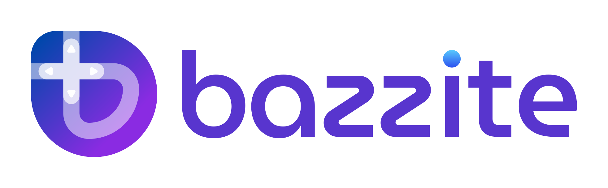

<p align="center">
  <a href="https://bazzite.gg/">
    <picture>
      <source srcset="repo_content/Bazzite_Light.svg" media="(prefers-color-scheme: dark)">
      
    </picture>
  </a>
</p>

[](https://github.com/ublue-os/bazzite/actions/workflows/build.yml) [](https://github.com/ublue-os/bazzite/actions/workflows/build_iso.yml)

# [🇺🇸](https://github.com/ublue-os/bazzite/blob/main/README.md) [🇪🇸](https://github.com/ublue-os/bazzite/blob/main/README-SPA.md) [🇮🇩](https://github.com/ublue-os/bazzite/blob/main/README-ID.md) [🇨🇳](https://github.com/ublue-os/bazzite/blob/main/README-zh-cn.md) [🇫🇷](https://github.com/ublue-os/bazzite/blob/main/README-FR.md) [🇧🇷](https://github.com/ublue-os/bazzite/blob/main/README-BR.md) [🇳🇱](https://github.com/ublue-os/bazzite/blob/main/README-NL.md) [🇹🇼](https://github.com/ublue-os/bazzite/blob/main/README-ZH-TW.md)

<p align="center">
  <a href="https://download.bazzite.gg/"></a>
</p>

---

# 目录
- [🇺🇸 🇪🇸 🇮🇩 🇨🇳 🇫🇷 🇧🇷 🇳🇱 🇹🇼](#-------)
- [目录](#目录)
  - [关于 \& 特性](#关于--特性)
    - [Desktop](#desktop)
    - [Steam Deck/家庭影院PC(HTPCs)](#steam-deck家庭影院pchtpcs)
      - [其他掌上电脑](#其他掌上电脑)
    - [GNOME](#gnome)
    - [上游系统特性](#上游系统特性)
      - [Universal Blue](#universal-blue)
      - [Fedora Linux (Kinoite \& Silverblue)的特性](#fedora-linux-kinoite--silverblue的特性)
  - [目的](#目的)
  - [展示](#展示)
  - [文档 \& 时事通讯](#文档--时事通讯)
  - [验证](#验证)
  - [安全启动](#安全启动)
  - [贡献者指标](#贡献者指标)
  - [Star History](#star-history)
  - [特别鸣谢](#特别鸣谢)
  - [构建自己的版本](#构建自己的版本)
  - [加入社区](#加入社区)
---

## 关于 & 特性

[请访问我们的网站](https://bazzite.gg/) 了解Bazzite的新手指引。此自述文件将深入介绍所有内容。

[Bazzite](https://bazzite.gg/) 是一个OCI镜像，可以作为[Steam Deck](https://www.steamdeck.com/)的替代操作系统，以及适用于台式电脑和客厅家庭影院PC的类似SteamOS的即开即用型游戏系统。

Bazzite是使用[Fedora](https://fedoraproject.org/)技术基于[ublue-os/main](https://github.com/ublue-os/main) 和 [ublue-os/nvidia](https://github.com/ublue-os/nvidia)构建的，这意味着更多的硬件支持和内置驱动程序。此外，Bazzite还添加了以下特性：

- 使用了 [fsync kernel](https://copr.fedorainfracloud.org/coprs/sentry/kernel-fsync/) 来实现HDR和扩展的硬件支持, 以及包含许多其他的补丁。
- HDR 在游戏模式下可用。
- NVK 可用于非Nvidia版本。
- 完全支持H264编码的硬件加速编/解码器。
- 完全支持AMD的ROCM OpenCL/HIP运行时。
- 适用于Xbox控制器的[xone](https://github.com/medusalix/xone) 驱动程序。
- 完全支持 [DisplayLink](https://www.synaptics.com/products/displaylink-graphics)。
- 包含来自SteamOS的 Valve's KDE 主题。
- 可选的 Valve-inspired GTK3/4 主题对应 SteamOS的Vapor and VGUI2。安装 [Gradience](https://flathub.org/apps/com.github.GradienceTeam.Gradience) 以启用它们。
- [LatencyFleX](https://github.com/ishitatsuyuki/LatencyFleX)， [vkBasalt](https://github.com/DadSchoorse/vkBasalt)， [MangoHud](https://github.com/flightlessmango/Mangohud)，和 [OBS VkCapture](https://github.com/nowrep/obs-vkcapture) 默认安装并可用。
- [Patched Switcheroo-Control](https://copr.fedorainfracloud.org/coprs/sentry/switcheroo-control_discrete/) 修复了默认损坏的iGPU/dGPU开关。
- 包含[ROM Properties Page shell extension](https://github.com/GerbilSoft/rom-properties) 。
- 完全支持 [Winesync/Fastsync/NTsync](https://github.com/Frogging-Family/wine-tkg-git/issues/936).
- 预装[Distrobox](https://github.com/89luca89/distrobox) 。
- [Ptyxis](https://gitlab.gnome.org/chergert/ptyxis) 用作所有镜像的默认终端。此终端专为你将在Bazzite中使用的容器工作流设计。如果你想切换回原始终端，请运行 `ujust _restore-original-terminal` 。
- `duperemove`服务进程用于减少wine前缀内容所占用的磁盘空间。
- 通过[libCEC](https://libcec.pulse-eight.com/)支持HDMI CEC。
- 预装[System76-Scheduler](https://github.com/pop-os/system76-scheduler)，为你的重点应用程序提供自动的进程优先级调整，并将后台进程的CPU时间保持在最低限度。
- 使用附加规则自定义System76-Scheduler配置。
- 默认启用 [Google's BBR TCP congestion control](https://github.com/google/bbr) 。
- 预装并启用[Input Remapper](https://github.com/sezanzeb/input-remapper) <sub><sup>(在Deck变体上默认禁用（或可用），可运行 `ujust _restore-input-remapper`以启用)。</sup></sub>
- Bazzite Portal 提供了一个安装应用程序和调整系统的简单方式，包括安装 [LACT](https://github.com/ilya-zlobintsev/LACT) 和 [GreenWithEnvy](https://gitlab.com/leinardi/gwe)。
- 预装了[Waydroid](https://waydro.id/) 用于运行Android应用程序。阅读这篇[快速指南](https://universal-blue.discourse.group/docs?topic=32)对其进行设置。
- 使用 [Flatseal](https://github.com/tchx84/Flatseal)，[Warehouse](https://github.com/flattool/warehouse)，和[Gear Lever](https://github.com/mijorus/gearlever)管理应用程序。
- [OpenRGB](https://gitlab.com/CalcProgrammer1/OpenRGB) i2c-piix4 和 i2c-nct6775驱动程序用于控制某些主板上的RGB装置。
- 内置了[OpenRazer](https://openrazer.github.io)驱动程序，在Bazzite Portal中选择安装OpenRazer或者在终端运行`ujust install-openrazer`来启用它。
- 内置了[OpenTabletDriver](https://opentabletdriver.net/)设备管理规则，完整的应用程序可以通过Bazzite Portal或者在终端运行`ujust install-opentabletdriver`来安装。
- 开箱即用的[Wooting](https://wooting.io/)键盘支持。
- 内置`amdgpu`驱动程序以支持Southern Islands <sub><sup>(HD 7000)</sup></sub> 和 Sea Islands <sub><sup>(HD 8000)</sup></sub> AMD GPUs。
- [XwaylandVideoBridge](https://invent.kde.org/system/xwaylandvideobridge)可用于Wayland上的Discord屏幕共享。
- [Webapp Manager](https://github.com/linuxmint/webapp-manager)可用于从各种浏览器（含Firefox）正在浏览的网站上创建应用程序。

### Desktop

`bazzite`适用于台式计算机的通用变体。

- 操作系统，Flatpaks，等的自动更新 - 由[ublue-update](https://github.com/ublue-os/ublue-update) 和 [topgrade](https://github.com/topgrade-rs/topgrade)提供支持。

> [!重要]
> **ISOs可以从我们的[发布页面](https://github.com/ublue-os/bazzite/releases)下载，也可以[在此处](https://universal-blue.discourse.group/docs?topic=30)找到有用的安装指南。**

从已安装的上游Fedora Atomic桌面变基（rebase）到此镜像：

```bash
rpm-ostree rebase ostree-unverified-registry:ghcr.io/ublue-os/bazzite:stable
```

或者针对Nvidia GPU的设备：

```bash
rpm-ostree rebase ostree-unverified-registry:ghcr.io/ublue-os/bazzite-nvidia:stable
```

**对于设置了安全启动的用户：** 请遵循我们的[安全启动文档](#安全启动)进行变基（rebase）。

### Steam Deck/家庭影院PC(HTPCs)
> [!重要]
非Steam Deck设备同样可以使用`bazzite-deck`镜像, 但该设备必须使用现代的AMD GPU。Intel Arc GPU也已经被确认可以正常工作。

`bazzite-deck`变体被设计用在Steam Deck上作为SteamOS的替代系统，并在HTPCs上提供类似控制台的操作体验，此变体可用作：

- 和SteamOS一样直接启动到游戏模式。
- **自动`duperemove`大大减少compatdata的大小。**
- **最新版本的Mesa创建更小的着色器缓存，并且不需要它们来防止卡顿。**
- **即便驱动器已满，也能启动。**
- **支持上游Fedora系统支持的每种语言。**
- **在桌面使用Wayland图形应用协议，[支持Steam input](https://github.com/Supreeeme/extest)。**
- 包含[HHD](https://github.com/hhd-dev/hhd)以提供非Valve手持设备的扩展输入支持。
- [evlaV仓库](https://gitlab.com/evlaV)包含大多数SteamOS软件包的移植版本，包括驱动程序，固件升级和风扇控制器。
- 修补了Mesa以便于Gamescope提供合适的帧率控制。
- 自带[SteamOS BTRFS](https://gitlab.com/popsulfr/steamos-btrfs)补丁以默认对SD card提供完整的BTRFS支持。
- 附带[SDGyroDSU](https://github.com/kmicki/SteamDeckGyroDSU)的移植副本，默认启用。
- 可选则安装[Decky Loader](https://github.com/SteamDeckHomebrew/decky-loader)，[EmuDeck](https://www.emudeck.com/)，[RetroDECK](https://retrodeck.net/)，和[ProtonUp-Qt](https://davidotek.github.io/protonup-qt/)，以及其他许多有用的软件包。
- 自定义更新系统允许从由[ublue-update](https://github.com/ublue-os/ublue-update) 和 [topgrade](https://github.com/topgrade-rs/topgrade)提供支持的游戏模式直接更新操作系统、Flatpaks、等。
- 内置对Windows双系统的支持，这要归功于Fedora的安装保持了GRUB的完整性。
- 更新破坏了一些东西？借助于`rpm-ostree`的回滚功能，你可以轻松回滚到先前版本的Bazzite。你甚至可以在启动时选定先前版本的镜像。
- Steam and Lutris作为分层包预装在镜像上。
- 为Discord预装了[Discover Overlay](https://github.com/trigg/Discover)，如果Discord已经安装，则会在游戏模式和桌面模式自动启动。[在此查看官方文档](https://trigg.github.io/Discover/bazzite)。
- 默认情况下将使用ZRAM<sub><sup>(4GB)</sup></sub> 及LZ4压缩算法。
- Kyber I/O 调度程序用来防止安装游戏或后台运行`duperemove`进程时出现I/O starvation。
- 应用SteamOS的内核参数。
- 包括用于磨砂和镜面Steam Deck屏幕的颜色校准显示配置文件。
- 默认禁用的高级用户功能，包括：
    - 通过[RyzenAdj](https://github.com/FlyGoat/RyzenAdj) 和 [Ryzen SMU](https://gitlab.com/leogx9r/ryzen_smu)提供的Steam Deck的低风险欠压服务进程，参阅`ryzenadj.service` 和 `/etc/default/ryzenadj`。
    - 内置超频显示支持。例如添加`GAMESCOPE_OVERRIDE_REFRESH_RATE=40,70` 到 `/etc/environment`。
    - 你的Steam Deck改了32GB内存？享受双倍最大显存，自动启用。<sup><sub>(可以分享你的焊接技巧吗？)</sub></sup>
- Steam Deck硬件特定的服务可以通过在终端中运行`ujust disable-bios-updates` 和 `ujust disable-firmware-updates` 以禁用。这些服务在非Deck硬件、改装了DeckHD显示屏或改装了32GB内存的Deck上自动禁用。
- 更多关于Bazzite Steam Deck镜像的信息可以在[此处](https://universal-blue.discourse.group/docs?topic=37)找到。

> [!警告]
> **由于上游错误，Bazzite目前无法在具有64GB eMMC存储空间的Steam Deck上使用。升级存储空间可以解决此问题。**

> [!重要]
> **镜像文件可以从我们的[发布页面](https://github.com/ublue-os/bazzite/releases)下载，也可以在[此处](https://universal-blue.discourse.group/docs?topic=30)找到有用的安装指南。**

从已安装的上游Fedora Atomic桌面变基（rebase）到此镜像：

```bash
rpm-ostree rebase ostree-unverified-registry:ghcr.io/ublue-os/bazzite-deck:stable
```

#### 其他掌上电脑

请参阅我们的[掌上电脑Wiki](https://universal-blue.discourse.group/docs?topic=1038)了解所需要的设置更改以及你的掌机在Steam游戏模式下需要的Decky Loader插件。

**请务必同时阅读[hhd文档](https://github.com/hhd-dev/hhd#after-install)，一些掌机需要特别的设置更改/调整才能正常运行。**

我们还提供了用于安装各种[CSS Loader](https://docs.deckthemes.com/CSSLoader/Install/#linux-or-steam-deck)主题的`ujust`命令。这些主题在CSS Loader商店中找不到。这些主题如果被安装，将随着Bazzite一起自动更新。

```bash
# 为CSS Loader安装Handheld Controller主题(https://github.com/victor-borges/handheld-controller-glyphs)
ujust install-hhd-controller-glyph-theme
```

### GNOME

桌面和Deck版本都可以使用GNOME桌面环境构建。这些版本具有如下的额外特性：

- [Wayland协议下支持可变刷新率和非整数倍缩放](https://gitlab.gnome.org/GNOME/mutter/-/merge_requests/1154)。
- 顶部栏中的自定义菜单，可用于返回游戏模式，启动Steam和打开许多有用的实用程序。
- 默认安装启用[GSConnect](https://extensions.gnome.org/extension/1319/gsconnect/)。
- 包含了[Hanabi扩展](https://github.com/jeffshee/gnome-ext-hanabi)以提供与KDE中Wallpaper Engine类似的功能。
- 预装了许多可选的扩展，包括[重要的用户体验修复](https://www.youtube.com/watch?v=nbCg9_YgKgM)。
- 自动更新[Firefox GNOME主题](https://github.com/rafaelmardojai/firefox-gnome-theme) 和 [Thunderbird GNOME 主题](https://github.com/rafaelmardojai/thunderbird-gnome-theme)。 <sup><sub>(如果已安装)</sub></sup>

> [!重要]
> **镜像文件可以从我们的[发布页面](https://github.com/ublue-os/bazzite/releases)下载，也可以[在此处](https://universal-blue.discourse.group/docs?topic=30)找到有用的安装指南。**

从已安装的上游Fedora Atomic桌面变基（rebase）到此镜像：

```bash
rpm-ostree rebase ostree-unverified-registry:ghcr.io/ublue-os/bazzite-gnome:stable
```

将现有的ostree系统变基（rebase）到**Nvidia驱动的桌面系统**版本：

```bash
rpm-ostree rebase ostree-unverified-registry:ghcr.io/ublue-os/bazzite-gnome-nvidia:stable
```

> [!警告]
> **由于上游错误，Bazzite目前无法在具有64GB eMMC存储空间的Steam Deck上使用。**

将现有的ostree系统变基（rebase）到**Steam Deck/HTPC**版本：

```bash
rpm-ostree rebase ostree-unverified-registry:ghcr.io/ublue-os/bazzite-deck-gnome:stable
```

**对于设置了安全启动的用户：** 请遵循我们的[安全启动文档](#安全启动)进行变基（rebase）。

### 上游系统特性

#### Universal Blue

- 预装了专有的Nvidia驱动程序<sub><sup>(仅限Nvidia镜像)</sup></sub>。
- 默认启用Flathub。
- 方便使用的[`ujust`](https://github.com/casey/just)命令。
- 开箱即用的多媒体编解码器。
- 从任何最近90天内的版本回滚Bazzite。

#### Fedora Linux (Kinoite & Silverblue)的特性

- 坚如磐石的基础。
- 系统软件包保持相对最新。
- 可以将Fedora软件包部署到镜像中以防止更新时丢失。
- 预装和设置好开箱即用的[SELinux](https://github.com/SELinuxProject/selinux)以关注安全性。
- 如果需要的话，可以在不丢失用户数据的情况下变基（rebase）到不同的Fedora Atomic镜像。
- 预装[CUPS](https://www.cups.org/)以支持打印机。

## 目的

Bazzite项目最初的目的是在于解决困扰SteamOS的一系列问题，主要是过时的软件包（尽管基于Arch）和缺少一个软件包管理器。

尽管此项目是基于镜像的，你仍然可以直接通过命令行安装任何Fedora软件包。这些软件包在更新后依然会保留<sub><sup>(所以尽管放心的去安装那些你需要花费一个小时以上才能在SteamOS上正常工作的晦涩的VPN软件)</sup></sub>。此外，Bazzite每周都会多次更新来自上游Fedora的软件包，在稳定的基础上为你提供最佳性能和最新特性。

Bazzite带来最新的Linux内核，默认启用的SELinux为安全启动提供了完整的支持<sub><sup>(如果系统提示注册密钥，那么运行`ujust enroll-secure-boot-key`并输入密码`universalblue`)</sup></sub>和磁盘加密。使此系统成为大众计算机的一个明智的解决方案。<sup><sub>(是的，你可以从Bazzite打印)</sub></sup>

阅读[常见问题解答](https://universal-blue.discourse.group/docs?topic=33)以了解Bazzite不同于其它Linux操作系统的细节。

## 展示


## 文档 & 时事通讯

- [安装和管理应用程序](https://universal-blue.discourse.group/docs?topic=35)
- [更新、回滚和变基](https://universal-blue.discourse.group/docs?topic=36)
- [游戏指南](https://universal-blue.discourse.group/docs?topic=31)

查看有关该项目的[其他文档](http://docs.bazzite.gg/)。

查看我们定期发布的[时事通讯](https://universal-blue.discourse.group/tag/bazzite-buzz)以了解项目的最新信息。

## 验证

这些镜像使用sigstore的[cosign](https://docs.sigstore.dev/cosign/signing/overview/)。你可以通过此存储库下载 `cosign.pub`密钥，并运行以下命令来验证签名：

```bash
cosign verify --key cosign.pub ghcr.io/ublue-os/bazzite
```

## 安全启动

> [!警告]
> **Steam Deck用户：Steam Deck并未启用安全启动功能，并且默认情况下也未提供任何注册的密钥。不要启用此功能，除非你确切的知道自己在做什么。**

我们的自定义密钥支持安全启动。公钥可以在[此存储库](https://github.com/ublue-os/bazzite/blob/main/secure_boot.der)的根目录中找到。
如果要在安装或变基之前注册此密钥，请下载该密钥并运行如下命令：

```bash
sudo mokutil --timeout -1
sudo mokutil --import secure_boot.der
```

对于已安装Universal Blue镜像的用户，你可以改为运行`ujust enroll-secure-boot-key`。

如果要求输入密码，就使用`universalblue`。

## 贡献者指标


## Star History

<a href="https://star-history.com/#ublue-os/bazzite&Date">
  <picture>
    <source media="(prefers-color-scheme: dark)" srcset="https://api.star-history.com/svg?repos=ublue-os/bazzite&type=Date&theme=dark" />
    <source media="(prefers-color-scheme: light)" srcset="https://api.star-history.com/svg?repos=ublue-os/bazzite&type=Date" />
    
  </picture>
</a>

## 特别鸣谢

Bazzite是社区努力的结果，离不开每个人的支持。以下是那些一路帮助过我们的人：

- [amelia.svg](https://bsky.app/profile/ameliasvg.bsky.social) - 创作了我们的徽标和整体品牌。
- [SuperRiderTH](https://github.com/SuperRiderTH) - 创作了我们Steam游戏模式的启动视频。
- [evlaV](https://gitlab.com/evlaV) - 使Valve的代码可用并成为[this person](https://xkcd.com/2347/).
- [ChimeraOS](https://chimeraos.org/) - For gamescope-session and for valuable support along the way.
- [Jovian-NixOS](https://github.com/Jovian-Experiments) - 支持我们解决技术问题并创建了一个类似的项目。Seriously, go check it out. It's our Nix-based cousin.
- [sentry](https://copr.fedorainfracloud.org/coprs/sentry/) - 帮助提供所需的内核补丁和创建我们现在使用的[kernel-fsync 仓库](https://copr.fedorainfracloud.org/coprs/sentry/kernel-fsync/)。
- [nicknamenamenick](https://github.com/nicknamenamenick) - 作为MVP，几乎单枪匹马维护着我们的文档和支持文献，和无数的帮助用户的案例。
- [Steam Deck Homebrew](https://deckbrew.xyz) - 尽管需要额外的工作，但还是选择支持SteamOS以外的发行版，特别感谢[PartyWumpus](https://github.com/PartyWumpus)使Decky Loader在SELinux下正常工作。
- [cyrv6737](https://github.com/cyrv6737) - 最初的灵感和成为Bazzite-arch的基础。

## 构建自己的版本

Bazzite完全在GitHub上构建，创建你自己的版本只需要fork此仓库，添加私钥，然后启用GitHub actions。

熟悉github[加密机制](https://docs.github.com/en/actions/security-guides/encrypted-secrets)。你需要[生成带有cosign的新密钥对](https://docs.sigstore.dev/cosign/signing/overview/)。公钥可以放置在你的公有仓库中<sub><sup>(你的用户需要用它来检查签名)</sup></sub>，你可以用`SIGNING_SECRET`作为名字把私钥粘贴到`Settings -> Secrets -> Actions`。

如果你想使你的fork与上游保持同步，我们同样提供了一个流行的[pull app](https://github.com/apps/pull)的设置。在你的仓库上启用此应用程序以追踪Bazzite的更新，同时进行你自己的修改。

## 加入社区

你可以在[Universal Blue Discord](https://discord.gg/f8MUghG5PB)找到我们，同时免账号查看[支持文档](https://www.answeroverflow.com/c/1072614816579063828/1143023993041993769)。

在[Universal Blue Discourse 论坛](https://universal-blue.discourse.group/c/bazzite/5)上讨论并创建用户指南。

在[Mastodon](https://fosstodon.org/@UniversalBlue)上关注Universal Blue。


[def]: #--
