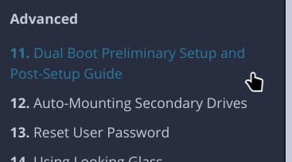
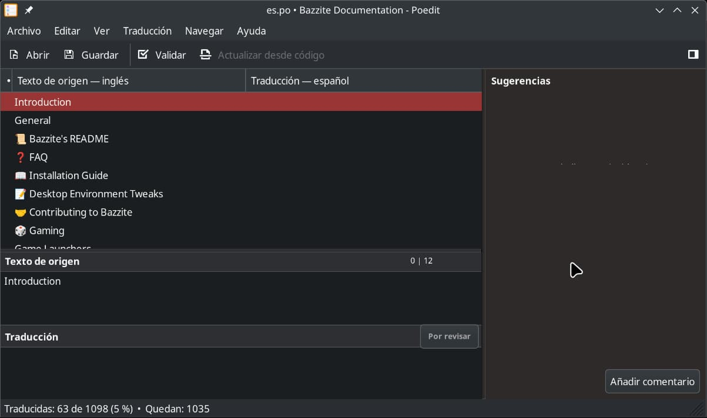
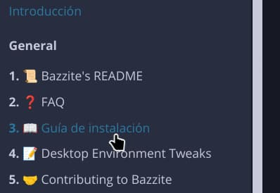

# Contributing to Bazzite mdBook documentation

## Introduction

This is a guide that will show you:

- How to write new documentation pages in mdBooks.
- How to transcribe documentation, from Discourse forums (https://universal-blue.discourse.group/) to mdBook pages.

## Brief explanation in how to work with mdBook

> _mdBook is a command line tool to create books with Markdown. It is ideal for creating product or API documentation, tutorials, course materials or anything that requires a clean, easily navigable and customizable presentation_
>
> Source ~ https://rust-lang.github.io/mdBook/

**TL;DR**: Its a fancy way tool that allows us to create a documentation website with basic [Markdown](https://commonmark.org/help/).

---

The essential part that cant be missing in a mdBook is the `SUMMARY.md` file.

```md
<!-- Example of SUMMARY.md contents -->

# General

- [📜 Bazzite's README](Bazzite_README.md)
- [❓️ FAQ](General/FAQ.md)
- [📖 Installation Guide](General/Installation_Guide/index.md)
- [📝 Desktop Environment Tweaks](General/Desktop_Environment_Tweaks.md)
- [🤝 Contributing to Bazzite](General/Contributing_to_Bazzite.md)
- [🎲 Gaming](Gaming/index.md)
  - [Game Launchers](Gaming/Game_Launchers.md)

# Steam Gaming Mode / Handheld & HTPC Hardware

- [📺️ Steam Gaming Mode Overview](Handheld_and_HTPC_edition/Steam_Gaming_Mode/index.md)
  - [Change Physical Keyboard Layout for Steam Gaming Mode](Handheld_and_HTPC_edition/Change_Physical_Keyboard_Layout_for_Steam_Gaming_Mode.md)
```

`SUMMARY.md` acts not only as a nice looking table of contents, but as indexer as well.

**If a page is not listed in `SUMMARY.md`, it wont be included in the mdBook**\*

<small>\* Just so you are aware </small>

---

## Transcribe Discourse docs to mdBooks

Requirements:

- Markdown compatible code editor (ex.: Visual Studio Code)
- mdBook (can be installed with Homebrew\*)
- Git

<small>\* If you are using Bazzite or [similar](https://universal-blue.org/), chances are that you already have it installed.</small>

---

Best way to learn is with a real life example. We will transcribe https://universal-blue.discourse.group/docs?topic=2743

### 1. Basic preparation

We will start with getting our utilities ready:

1. A web browser with the Discourse doc page we want to transcribe. We will use <https://universal-blue.discourse.group/docs?topic=2743> for this example.
2. Our code editor.
3. A terminal open in the `docs` directory

   ```sh
   $ cd docs
   ```

   Get sure we have `fetch_discourse_md.py` in there, we will need it

   ```sh
   $ ls ./utils/fetch_discourse_md.py
   ./utils/fetch_discourse_md.py
   ```

### 2. Copy the post

`fetch_discourse_md.py` is your friend for this task.

1. Copy the URL of the document
2. In the terminal, pass the URL to `fetch_discourse_md.py`

   ```sh
   $ ./utils/fetch_discourse_md.py "https://universal-blue.discourse.group/docs?topic=2743" | wl-copy
   ```

   Normally, `fetch_discourse_md.py` would dump the resulting markdown doc in the terminal output, with `wl-copy` we store it in our clipboard for now.

3. Create the markdown file where we will store our document. The title of the post is "_Dual Boot Preliminary Setup and Post-Setup Guide_", so somewhere under "Advanced" should be fitting.

   > ⚠️ WARNING
   >
   > Just remember, ⚠️**DO NOT USE SPACES IN THE FILE NAME**⚠️. Is really important, spaces in filenames is going to bit us later in a future.
   > Instead, use underscores `_`

   

### 4. Paste the document in the file


### 5. Rewrite URLs

We are almost done. The problem is `fetch_discourse_md.py` only will give us a dumped version of the Discourse document.

There is posibly URLs that are pointing to other documentation posts in Discourse that we might have already in our mdBook.


The url in the image above is pointing to the _Steam Gaming Mode Overview (Handheld/HTPC)_ post.
At the time of writting this, we have that post avaliable in our mdBook, so we can simply replace that URL with ours


In our case, the post is located in `../Handheld_and_HTPC_edition/Steam_Gaming_Mode/index.md`

### 6. Link back in `SUMMARY.md`

We can check how our post looks in mdBook, run in the terminal

```sh
mdbook serve --open
```

Now, more likely you wont find our new added post.


If you take a look at [the brief explanation](#brief-explanation-in-how-to-work-with-mdbook), you will read about `SUMMARY.md`. Files not listed in there wont be processed by mdBook.

Lets add our file there.


And now our post is ready.



## Translate documentation

> ⚠️ WARNING
>
> It is better to start translation once [transcription](#transcribe-discourse-docs-to-mdbooks) is settled to keep up.

Translation isnt so straightforward as copying a markdown file and start working.

We rely in [mdbook-i18n-helpers](https://github.com/google/mdbook-i18n-helpers) for translation, which uses [GNU Gettext](https://www.gnu.org/software/gettext/manual/html_node/index.html).

We need some more dependencies in order to do translations, which can be installed with this script:

```sh
bash docs/utils/install-deps.sh
```

<details>
<summary>
<big>Dependencies list</big><br>
<sup>Ignore if using install-deps.sh</sup>
</summary>

- `.po` file editor (like [Poedit](https://flathub.org/apps/net.poedit.Poedit))
- Rust's `cargo` (you can install rust by running
  `brew install rustup; rustup-init`)
- `mdbook-i18n-helpers` (after installing rust,
  `cargo install mdbook-i18n-helpers`)

</details>

### 1. Basic preparation

Move to `docs`, then build the `.pot` file

```sh
cd docs
just build_messages_pot
```

This will create `po/messages.pot`, which acts as an index of text fragments
from all our markdown files.

### 2. (Optional) Add a new language

All translations files are stored in `docs/po/` in the form of `xx.po` files, `xx` referencing the language code following [ISO 639][ISO]. Per example, `es.po` would be an Spanish translation
file.

To add a new language to the documentation, follows these steps:

1. Get sure you did the [basic preparation](#1-basic-preparation-1)
2. Then run this, replacing `XX` with the [language code][ISO]:

   ```sh
   just add_translation XX
   ```

   In my case, I'm going to create an Spanish translation file:

   ```sh
   just add_translation es
   ls po/
   # es.po  messages.pot
   ```

### 3. Working with a translation file



We will now open that `.po` file with our po editor (in my case is Poedit).

We make some changes, hit <kbd>Ctrl</kbd>+<kbd>S</kbd> to save.

Lets see the changes we had done with a preview. Run this:

```sh
just preview_translation XX
```

In my case is `es`

```sh
just preview_translation es
```

And there it is!



## Write new documentation

WIP

[ISO]: https://en.wikipedia.org/wiki/List_of_ISO_639_language_codes
