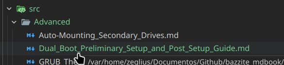
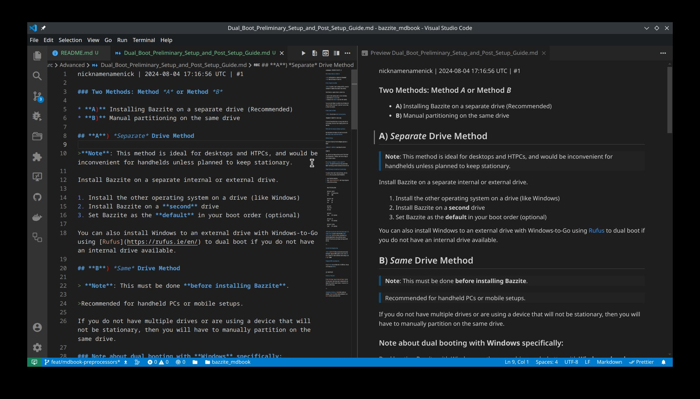
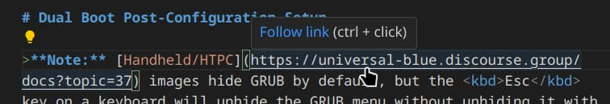
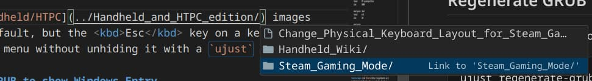
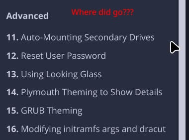
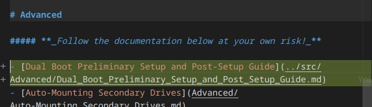

# Contributing to Bazzite MkDocs documentation

## Introduction

This is a guide that will show you how to write, or transcribe documentation from Discourse forums (https://universal-blue.discourse.group/) to MkDocs pages.

## What is MkDocs

> _MkDocs is a fast, simple and downright gorgeous static site generator that's geared towards building project documentation. Documentation source files are written in Markdown, and configured with a single YAML configuration file._
>
> Source ~ https://www.mkdocs.org/

**TL;DR**: Its a fancy way tool that allows us to create a documentation website with basic [Markdown](https://commonmark.org/help/).

The essential part that cant be missing in a mdBook is the `mkdocs.yml` file.

`mkdocs.yml` acts as our main configuration file. One of its main tasks is to configure the **Table of Contents** and to configure translation files.

## Setup MkDocs tooling

> ⚠️ WARNING ⚠️
>
> This step is **required** in order to setup previews of the resulting MkDocs

To install our dependencies, run this:

```sh
bash docs/utils/install-deps.sh
```

<details>
<summary>
<big>Dependencies list</big><br>
<sup>Ignore if using install-deps.sh</sup>
</summary>

- [Poetry](https://python-poetry.org/) (can be installed with Homebrew)
- [Just](https://just.systems/man/en/) (preinstalled in all [Universal Blue](https://universal-blue.org/) images)

</details>

You will need other tools as well, like:

- A markdown compatible code editor (ex.: **Visual Studio Code**)
- **git** (comes preinstalled in most Linux distributions)

## Transcribe Discourse docs to MkDocs

Best way to learn is with a real life example. We will transcribe <https://universal-blue.discourse.group/docs?topic=2657>, which at the time of writting is a post called _Managing and Modding Games_.

### 1. Basic preparation

We will start with getting our utilities ready:

1. A web browser with the Discourse doc page we want to transcribe. We will use <https://universal-blue.discourse.group/docs?topic=2657> for this example.
2. Our code editor.
3. A terminal open in the `docs` directory

   ```sh
   $ cd docs
   ```

   Get sure we have `fetch_discourse_md.py` in there, we will need it

   ```sh
   $ ls ./utils/fetch_discourse_md.py
   ./utils/fetch_discourse_md.py
   ```

### 2. Copy the post

`fetch_discourse_md.py` is your friend for this task.

1. Copy the URL of the document
2. In the terminal, pass the URL to `fetch_discourse_md.py`

   ```sh
   $ ./utils/fetch_discourse_md.py "https://universal-blue.discourse.group/docs?topic=2657" | wl-copy
   ```

   Normally, `fetch_discourse_md.py` would dump the resulting markdown doc in the terminal output, with `wl-copy` we store it in our clipboard for now.

3. Create the markdown file where we will store our document. The title of the post is "_Dual Boot Preliminary Setup and Post-Setup Guide_", so somewhere under "Advanced" should be fitting.

   > ⚠️ WARNING
   >
   > Just remember, ⚠️**DO NOT USE SPACES IN THE FILE NAME**⚠️. Is really important, spaces in filenames is going to bit us later in a future.
   > Instead, use underscores `_`

   

### 4. Paste the document in the file



### 5. Rewrite URLs

We are almost done. The problem is `fetch_discourse_md.py` only will give us a dumped version of the Discourse document.

There is posibly URLs that are pointing to other documentation posts in Discourse that we might have already in our MkDocs.



The url in the image above is pointing to the _Steam Gaming Mode Overview (Handheld/HTPC)_ post.
At the time of writting this, we have that post avaliable in our MkDocs, so we can simply replace that URL with ours



In our case, the post is located in `../Handheld_and_HTPC_edition/Steam_Gaming_Mode/index.md`

### 6. Add our page to navigation bar

> [!TIP]
> You can skip this step if you dont need to show the page in the navigation bar

We can check how our post looks in MkDocs, run in the terminal

```sh
just mkdocs serve
```

Now, more likely you wont find our new added post.



If you take a look at [the brief explanation](#what-is-mkdocs), you will read about `mkdocs.yml`. Files not listed in there wont be added to the navigation bar, though still will be accessible with the search bar.

Lets add our file there. Look for the `nav` field in there and add the new file as shown:



And now our post should be visible in the nav bar.

### 7. (Bonus) Set a proper page name

You can add more explicit page titles (used by the browser tab names) by using YAML metadata.

Adding this at the start of the markdown file would change the tab name to "Hello world":

```yaml
---
title: "Hello world"
---
```

## Translate documentation

> ⚠️ WARNING
>
> It is better to start translation once [transcription](#transcribe-discourse-docs-to-mkdocs) in a post is settled to keep up.

Translating documentation is as straightfoward as can be.
Lets say we want to translate `Homebrew.md` to Spanish. All what you would have to do is make a copy of the file with the name `Homebrew.es.md` and start translating.

Perhaps you cant see your translation with `just mkdocs serve`.
Chances are we need to configure MkDocs to do so.

Open `mkdocs.yml`, look for the field `languages`, should look something like this:

```yaml
languages:
   - locale: en
      default: true
      name: English
      build: true
```

Add your language, in our case is Spanish:

```yaml
languages:
   - locale: en
      default: true
      name: English
      build: true
   - locale: es
      name: Spanish
      build: true
```

And now MkDocs should show a language selector in the top bar.
