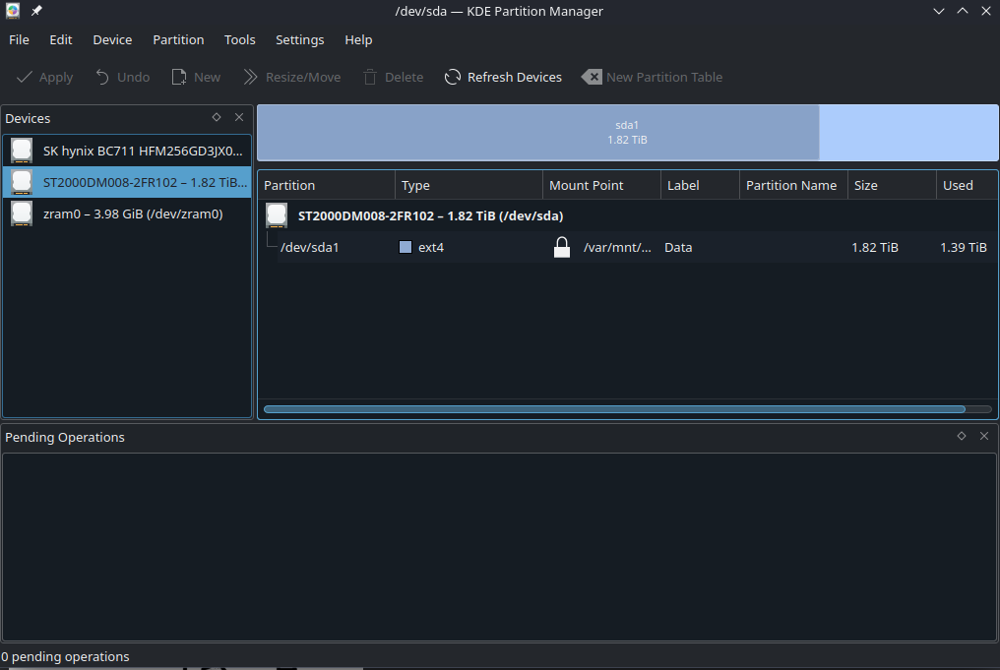
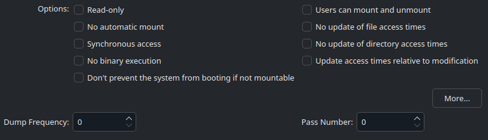
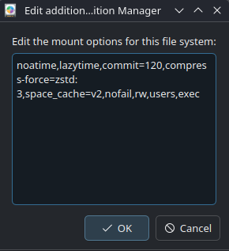

<div class="warning">

# WARNING!

> **Attention**: You may lose data on the drive(s) or result in an unbootable system if configured improperly.

> **Note:** MicroSD cards automatically mount without any manual intervention required on Bazzite.

> **Important**: Do **not** use the NTFS, exFAT, or FAT32 filesystems for game library storage.

Follow this guide **at your own discretion** and make sure to read the entire document relevant to your method, so you do not miss anything!

</div>

<hr>

# 1. Formatting a disk

> **Warning**: This will wipe all existing data on it

## Note when formatting in **KDE Partition Manager**

Make sure you set permissions to **everyone**.

Use a disk graphical user interface like KDE Plasma or GNOME Disks to format your drive. We recommend formatting secondary drives to **btrfs** or **ext4**.

### Creating a secondary drive directory and where to mount drives?

> **Note**: Drive directories should be **lowercase** with **no spaces** for best practice.

> **Attention**: `/var/mnt` should NOT be the path, but create a new **directory** in either `/var/mnt` or `/var/run/media/`.

- `/var/mnt/...` for **permanent** drives
- `/var/run/media/...` for **removable** drives

You can make a directory in `/var/mnt/` by opening a host terminal and **entering this command in a host terminal**:

```command
cd /var/mnt
```

```command
sudo mkdir /var/mnt/games
```

The drive will now be mounted in a directory known as `games`.

> **Note**: `games` can be named anything you desire that fits best practices.

#### Permissions for the drive

```command
sudo chown $USER:$USER /var/mnt/games
```

> **Note**: If you plan to reformat the partition, remember to edit the mount point and "Remove" the mount path before you reformat! If not you will have to manually edit `/etc/fstab`.

# 2. Graphical User Interface (GUI) Methods for Auto-Mounting

> **Warning**: Do not set up auto-mount, unmount then format a drive! It can confuse the software you are configuring drives with. Instead, **remove the auto-mount first before formatting the drive**.

## KDE Partition Manager


**This is pre-installed on KDE images.**

### Instructions




1.  Open KDE Partition Manager
2.  Locate the disk and partition you want to mount
3.  Right click on the partition and click "Edit Mount Point"
4.  Select "Identify by: UUID" (This will guarantee you mount THIS partition instead of a different one if the device nodes change for some reason)
5.  Select a mounting path:
    5a. You would want to use `/var/mnt/games` or something similar for permanent mounts
6.  **Untick all the boxes in the graphical application if they are checked**
7.  Click "More..." and add extra options depending on what filesystem is on the partition (read the "Filesystem Arguments" section)
8.  Click OK on both windows to save the mount points.
9.  Open the terminal to test the mounts by running the **command**:

```command
sudo systemctl daemon-reload && sudo mount -a
```

10. **If no errors appeared then it should be safe to reboot.**

> **Note**: If errors occur, then research the error and undo what you did and try again. Redo the previous two steps in the terminal (see CLI method down below and research how to use fstab) as KDE Partition Manager might not give a good error to search for if the test mount fails.

Display Name should be added too. Name it whatever you want it to be identified as.

#### Required additional options depending on **filesystem**

Use the below generic options depending on your filesystem (these are just good defaults)
You can copy+paste these into the "More.." dialog and they will be valid

> **Note**: "Users can mount and unmount" is an **optional** setting.

#### Filesystem arguments

> **Warning**: If a drive is formatted, then do not remove it from `/etc/fstab`, so the "nofail" option is a must to avoid issues with booting.



> **Example: btrfs requires these additional options.**

##### **BTRFS**:

```command
defaults,compress-force=zstd:3,noatime,lazytime,commit=120,space_cache=v2,nofail
```

##### **Ext4**:

```command
defaults,noatime,errors=remount-ro,nofail,rw,users,exec
```

##### **NTFS**:

```command
defaults,noatime,nofail,rw,users,exec
```

> **Note**: Do not use the NTFS filesystem for game library storage in Bazzite, and it is not supported and you will get lots of issues with it. NTFS is **not** intended as a game drive for Bazzite.

#### Advanced Options (Not required for most setups)

##### Information about compression:

**3** is a good balance, older CPUs should use **1**.

##### Information about subvolumes:

use `subvol=name` as an option, KDE and GNOME Disks let you only mount 1 subvolume through the GUI, you can mount the root with `subvol=/` if a default subvolume is configured in the filesystem.

### Installing KDE Partition Manager on non-KDE images

If you would like to install this, then it can be layered to your system by entering in a terminal:

```
rpm-ostree install kde-partitionmanager
```

Reboot your system after it has finished installing the terminal.

## GNOME Disks


**This comes pre-installed on GNOME images.**

### Instructions


1. Open GNOME Disks (`gnome-disk-utility`)
2. Locate the disk and partition you want to mount
3. Click the cog icon on the partition
4. Select "Edit Mount Options"
5. Turn off "User Session Default"
6. Check:
   a) Mount at system startup
   b) Show in user interface
7. In the space where this is no label: `nosuid,nodev,nofail,x-gvfs-show,` (refer to the correct filesystem below for more options)
8. `/var/mnt/games` (or whatever directory you made)
9. `auto`
10. Select "Take Ownership"
11. Open the terminal to test the mounts by running the **command**:

```command
sudo systemctl daemon-reload && sudo mount -a
```

12. **If no errors appeared then it should be safe to reboot.**

> **Note**: If errors occur, then research the error and undo what you did and try again. Redo the previous two steps in the terminal as GNOME Disks might not give a good error to search for if the test mount fails.

Display Name should be added too. Name it whatever you want it to be identified as.

#### Filesystem Arguments

> **Warning**: If a drive is formatted, then do not remove it from `/etc/fstab`, so the "nofail" option is a must to avoid issues with booting.


##### **BTRFS**:

```command
defaults,compress-force=zstd:3,noatime,lazytime,commit=120,space_cache=v2,nofail
```

##### **Ext4**:

```command
defaults,noatime,errors=remount-ro,nofail,rw,users,exec
```

##### **NTFS**:

```command
defaults,noatime,nofail,rw,users,exec
```

> **Note**: Do not use the NTFS filesystem for game library storage in Bazzite, and it is not supported and you will get lots of issues with it. NTFS is **not** intended as a game drive for Bazzite.

#### Permissions for the drive

```command
sudo chown $USER:$USER /mnt/games
```

#### Advanced Options (Not required for most setups)

##### Information about compression:

**3** is a good balance, older CPUs should use **1**.

##### Information about subvolumes:

use `subvol=name` as an option, KDE and GNOME Disks let you only mount 1 subvolume through the GUI, you can mount the root with `subvol=/` if a default subvolume is configured in the filesystem

### Installing GNOME Disks on non-GNOME images

If you would like to install this, then it can be layered to your system by entering in a terminal:

```
rpm-ostree install gnome-disk-utility
```

Reboot your system after it has finished installing the terminal.

# Alternative Methods (CLI)

There are also two command-line interface (CLI) methods.

1.  Using `systemd.mount`

2.  Editing the `/etc/fstab` file

CLI methods are intended for advanced users, and it is recommended to research one of the two methods elsewhere.

<hr>

# Emergency Mode After Following This Guide?

This video tutorial shows how to recover from your mounting mistakes.

<https://www.youtube.com/watch?v=-2wca_0CpXY>

<hr>

**Documentation Contributors**: [HikariKnight](https://github.com/HikariKnight) and [asen23](https://github.com/asen23)
