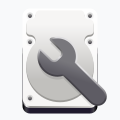
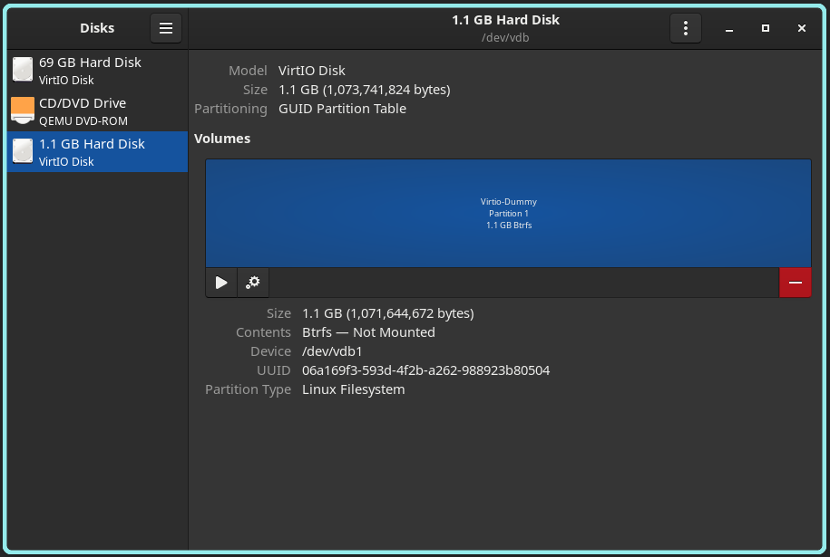
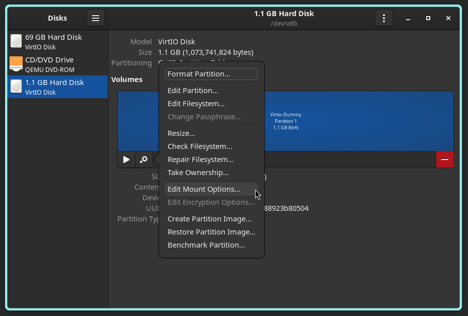
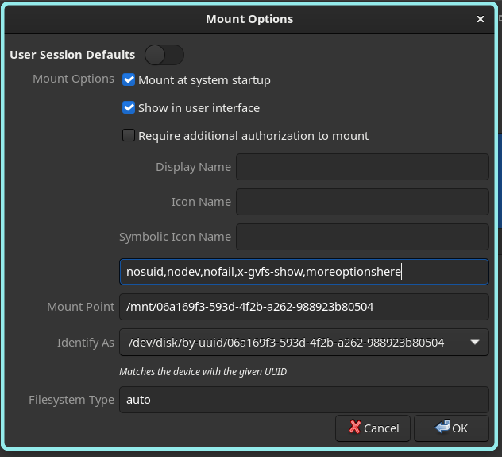

# GNOME Disks Auto-Mount Guide

<!-- ANCHOR: METADATA -->
<!--{"url_discourse": "https://universal-blue.discourse.group/docs?topic=3781", "fetched_at": "2024-09-03 16:43:10.816923+00:00"}-->
<!-- ANCHOR_END: METADATA -->



**This comes pre-installed on GNOME images.**

# Instructions



1. Open GNOME Disks (`gnome-disk-utility`)
2. Locate the disk and partition you want to mount
3. Click the cog icon on the partition
4. Select "Edit Mount Options"
5. Turn off "User Session Default"
6. Check: "**Mount at system startup**" and "**Show in user interface**" 
7.  In the space where this is no label: `nosuid,nodev,nofail,x-gvfs-show,` (refer to the correct filesystem below for more options)
8. `/var/mnt/games` (or whatever directory you made)
9. `auto`
10. Select "Take Ownership"
11. Open the terminal to test the mounts by running the **command**: 
```command
sudo systemctl daemon-reload && sudo mount -a
```
12. **If no errors appeared then it should be safe to reboot.**

>**Note**: If errors occur, then research the error and undo what you did and try again.  Redo the previous two steps in the terminal as GNOME Disks might not give a good error to search for if the test mount fails.

Display Name should be added too.  Name it whatever you want it to be identified as.

## Filesystem Arguments

>**Warning**: If a drive is formatted, then do not remove it from `/etc/fstab`, so the "nofail" option is a must to avoid issues with booting.





### **BTRFS**: 
```command
defaults,compress-force=zstd:3,noatime,lazytime,commit=120,space_cache=v2,nofail
```

### **Ext4**:  
```command
defaults,noatime,errors=remount-ro,nofail,rw,users,exec
```

### **NTFS**:  
```command
defaults,noatime,nofail,rw,users,exec
```
>**Note**: Do not use the NTFS filesystem for game library storage in Bazzite, and it is not supported and you will get lots of issues with it.  NTFS is **not** intended as a game drive for Bazzite.

## Permissions for the drive
```command
sudo chown $USER:$USER /mnt/games
```

### Advanced Options (Not required for most setups)

>Change at your own risk!

### Information about compression: 

**3** is a good balance, older CPUs should use **1**.

### Information about subvolumes: 

use `subvol=name` as an option, KDE and GNOME Disks let you only mount 1 subvolume through the GUI, you can mount the root with `subvol=/` if a default subvolume is configured in the filesystem

# Installing GNOME Disks on non-GNOME images

If you would like to install this, then it can be layered to your system by entering in a terminal:

```
rpm-ostree install gnome-disk-utility
```

Reboot your system after it has finished installing the terminal.
