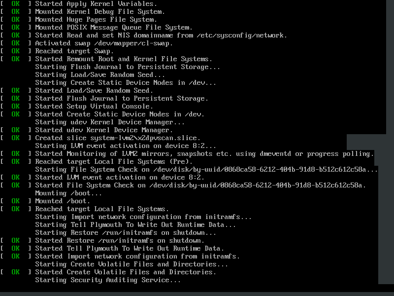

nicknamenamenick | 2024-07-14 15:50:27 UTC | #1

For those who want to see the init log show if services are functional when their PC starts up:



```command
sudo plymouth-set-default-theme details
```

Alternatively, create `/etc/plymouth/plymouthd.conf` manually

```command
sudo rpm-ostree initramfs --enable --reboot
```

<hr>

**Documentation Contributors**: Krin

---
