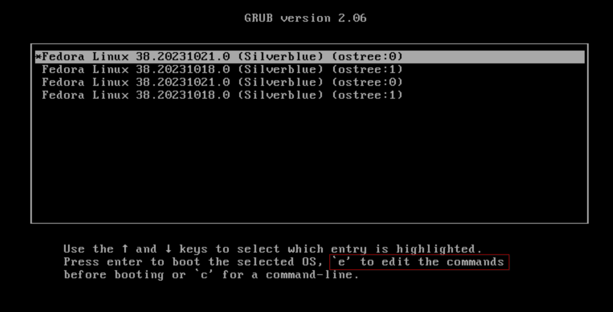
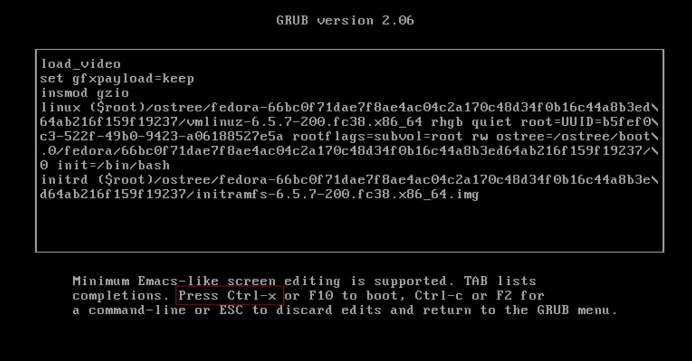
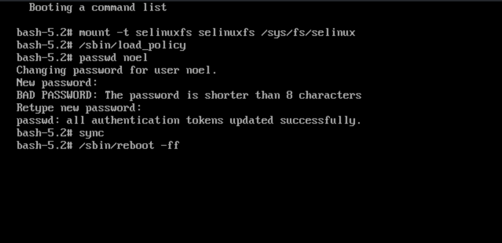

nicknamenamenick | 2024-07-22 16:35:12 UTC | #1

> Follow this guide **at your own discretion** because you can break your system attempting any of this.



Reboot your device and edit the last deployment by presssing <kbd>E</kbd> on your keyboard.


Boot with `init=/bin/bash` on the kernel command line (e.g. edit GRUB prompt.)



Continue boot process with <kbd>Ctrl</kbd>+<kbd>X</kbd>

Once you are in the GRUB command line:

1. Temporarily mount SELinux

```
mount -t selinuxfs selinuxfs /sys/fs/selinux
```

2.  Load SELinux policy

```
/sbin/load_policy
```

3. Enter your new password (i.e. passwd nick)

```
passwd [INSERT USERNAME HERE]
```

4. Sync

```command
sync
```

5. Reboot

```
/sbin/reboot -ff
```



Your user password should now be reset.

Thanks to [Colin Walters](https://github.com/cgwalters) for the [solution](https://github.com/ublue-os/main/issues/469#issuecomment-1885264886).

<hr>

**Documentation Contributors**: [Noel Miller](https://github.com/noelmiller)
