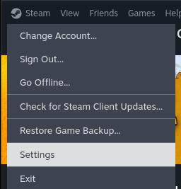
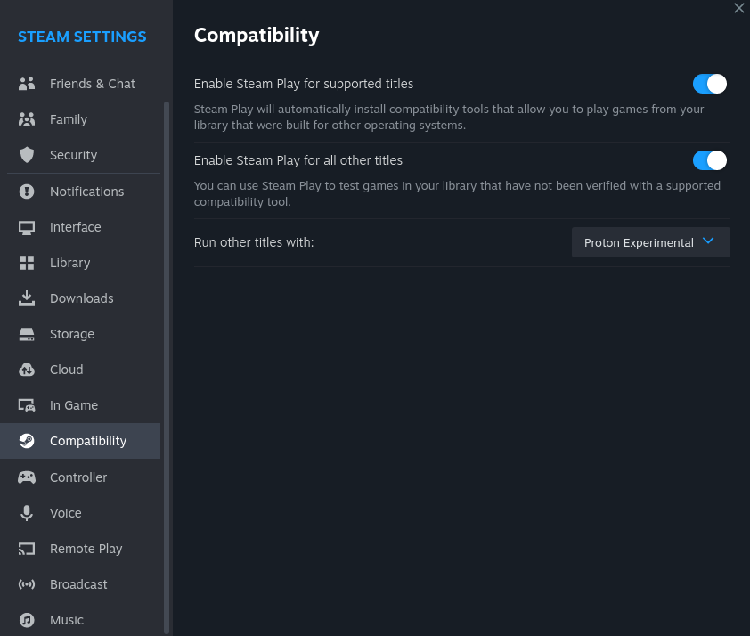
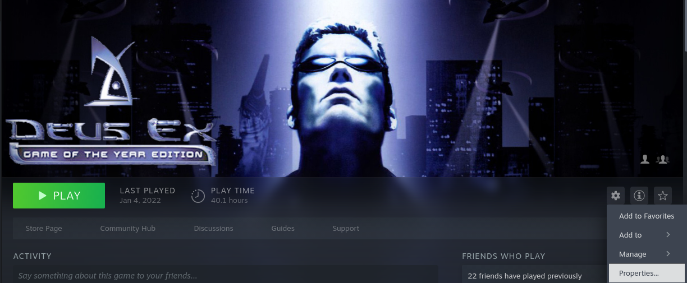
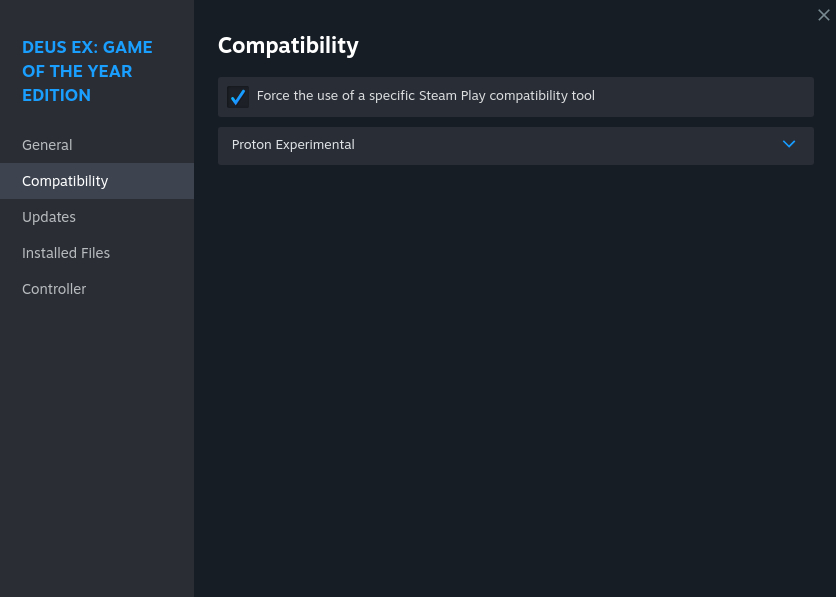
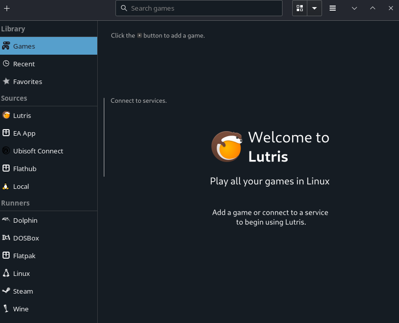
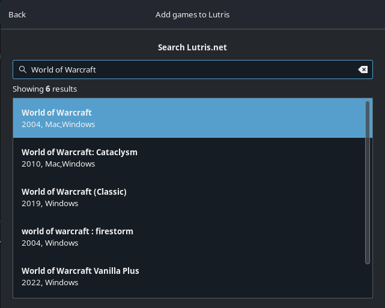
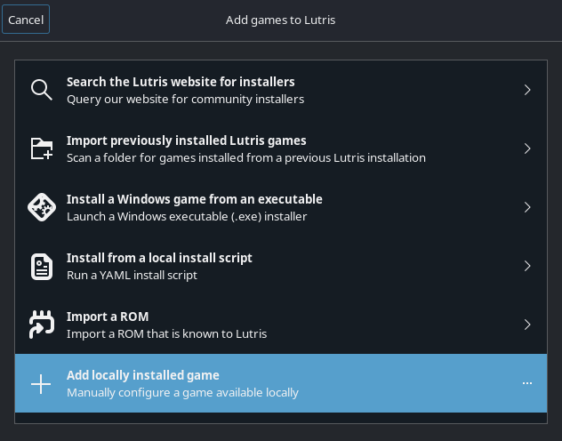
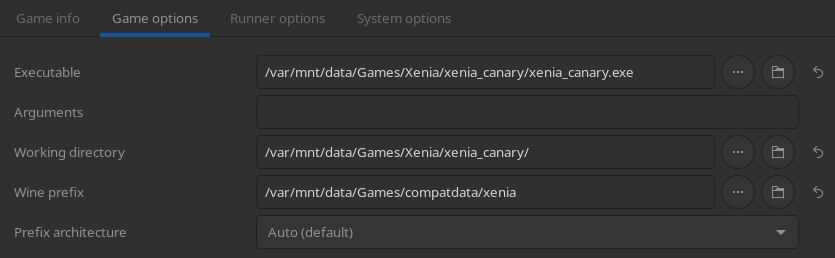
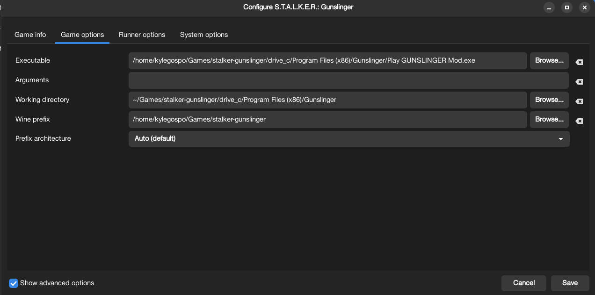
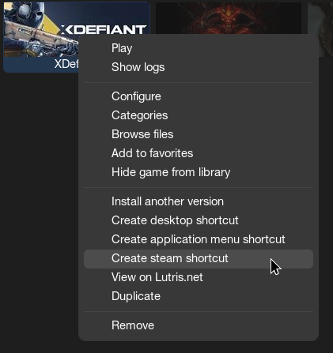

<!-- ANCHOR: METADATA -->
<!--{"url_discourse": "https://universal-blue.discourse.group/docs?topic=2656", "fetched_at": "2024-09-03 16:43:09.533219+00:00"}-->
<!-- ANCHOR_END: METADATA -->

# **Steam Setup**

Steam can run Windows games on Linux.  It utilizes a wide range of projects and patches all packed into a piece of software built-in to Steam called [Proton](https://github.com/ValveSoftware/Proton) for Windows compatibility.

## Enabling Proton For All Steam Games

>**Note**: Skip this section if you're using a [*Handheld/HTPC*](https://universal-blue.discourse.group/docs?topic=37) image.

* Currently Steam only allows whitelisted games to run by default on the desktop Steam client.
* You can change this by going into the Steam **Settings** > **Compatibility** > Check **Enable Steam Play for all other titles**

## Forcing A Specific Proton / Steam Play Tool Version

* Games with a Linux port will be used by default on Desktop images.
* Valve selects the default runner on *Handheld/HTPC* images.
* Some games run better with a specific version of Proton or forcing the Linux runtime.
    * Run that specific version by going into the game's **Properties** > **Compatibility** > **Force the use of a specific Steam Play compatibility tool**

# **Non-Steam Games**

* **It is recommended to use [Lutris](https://lutris.net/games?q=&ordering=-popularity&paginate_by=100) for _most_ non-steam games**.
  * However, [Heroic Games Launcher](https://heroicgameslauncher.com) is intended as a suitable replacement for the Epic Games Launcher.
  * [Bottles](https://usebottles.com/) is an alternative to Lutris and great for non-gaming Windows software.
  * Other games and launchers are also available in the software center (_Discover_ or _GNOME Software_) like itch.io.

## Lutris Setup

Lutris is game management software that doubles as a WINE front-end for Windows games.  Several games and launchers can be installed by searching for the title and using one of the installer scripts for it.

### Manually adding a Windows game to Lutris

However if your game is not listed or doesn't work with the provided script, then manually add the executable.  Add locally installed game and make sure to configure it properly within the game and runner options.

**Example 1**:

**Example 2**:

### Lutris Shortcuts

Right clicking a game on Lutris gives the option to add it as a non-Steam game (useful for Steam Gaming Mode), create a desktop shortcut, or an application menu shortcut.

## Gamepass / Microsoft Store Games (Cloud Streaming)

Games installed from the Microsoft Store do **not** run on desktop Linux unless you use a xCloud client like [Greenlight](https://github.com/unknownskl/greenlight).  Fortnite can also be played via xCloud without a Gamepass subscription using this method.

# Auto-Mounting Game Drives

Read the [Auto-Mounting Secondary Drives Guide](https://ublue-os.github.io/bazzite/Advanced/Auto-Mounting_Secondary_Drives/) for more information.  It is also recommended to do your own research on drive mounting on Linux.

[**<-- Back to Gaming Guide**](https://universal-blue.discourse.group/docs?topic=31)
