<!-- ANCHOR: METADATA -->
<!--{"url_discourse": "https://universal-blue.discourse.group/docs?topic=1146", "fetched_at": "2024-09-03 16:43:27.199924+00:00"}-->
<!-- ANCHOR_END: METADATA -->

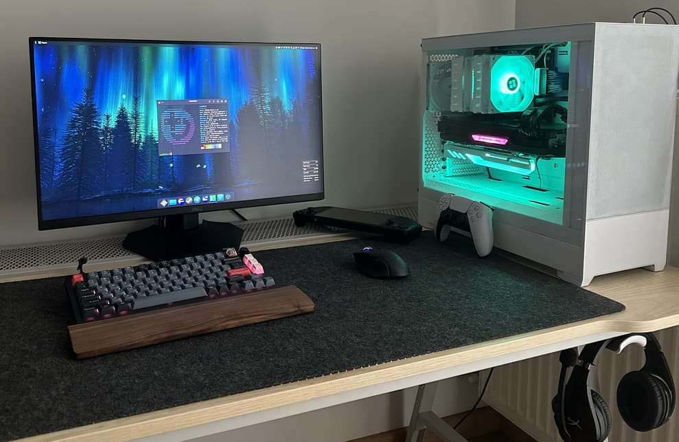

# Pre-Installation

>Pre-requisites and steps before installing Bazzite.

## Minimum System Requirements
- **Architecture**: x86_64
- **Firmware**: UEFI (CSM Support should be **disabled** if available)
- **Processor (CPU)** : 2GHz quad core processor or better
- **System Memory (RAM)**: 4GB
- **Graphics**:  A graphics card that can utilize Vulkan 1.3+
- **Storage**: 50GB free on an internal solid-state drive
- **Network**: Stable internet connection with no bandwidth caps
- **Additional Notes**: Certain [drivers](https://github.com/morrownr/8812au-20210820) are **not** compatible with Bazzite.

### Installer Requirements
* A USB flash drive with 10GB free space
  * **Note**: All data on this drive will be wiped when flashed
* Software to flash the image:
  * [Fedora Media Writer](https://www.fedoraproject.org/en/workstation/download/), [Ventoy](https://www.ventoy.net/en/index.html), or [Rufus](https://rufus.ie/en/)
    * Make sure to properly eject the drive after flashing the ISO to it
* Physical keyboard

## Desktop Environments

Bazzite comes with the choice of [KDE Plasma](https://kde.org/plasma-desktop/) or [GNOME](https://www.gnome.org/) for the desktop environment.

[Steam Gaming Mode](https://github.com/KyleGospo/gamescope-session) is an option and if you opt to use it, then this installation guide no longer applies and it is recommended to read the [HTPC installation guide](./Installing_Bazzite_for_HTPC_Setups.md) instead.  

More information can be found on our [FAQ](https://faq.bazzite.gg) about the differences between the image variants.

### [KDE Plasma (Default)](https://kde.org/plasma-desktop/)

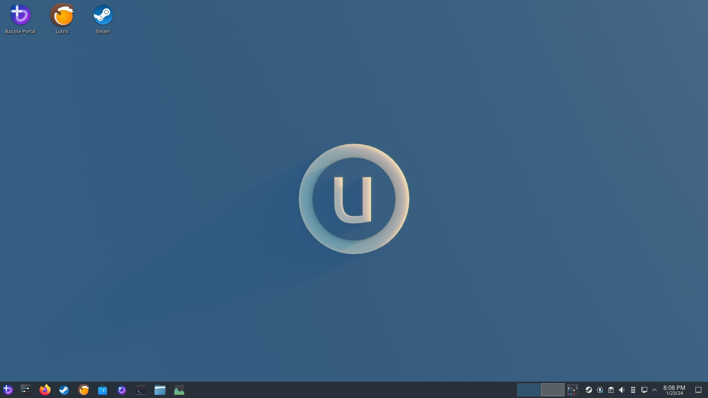

- KDE Plasma's default interface has a traditional and familiar layout
- Highly customizable with tons of settings
- Qt framework
- Popular Linux distributions like SteamOS use KDE Plasma

### [GNOME (`-gnome` images)](https://www.gnome.org/)

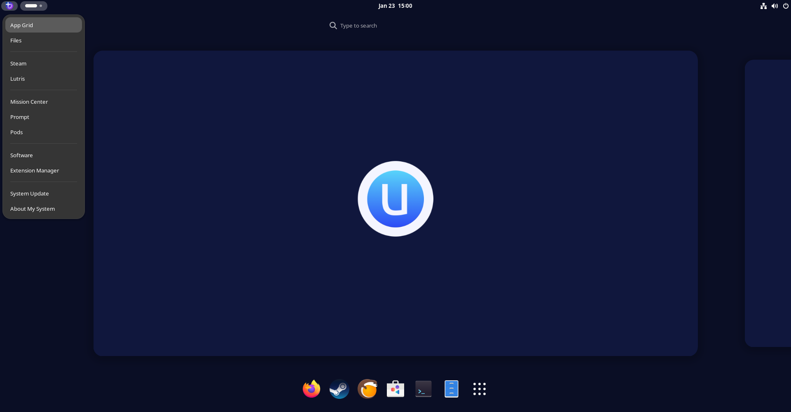

- GNOME's default interface has an elegant and touch-friendly layout
- Simple and concise
- GTK framework
- Popular Linux distributions like Ubuntu use GNOME

### [Steam Gaming Mode (`-deck` images)](../../Handheld_and_HTPC_edition/Steam_Gaming_Mode.md)

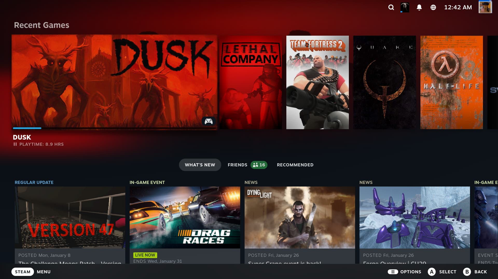

>**Note**: Your device will automatically boot into the Steam Gaming Mode session at startup, and Desktop Mode can be accessed from the "**power menu**" in Steam Gaming Mode.

-  **Requires a [Steam](https://store.steampowered.com/) account**
- Included in the [Handheld/HTPC images](../../Handheld_and_HTPC_edition/Steam_Gaming_Mode.md)
- Interface is designed for handheld and couch gaming
- Controller friendly
- Choice of KDE Plasma or GNOME in Desktop Mode
- Extra functionality with [Decky](https://github.com/SteamDeckHomebrew/decky-loader) [plugins](https://plugins.deckbrew.xyz/)

## Dual Boot Preliminary Setup + Post-Setup Guide

Read the [Dual Boot Guide](./dual_boot_setup_guide.md) **after** reading this guide before proceeding.

# Installation Guide

>The part of the guide that requires the most effort.

## 1. Download and Flash Bazzite

- Download [Bazzite](https://download.bazzite.gg) after choosing the correct ISO for your hardware with our Image Picker tool.
- Flash Bazzite to your bootable medium.
- Eject drive.

### Current Fedora Atomic Desktop Users

Current [Fedora Atomic Desktop](https://fedoraproject.org/atomic-desktops/) users can rebase with the terminal command listed on the website under the "**Existing Fedora Atomic Desktop Users**" section and can skip the next step.

## 2. Boot Bazzite
- Connect your bootable medium to your device and boot into it.
- After connecting the device, boot into the Bazzite installer.
- This depends on your motherboard hardware, but most of the time it could be a function keys like <kbd>F9</kbd> or similar.
  - Sometimes you need to consult the manual, look up your device online, or read any hotkeys that appear when you boot your PC.  
      - Alternatively change the BIOS settings to boot with your bootable device first before your current storage, but this is **not recommended** to keep enabled after installing Bazzite.
- Verify the media correctly and proceed to the installer.

## 3. Installer

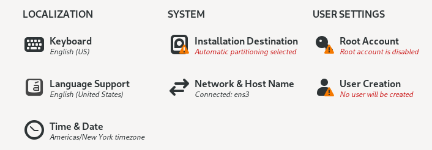

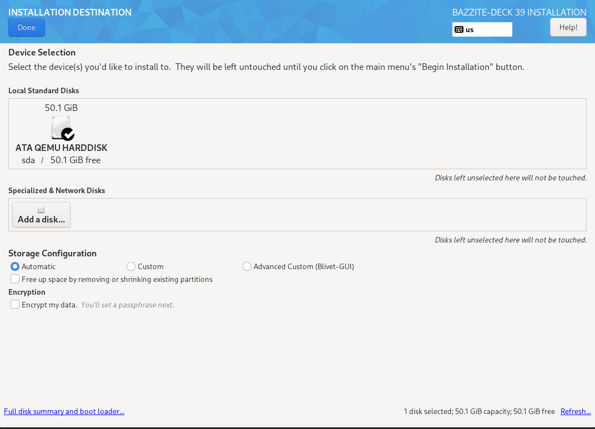

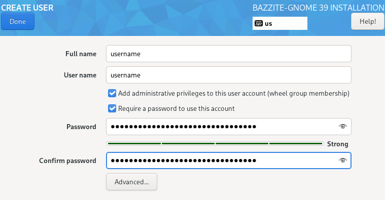

- Select your language, region, keyboard layout, and time zone.
- Select the drive that Bazzite is going to be installed on.
  - Delete any partitions that you have remaining on the drive **unless dual booting on the same drive**.
  - Recommended to use the automatic storage configuration **unless dual booting on the same drive**.
- Optionally encrypt the drive with a password if desired.
  - **If you lose this password, then it cannot be decrypted**.
- Setup a user account.
  - Give administrative privileges and **set a user password**.
- Begin the installation.
- Reboot device after it has finished installing.

### Important information for users with Secure Boot **enabled**:

Read the [Secure Boot Guide](https://universal-blue.discourse.group/docs?topic=2742) for more information.

# Post-Installation

>The fine tuning before gaming.

## GRUB Menu

The first boot will show a screen showing your current and last deployment. It will automatically boot if nothing.  It is important to note that the GRUB menu can be used to rollback Bazzite deployments if you encounter issues.  

Read more about this in the [Updates, Rollback, and Rebasing documentation](../../Installing_and_Managing_Software/Updates_Rollbacks_and_Rebasing/index.md).

## Configuring System Settings for KDE Plasma and GNOME

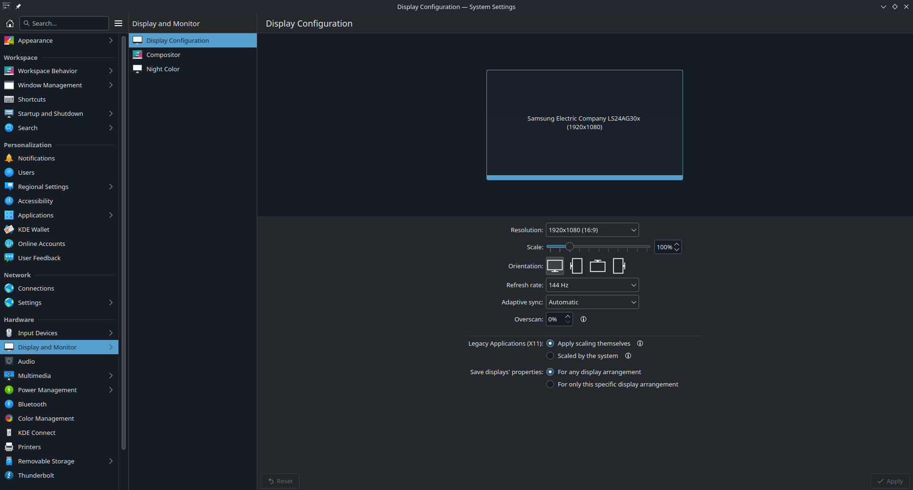
***KDE Plasma's System Settings application***

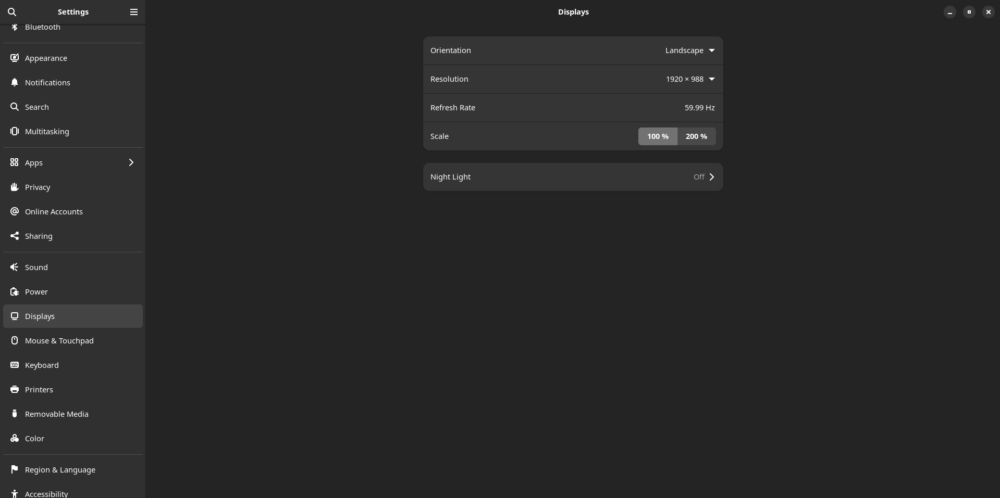
***GNOME's Settings application***

It is important to configure the system settings on a first boot to personalize your desktop especially if you notice the scaling is incorrect on first-boot.

## First Boot Setup Utility: Bazzite Portal

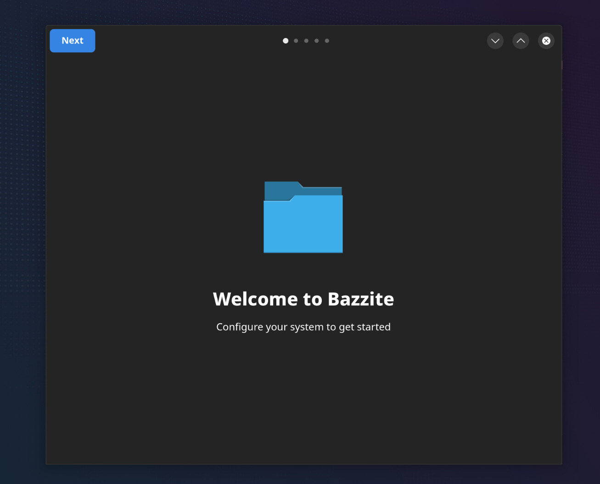

>**Attention**: Make sure you are connected to the internet.

An application will pop up welcoming you to Bazzite when you boot into the desktop for the first time.  This is a utility that allows you to tailor Bazzite to your liking by installing additional software.  

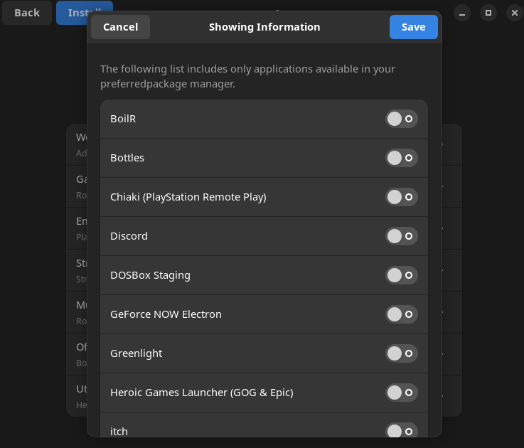

- Click "Next" to begin configuring Bazzite.  
- Press the toggle switch button next to the item to have the option enabled or disabled for your installation, some are already toggled on by default.  
- If you would like to customize any of the options, then press the arrow next to the toggle switch button if available.  
- Installing items from the portal **may take a long time**. 

>**Note**: If you only check a few items in a category, then it will only install those selected items.  The switch is only toggled to install **everything** in that category.

>**Attention**: There is a rare chance you will be asked to setup KDE Wallet or GNOME Keyring and set a password to continue installing items from the Bazzite Portal.

## Installing additional software

The [Installing and Managing Applications documentation](../../Installing_and_Managing_Software/index.md) is useful to learn how to install additional software on Bazzite outside of the Bazzite Portal.

# Ready to Game

**You have now installed Bazzite!**

View our [Gaming Guide](../../Gaming/index.md) for a quick rundown of Linux gaming, useful resources, and setting up Proton on Steam.

Check out the additional [documentation](https://docs.bazzite.gg) surrounding the project.

# **Video Tutorial - Dual Boot Setup w/ Secure Boot Enabled**:

https://www.youtube.com/watch?v=dXBN9OM7mSE

# Issues Installing Bazzite?

View the [Installation Troubleshoot Guide](./troubleshoot_guide.md).

**Documentation Contributors**: [Kyle Gospodnetich](https://github.com/KyleGospo), [Nathaniel Warburton](https://github.com/storyaddict), [Jorge Castro](https://github.com/castrojo), [Noel Miller](https://github.com/noelmiller), [ChaiQi](https://github.com/atimeofday), [Damian Korcz](https://github.com/damiankorcz), and [Justin Garrison](https://github.com/rothgar)

**See also:** [Upstream Manual Partitioning Guide](https://docs.fedoraproject.org/en-US/fedora-silverblue/installation/#manual-partition) & [Auto-Mounting Secondary Drives](../../Advanced/Auto-Mounting_Secondary_Drives.md)

<-- [**View all Bazzite documentation**](../../index.md)