<!-- ANCHOR: METADATA -->
<!--{"url_discourse": "https://universal-blue.discourse.group/docs?topic=1819", "fetched_at": "2024-09-03 16:43:25.971719+00:00"}-->
<!-- ANCHOR_END: METADATA -->

1. Download the Framework Laptop image of [Bazzite](https://bazzite.gg/). Make sure you select Intel or AMD depending on the mainboard in your device:

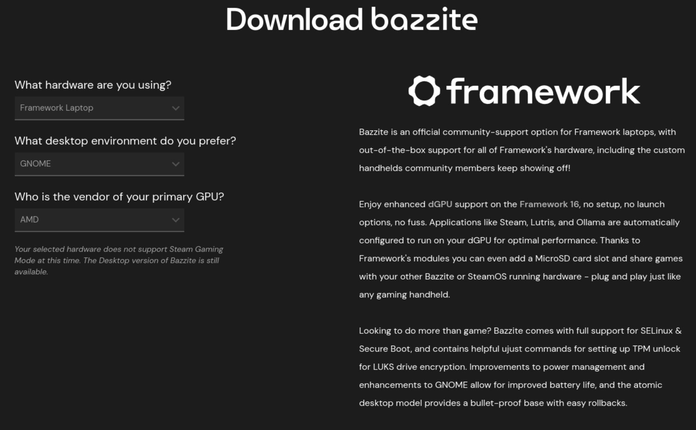

2. **Create a USB stick** using [Fedora Media Writer](https://docs.fedoraproject.org/en-US/fedora/latest/preparing-boot-media/#_on_windows) ([Windows](https://fedoraproject.org/fmw/FedoraMediaWriter-win32-latest.exe) or [Mac](https://fedoraproject.org/fmw/FedoraMediaWriter-osx-latest.dmg) or [Linux](https://flathub.org/apps/org.fedoraproject.MediaWriter))

* Insert your USB drive (8GB or larger). Note that it will be reformatted, so make sure you are ok with erasing any data that is on it.
* After installing Fedora Media Writer, run it. Choose Select .iso file, browse to bazzite-gnome-stable.iso (GNOME) or bazzite-stable.iso (KDE) and select it.
* Click the Write button.
* Once the USB drive creation is complete, you can click Finish, close Fedora Media Writer, eject your USB drive.

3. **Linux Audio Compatibility**

* Before we begin the installation process with the Live USB, let’s make sure you have your Linux Audio Compatibility set to Linux in the BIOS.
  * Power on the laptop, repeatedly tapping F2 in order to get into the BIOS. Note: If you’re having trouble with this, try again, holding down the Fn key while rapidly tapping F2.
  * In BIOS mode, arrow key over to Setup Utility. Press the enter key. Arrow down to Advanced. Then arrow right, then arrow down to Linux Audio Compatibility. Press enter.
  * A new box for Linux Audio Compatibility will appear, arrow to Linux, then press enter. Now press F10 key to reboot.
  * Now we don’t have an OS installed yet. So the reboot won’t get us to a running operating system and we fully expect to see an error to this point. Simply press the power button to shutdown.

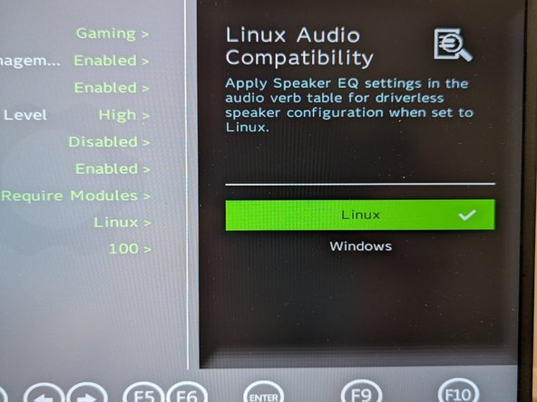

4. **Booting to the Bazzite USB**

* Insert the USB drive into your powered off Framework Laptop 13, and then power on. If you have an existing OS installed on the Storage drive in your laptop, immediately after the power light comes on begin rapidly tapping (continuously ) the F12 key - you must begin tapping well before you see the Framework logo.
* Select Linpus lite (General UDisk) with your arrow keys. Enter key.
* Next select Install Bazzite. Hit the enter key.
* Select the keyboard language you’d like to use. On the next screen, click on the Installation Destination button to choose the disk.
* If there is an OS already installed on the target drive, you’ll need to follow the guided steps to delete the existing partitions.
* Click Finish Installation and then reboot into your new Bazzite install!

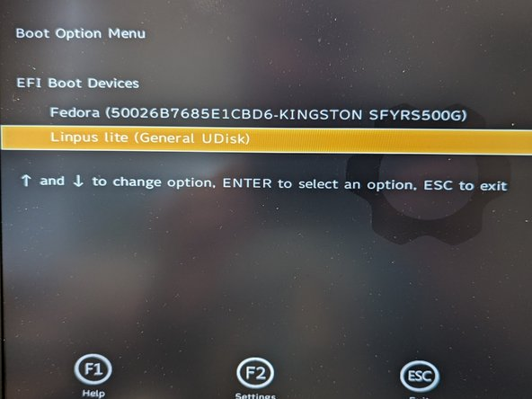

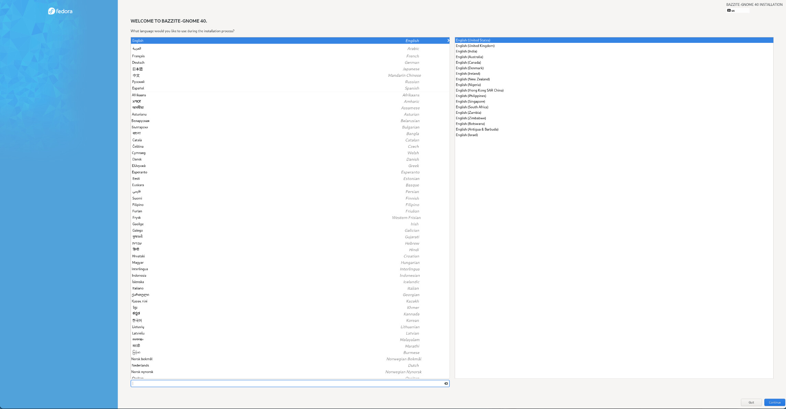

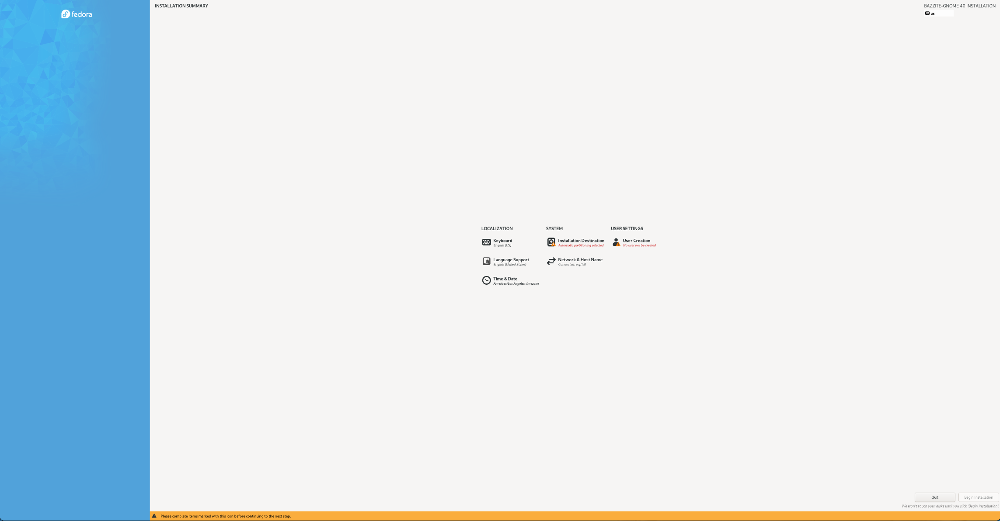

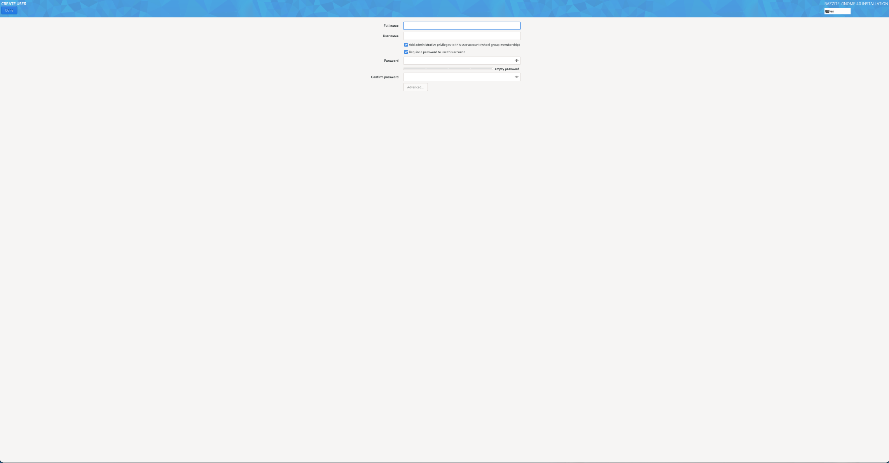

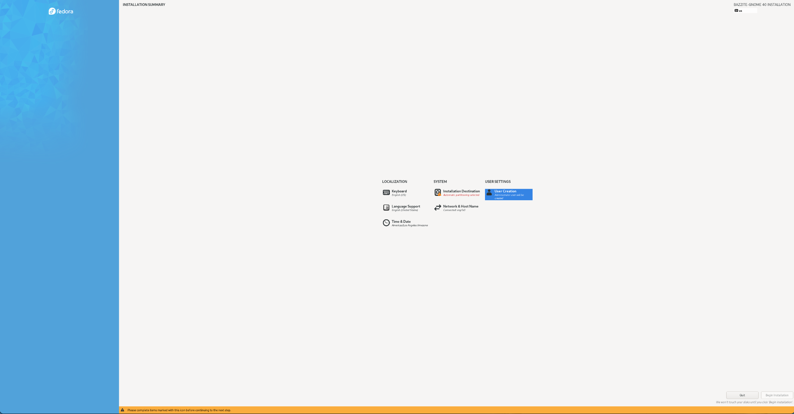

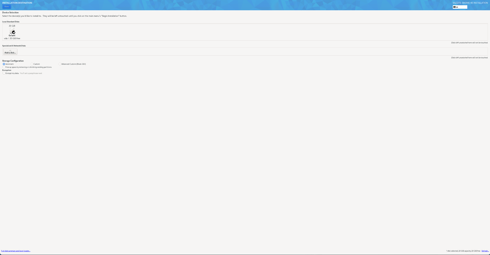

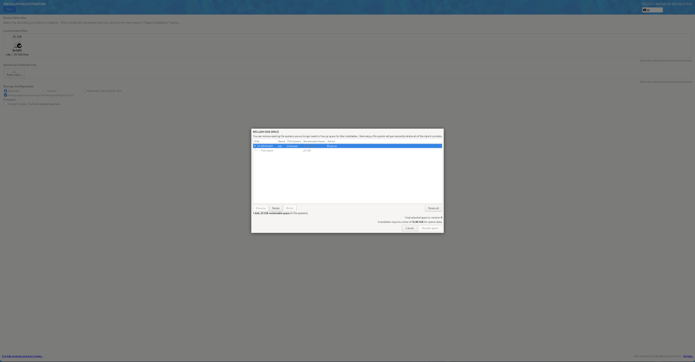

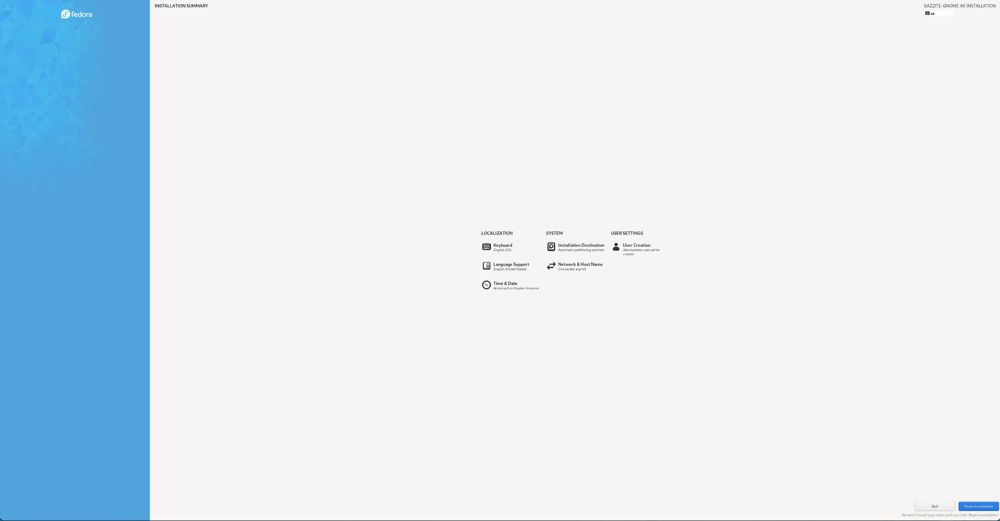

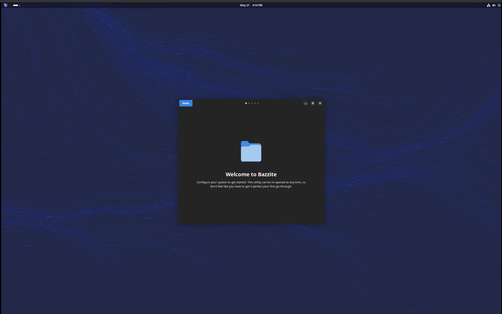

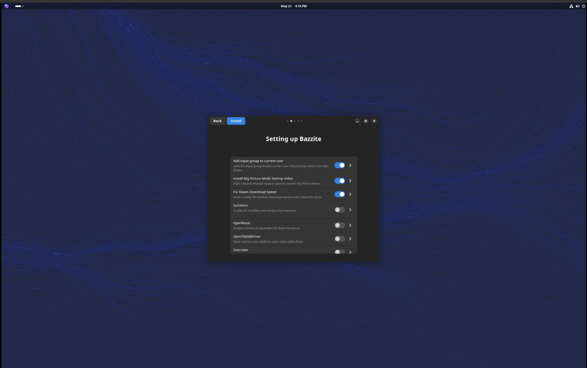

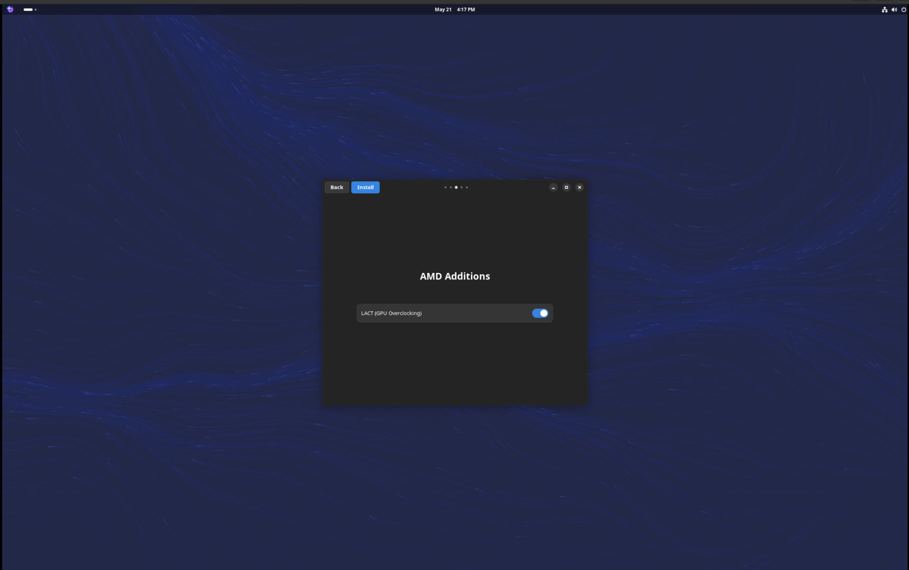

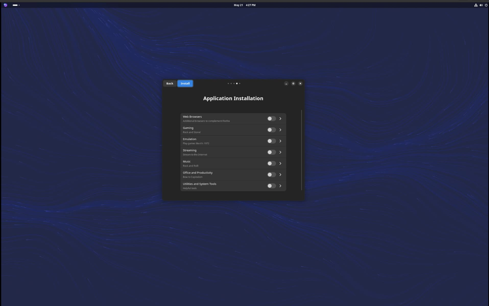

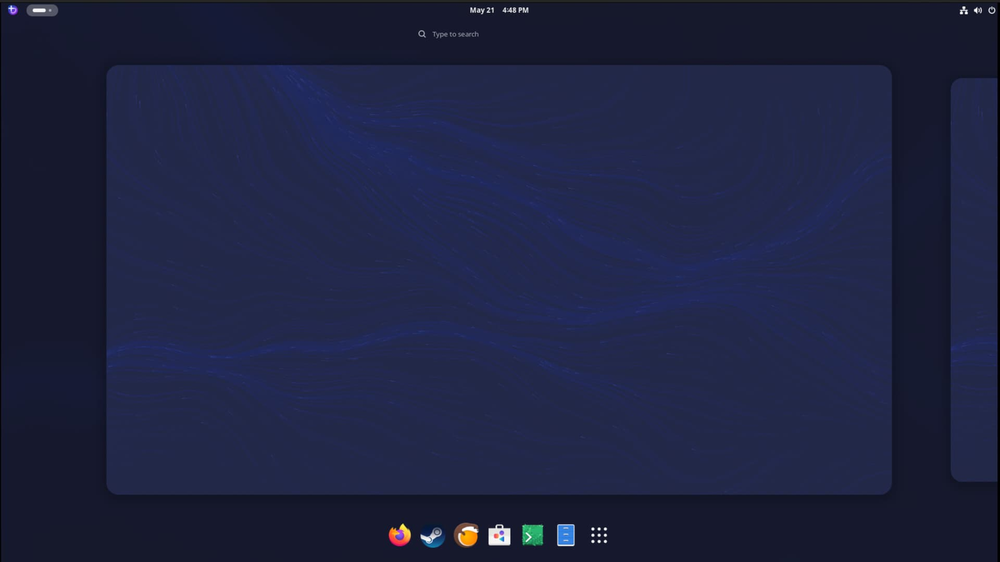