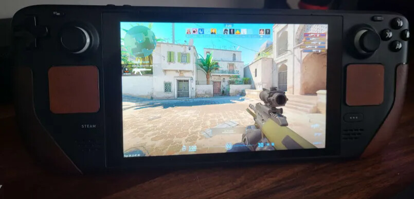
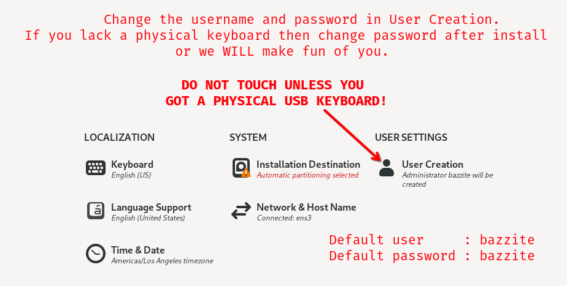
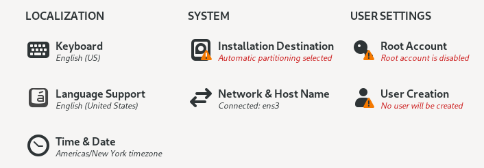
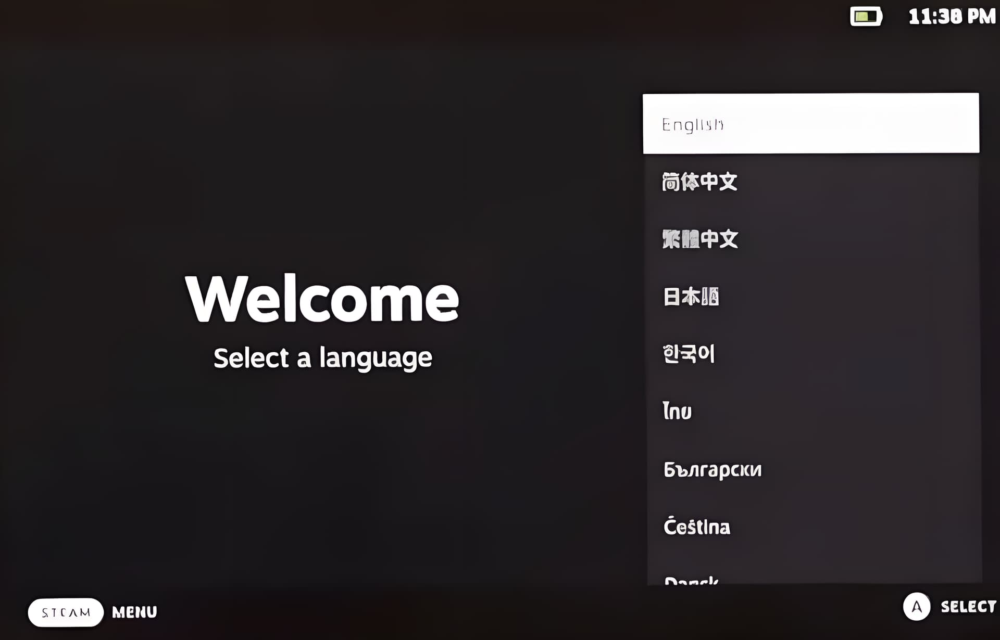

<!-- ANCHOR: METADATA -->
<!--{"url_discourse": "https://universal-blue.discourse.group/docs?topic=1143", "fetched_at": "2024-09-03 16:43:25.151999+00:00"}-->
<!-- ANCHOR_END: METADATA -->

# Bazzite on the Steam Deck

>**Attention**:  XHCI has to be set as the USB Mode for the Steam Deck for our ISO to boot!  If it is set to DRD, please change it in your BIOS settings, and more information can be found [here](https://github.com/ublue-os/bazzite/issues/808#issuecomment-1963141866).

## Status

Bazzite functions properly on the Steam Deck LCD (256GB+) and Steam Deck OLED models.

**Bazzite and SteamOS** comparison:
Read the [Handheld Wiki entry for the Steam Deck](https://universal-blue.discourse.group/docs?topic=1849) for a quick comparison.

>**Note**: Bazzite requires a stable internet connection with no bandwidth cap in place.

# Pre-Installation

>Pre-requisites and steps before installing Bazzite.

### Installer Requirements
* A USB flash drive with 10GB free space
  * **Note**: All data on this drive will be wiped when flashed
* Software to flash the image:
  * [Ventoy](https://www.ventoy.net/en/index.html)
    * Make sure to properly eject the drive after flashing the ISO to it
* Optional: Physical keyboard (without one, your username will be `bazzite` and the password will be `bazzite`)

## Desktop Environments

All of the images come with the choice of [KDE Plasma](https://kde.org/plasma-desktop/) or [GNOME](https://www.gnome.org/) for their desktop environment.

[Steam Gaming Mode](https://github.com/KyleGospo/gamescope-session) is a requirement for the Steam Deck.

More information can be found on our [FAQ](https://faq.bazzite.gg) about the differences between the image variants.

### [KDE Plasma (Default)](https://kde.org/plasma-desktop/)

- KDE Plasma's default interface has a traditional and familiar layout
- Highly customizable with tons of settings
- Qt framework
- Popular Linux distributions like SteamOS use KDE Plasma

### [GNOME (`-gnome` images)](https://www.gnome.org/)

- GNOME's default interface has an elegant and touch-friendly layout
- Simple and concise
- GTK framework
- Popular Linux distributions like Ubuntu use GNOME

### [Steam Gaming Mode (`-deck` images)](https://universal-blue.discourse.group/docs?topic=37)

>**Note**: Your device will automatically boot into the Steam Gaming Mode session at startup, and Desktop Mode can be accessed from the "**power menu**" in Steam Gaming Mode.

- **Requires a [Steam](https://store.steampowered.com/) account**
- Included in the [Handheld/HTPC images](https://universal-blue.discourse.group/docs?topic=37)
- Interface is designed for handheld and couch gaming
- Controller friendly
- Choice of KDE Plasma or GNOME in Desktop Mode
- Extra functionality with [Decky](https://github.com/SteamDeckHomebrew/decky-loader) [plugins](https://plugins.deckbrew.xyz/)
- XHCI has to be set as the USB Mode for the Steam Deck for our ISO to boot!  If it is set to DRD, please change it in your BIOS settings.  More information can be found [here](https://github.com/ublue-os/bazzite/issues/808#issuecomment-1963141866).
- **Steam Deck OLED only**: It must be installed with Basic Graphics Mode.

# Installation Guide

>The part of the guide that requires the most effort.

**IMPORTANT**: XHCI has to be set as the USB Mode for the Steam Deck for our ISO to boot!  If it is set to DRD, please change it in your BIOS settings.  More information can be found [here](https://github.com/ublue-os/bazzite/issues/808#issuecomment-1963141866).

## 1. Download and Flash Bazzite

- Download [Bazzite](https://download.bazzite.gg) after choosing the Steam Deck ISO with our Image Picker tool.
- Flash Bazzite to your bootable medium.
- Eject drive.

## 2. Boot Installation Medium

Hold the 'Volume Down' (<kbd>-</kbd>) button and click the Power Button, and when you hear the chime, let go of both buttons, and you'll be booted into the Boot Manager.  

When you get to the boot menu, select your bootable device to boot into the Bazzite installer.

>**Warning**: Steam Deck OLED users must use Basic Graphics Mode in the installer!

Access this with the "**Troubleshooting**" section when the ISO is booted.

## 3. Installer

> **NOTE**: If you do not have a usb physical keyboard connected, do **NOT** press "*User Creation*", since it will remove the default username and password, and you will be unable to type a username or password without a physical keyboard.

>**default user**: `bazzite`
>**default password**: `bazzite`

<!---->

- Select your language, region, keyboard layout, and time zone.
- Select the drive that Bazzite is going to be installed on.
  - Delete any partitions that you have remaining on the drive.
  - Recommended to use the automatic storage configuration.
- Optionally encrypt the drive with a password if desired.
  - **If you lose this password, then it cannot be decrypted**.
- Setup a user account. (If you do not have a physical, skip this step and begin the installation)
  - Give administrative privileges and **set a user password**.
- Begin the installation.
- Reboot device after it has finished installing.

# Post-Installation

>The fine tuning before gaming.

## GRUB Menu

The first boot will show a screen showing your current and last deployment. It will automatically boot if nothing.  It is important to note that the GRUB menu can be used to rollback Bazzite deployments if you encounter issues.  

Read more about this in the [Updates, Rollback, and Rebasing documentation](https://universal-blue.discourse.group/docs?topic=36).

***KDE Plasma's System Settings application***

***GNOME's Settings application***

It is important to configure the system settings on a first boot to personalize your desktop especially if you notice the scaling is incorrect on first-boot.

## First Boot Setup Utility: Bazzite Portal

>**Attention**: Make sure you are connected to the internet.

An application will pop up welcoming you to Bazzite when you boot into the desktop for the first time.  This is a utility that allows you to tailor Bazzite to your liking by installing additional software.  

- Click "Next" to begin configuring Bazzite.  
- Press the toggle switch button next to the item to have the option enabled or disabled for your installation, some are already toggled on by default.  
- If you would like to customize any of the options, then press the arrow next to the toggle switch button if available.  
- Installing items from the portal **may take a long time**. 

>**Note**: If you only check a few items in a category, then it will only install those selected items.  The switch is only toggled to install **everything** in that category.

>**Attention**: There is a rare chance you will be asked to setup KDE Wallet or GNOME Keyring and set a password to continue installing items from the Bazzite Portal.

## Installing additional software

The [Installing and Managing Applications documentation](https://universal-blue.discourse.group/docs?topic=35) is useful to learn how to install additional software on Bazzite outside of the Bazzite Portal.

## Login to Steam &  Reboot Device

Login to Steam then **reboot** your device when you finish setting up your device during the first-boot process.

### Setting Up Steam Gaming Mode

After completing all of the above, then your next boot will be in Steam Gaming Mode which requires additional setup for Steam. 

>[Read further information about Steam Gaming Mode](https://universal-blue.discourse.group/docs?topic=37)

# Issues Installing Bazzite?

View the [Installation Troubleshoot Guide](https://ublue-os.github.io/bazzite/General/Installation_Guide/troubleshoot_guide/).

**Documentation Contributors**: [Kyle Gospodnetich](https://github.com/KyleGospo), [Nathaniel Warburton](https://github.com/storyaddict), [Jorge Castro](https://github.com/castrojo), [Noel Miller](https://github.com/noelmiller), [ChaiQi](https://github.com/atimeofday), [Damian Korcz](https://github.com/damiankorcz), and [Justin Garrison](https://github.com/rothgar)

**See also:** [Upstream Manual Partitioning Guide](https://docs.fedoraproject.org/en-US/fedora-silverblue/installation/#manual-partition) & https://universal-blue.discourse.group/docs?topic=37

<-- [**View all Bazzite documentation**](https://universal-blue.discourse.group/docs?topic=561)