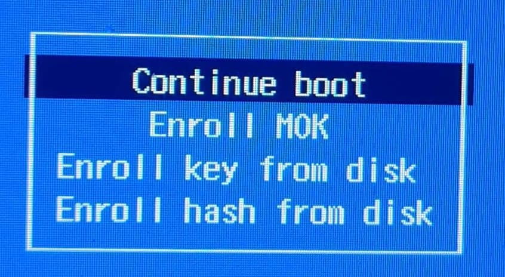
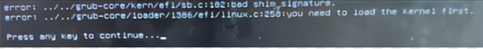

<!-- ANCHOR: METADATA -->
<!--{"url_discourse": "https://universal-blue.discourse.group/docs?topic=2742", "fetched_at": "2024-09-03 16:43:23.922705+00:00"}-->
<!-- ANCHOR_END: METADATA -->

# Secure Boot Information



>**Note**: Skip this section if Secure Boot is not enabled or unsupported with your hardware.

> **Attention**: Updating your BIOS may re-enable Secure Boot and you may have to follow **"Method B"** after updating it to resolve the black screen on boot complaining about loading the kernel first.

> **Warning**: The Steam Deck does **not** come with secure boot enabled and does not ship with any keys enrolled by default, do not enable Secure Boot on your Steam Deck unless you absolutely know what you're doing.

## Error message if key is **not** enrolled properly:



Follow **Method B** below to resolve this and move past the error message if you encounter it.

# **Method A**) During Installation Method (See Image Above)

A blue screen will appear giving the option to enroll the signed keys after leaving the Bazzite installer.

`Enroll MOK` if you have secure boot enabled.   If prompted to enter a password, then **enter**:
```command
universalblue
```

Otherwise `Continue boot` if you have Secure Boot disabled or if it is not supported with your hardware.

# **Method B**) After Installation Method

>**ATTENTION**: Disable Secure Boot before doing this, and then re-enable it after enrolling the key.

If you have already installed Bazzite then **enter this command in a host terminal**: 
```
ujust enroll-secure-boot-key
``` 
If prompted to enroll the required key, then **enter the password in the host terminal**: 
```command
universalblue
``` 

You can now turn Secure Boot back on in the BIOS.

**If you're rebasing from a Fedora Atomic Desktop image and use Secure Boot, then follow our [README](https://github.com/ublue-os/bazzite/blob/main/README.md#secure-boot)**.