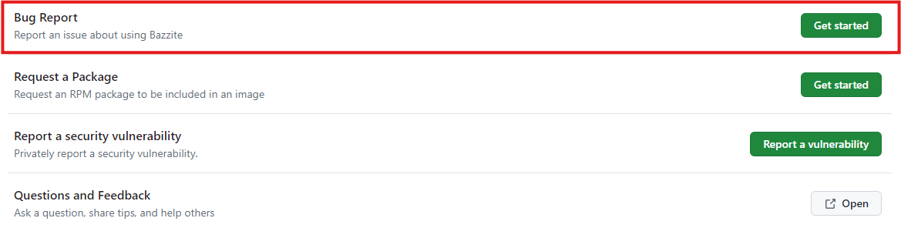
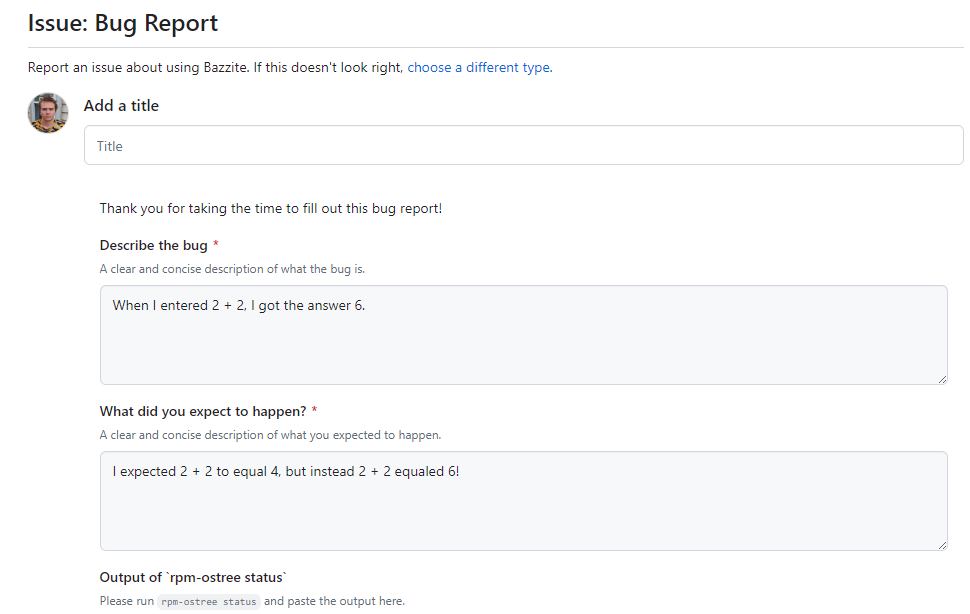

<!-- ANCHOR: METADATA -->
<!--{"url_discourse": "https://universal-blue.discourse.group/docs?topic=3402", "fetched_at": "2024-09-03 16:43:15.937921+00:00"}-->
<!-- ANCHOR_END: METADATA -->

# Submit bug reports in the appropriate place
Report bugs experienced with Bazzite in our [**issue tracker**](https://github.com/ublue-os/bazzite/issues)!  We discourage reporting bugs in the Discourse forums since reports can get lost or may not be viewed by Bazzite contributors as often as the issue tracker.

# Before submitting an issue

**Read how to file an issue properly before proceeding**:
https://universal-blue.discourse.group/docs?topic=1470

## Bazzite Issue Template Walkthrough







## Update Bazzite before reporting

Sometimes bugs are fixed during upgrades, so try updating and rebooting your device before submitting a report to see if the issue still persists between updates.

**Read how to update Bazzite for your device**:
https://universal-blue.discourse.group/docs?topic=2637

## Make sure to attach system logs
Open a host terminal and **enter**:
```
ujust device-info
```
Attach the link that it outputs for system logs.

### Experience system crashes?
```command
ujust logs-last-boot
```

<hr>

[**<-- View all Bazzite documentation**](https://docs.bazzite.gg)