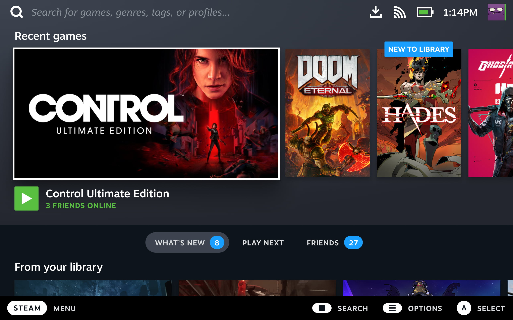

# General Information

> **For Handheld PC users only**: View our [Handheld Wiki](https://universal-blue.discourse.group/docs?topic=1038) for post-installation setup, workarounds, and known issues on handheld hardware.



## What is Steam Gaming Mode?

<iframe width="560" height="315" src="https://www.youtube-nocookie.com/embed/zXK1CXUyzXQ?si=STSArjoHCZ1kcFke" title="YouTube video player" frameborder="0" allow="accelerometer; autoplay; clipboard-write; encrypted-media; gyroscope; picture-in-picture; web-share" referrerpolicy="strict-origin-when-cross-origin" allowfullscreen></iframe>

**Steam Deck UI Tour by [Linux For Everyone](https://www.youtube.com/@LinuxForEveryone)**

Bazzite utilizes Steam Gaming Mode by [forking ChimeraOS’s `gamescope-session` ](https://github.com/KyleGospo/gamescope-session) and modifying it to fit the needs of our operating system. Steam Gaming Mode is also referred to as "gamepadUI" and "gamescope-session" but Bazzite documentation will usually refer to it as "Steam Gaming Mode" most of the time.

Steam Gaming Mode is what SteamOS on the Steam Deck is built around. A simple interface that is controller-friendly built around Steam's "Big Picture Mode" UI/UX. The minimal session only runs the bare minimum in the background, so most of the hardware resources is going towards the game being played. [Gamescope](https://github.com/ValveSoftware/gamescope) is the main ingredient in Steam Gaming Mode which gives users options to set a framerate cap, resolution scaling options, etc.

## What are the HTPC/Handheld Images?

> **Note**: The Steam beta client is **not** supported, please revert to the stable client before reporting issues.

Bazzite for Steam Deck hardware, Home Theater PC setups, and other Handheld PCs like the Lenovo Legion Go and Asus ROG Ally.

It is intended to be a controller-friendly environment and give users a "console-like" experience similar to SteamOS for the Steam Deck. It is intended for both handhelds and home theatre PC setups. Bazzite is similar to SteamOS by sharing many packages that SteamOS includes, so it is ready to game as soon the installation process is finished.

This documentation may not cover specific areas with the assumption that the user is already aware of SteamOS and how it works. If you are unfamiliar with something that cannot be found in our [documentation](https://docs.bazzite.gg), then research your specific question with "SteamOS" or "Steam Deck" as keywords in your search. Otherwise, ask your question on our [forums](https://universal-blue.discourse.group/c/bazzite/5) or [Discord](https://discord.gg/f8MUghG5PB).

<hr>

# Common Questions & Issues for Steam Gaming Mode

## How do I open the on-screen keyboard?

> **Note**: Steam must be running to access the keyboard.

- By default it is bound to the <kbd>Steam</kbd> + <kbd>X</kbd> on the Steam Deck.
- For other handhelds it may require turning on Desktop Controls and configuring it manually.
  - After that it is usually a combination of <kbd>X</kbd> (or equivalent) + one of the specific buttons your handheld has and it may also not be configured for your device out of the box.

## Update and Changelog Inaccuracy

### Steam Gaming Mode

The update indicator is not accurate and will most likely look it's stuck at "99%" for a long time. This is due to the update component not containing a live progress indicator, so it cannot hook into Steam Gaming Mode properly. After a while, the update progress bar will appear done and ask for a reboot.

### Desktop Mode

In Desktop Mode, run our _System Update_ tool for an accurate update visual if you are unsure if your system has actually updated properly in Gaming Mode. When the update has finished, it will output what has completed successfully. Alternatively, open a host terminal and **enter**:

```command
ujust update
```

### Changelog

The changelog is specifically for SteamOS by Valve, so the upgrade for Bazzite may not apply. Check out our [newsletters](https://universal-blue.discourse.group/docs?topic=2252) for major changes and features. If you want to see the patch notes in real time, check the newest [commits](https://github.com/ublue-os/bazzite/commits/main) on Github.

View a changelog to the next update in the terminal by **entering**:

```
ujust changelogs
```

## How do I access GRUB?

[GRUB](https://www.gnu.org/software/grub/manual/grub/grub.html#Overview) is hidden by default.

Keep in mind, other handhelds and controllers may not be able to unhide GRUB without a physical keyboard connected, but a `ujust` command can be performed to unhide it permanently.

Enter this command in the terminal to have it appear every boot:

```
ujust configure-grub
```

Select "unhide" to have GRUB appear on boot.

> View the [Rollback guide](https://universal-blue.discourse.group/docs?topic=2644) for more information.

## How do I open the Quick Access Menu (QAM) with a physical keyboard?

<kbd>Ctrl</kbd>+<kbd>2</kbd>

## Change physical keyboard layout for Steam Gaming Mode

https://universal-blue.discourse.group/docs?topic=816

## Why do specific Decky Loader plugins not function on Bazzite?

- Bazzite does not provide the functionality.
  - [PauseGames](https://github.com/popsUlfr/SDH-PauseGames) requires a swapfile while Bazzite utilizes zram for example.

## How do I specify the correct monitor for Gaming Mode to use? (HTPC only)

Go into desktop mode and open `ptyxis` our terminal and run

```command
mkdir ~/.config/environment.d
nano ~/.config/environment.d/10-gamescope-session.conf
```

add this to the file:
`OUTPUT_CONNECTOR=DP-1`
change `DP-1` to the correct output.
You can find your display outputs on KDE using the command

```
kscreen-doctor -o
```

You can find your display outputs in GNOME using this command

```
gnome-randr
```

Save with <kbd>CTRL</kbd> + <kbd>X</kbd> then pressing <kbd>Y</kbd> followed by <kbd>ENTER</kbd>

## How do I specify which GPU that Steam Gaming Mode should use?

1. Open a TTY session with an **external physical keyboard** using this **keyboard combination**:
   <kbd>Ctrl</kbd>+<kbd>Alt</kbd>+<kbd>F4</kbd>

```command
export-gpu
```

**Alternatively**, in Desktop Mode, enter in a host terminal:

```
/usr/bin/export-gpu
```

2. Select the GPU to use for Steam Gaming Mode.

## How do I use SteamDeckGyroDSU on hardware that isn't the Steam Deck?

You cannot use SteamDeckGyroDSU outside of the Steam Deck, but you can try disabling Steam Input and it _may_ work depending on your hardware and use case.

## How do I disable certain "Steam Deck" features that conflict with my setup?

**Scenarios**:

- _Example 1_: Keyboard and mouse is not working for this title.
- _Example 2_: The game's launcher for adjusting video settings or adding mods does not launch.
- _Example 3_: Certain features/options are not available for Steam Deck.

Open the game's properties on Steam and **enter this launch option**:

```command
SteamDeck=0 %command%
```

## Stuck at the Bazzite logo

https://www.youtube.com/watch?v=gE1ff72g2Gk

> **Attention**: Try rebooting your device first before proceeding with the next steps.

1.  Resolve this by opening a TTY session with an **external physical keyboard** using this **keyboard combination and entering this command**:
    <kbd>Ctrl</kbd>+<kbd>Alt</kbd>+<kbd>F4</kbd> and `mv ~/.local/share/Steam ~/.local/share/Steam1`
2.  This command will rename the `Steam` directory to `Steam1`, and it will force Steam to reinitialize and create a new directory
3.  You can move your games from the renamed `Steam1` directory to the new `Steam` directory if you had any installed previously on your internal storage
4.  Exit the TTY session by entering this **keyboard combination**: <kbd>Ctrl</kbd> + <kbd>Alt</kbd> + <kbd>F2</kbd>

## "Something went wrong while displaying this content" Error

This is most likely due to a broken Decky Loader plugin you have installed. The easiest fix is to uninstall the broken plugin. CSS Loader themes can also cause this issue.

## Audio output not working (Default Device)

> This issue happens usually with HDMI TV audio.

Go into Desktop Mode and into the system settings to adjust the sound settings. Disable devices that do not match the sound output that you're using. An example of this is disabling all the things that aren't HDMI for your TV audio.

## I lost my "Return to Gaming Mode" shortcut

You can restore this shortcut by creating a text file called `Return.desktop` and adding these specific lines to it:

### KDE

```file
[Desktop Entry]
Name=Return to Gaming Mode
Exec=qdbus org.kde.Shutdown /Shutdown org.kde.Shutdown.logout
Icon=steamdeck-gaming-return
Terminal=false
Type=Application
StartupNotify=false
```

### GNOME

```file
[Desktop Entry]
Name=Return to Gaming Mode
Exec=gnome-session-quit --logout --no-prompt
Icon=steamdeck-gaming-return
Terminal=false
Type=Application
StartupNotify=false
```

Save it and place it in the `Desktop` directory.

<hr>

# Valve's Official SteamOS Guide

> **Note**: Not all of the information will be accurate in regards to Bazzite.

https://help.steampowered.com/en/faqs/view/7DD4-C618-182E-0E49

<hr>

**See also**: [Gaming Guide](https://universal-blue.discourse.group/docs?topic=31)

<-- [**View all Bazzite documentation**](https://universal-blue.discourse.group/docs?topic=561)
