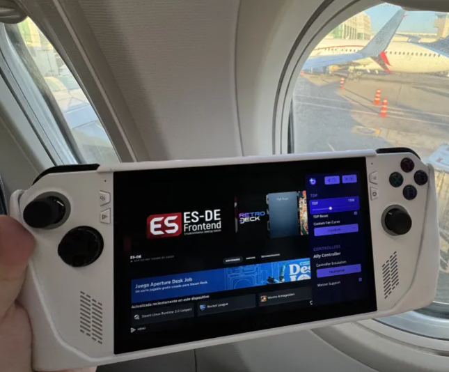
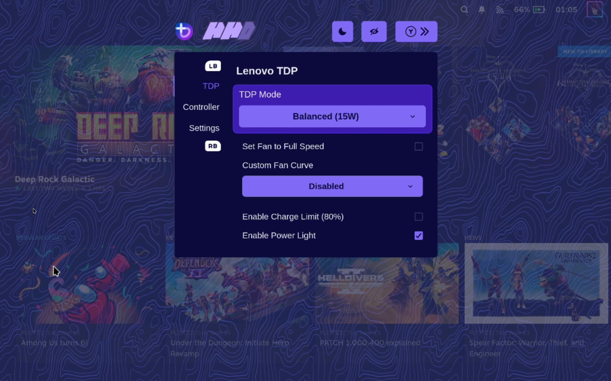
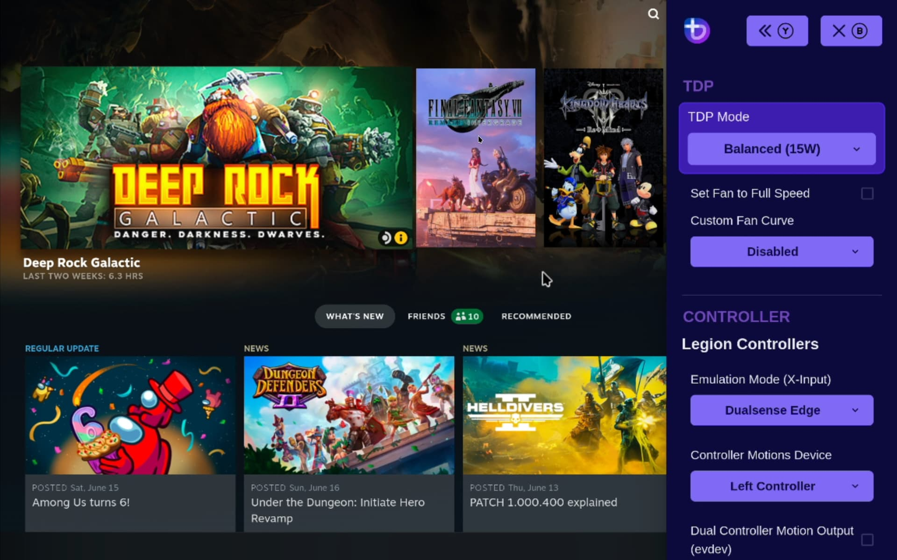
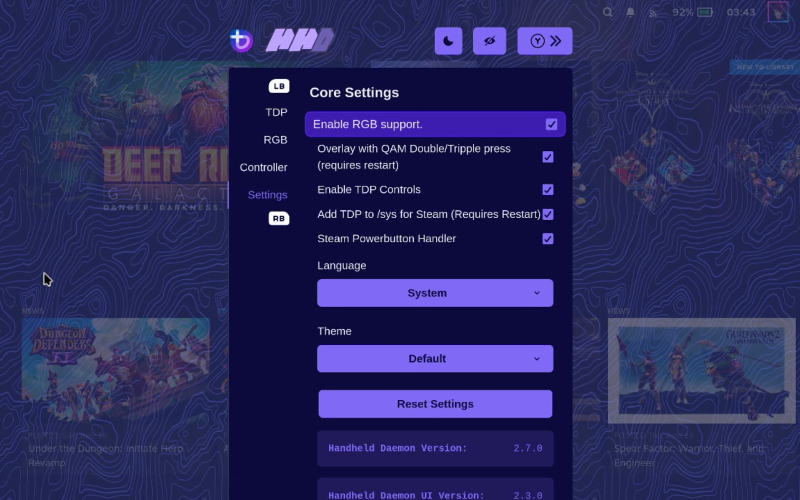
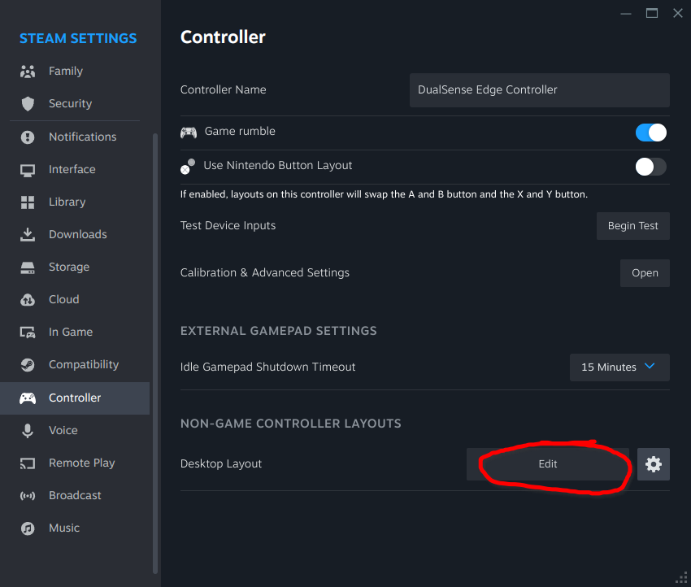
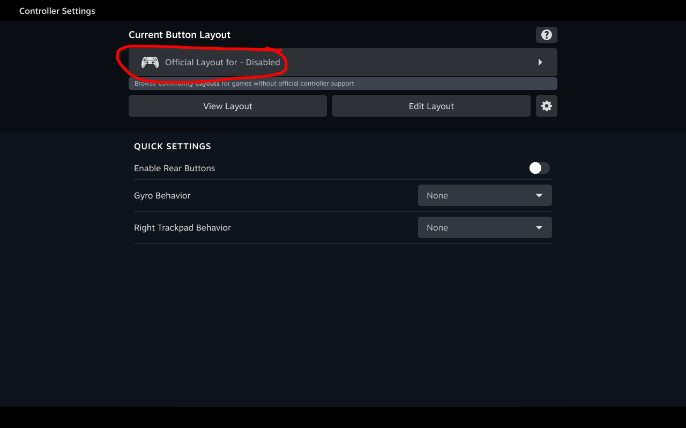
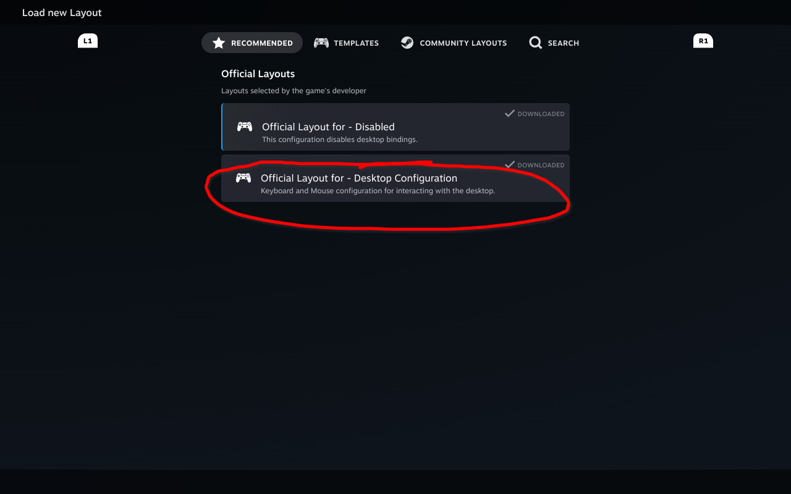

<!-- ANCHOR: METADATA -->
<!--{"url_discourse": "https://universal-blue.discourse.group/docs?topic=2414", "fetched_at": "2024-09-03 16:43:21.670173+00:00"}-->
<!-- ANCHOR_END: METADATA -->

# ASUS ROG Ally / ASUS ROG Ally X



**Status**: Gold

## Installing Bazzite

Read the [**Installing Bazzite on Handheld PCs documentation**](https://ublue-os.github.io/bazzite/General/Installation_Guide/Installing_Bazzite_for_Handheld_PCs/).

## Post-Installation Setup

- Complete the Bazzite Portal
- Login to Steam
- Reboot device
- Configure the HHD Overlay by opening it with the QAM button
- Virtual keyboard is Steam's keyboard, but needs to be setup in Steam's settings in Desktop Mode (See "Desktop Controls" section below)
   - There is **no default keybinding for Steam's on-screen keyboard** (Remap it to <kbd>**X**</kbd> or whatever you prefer)
- Holding the Armoury Crate button (on the side) allows you to switch to Mouse Mode
- Enable the Steam Power Button Handler setting in Handheld Daemon

## Optional Tweaks

- Adjust RGB with Steam Gaming Mode in Handheld Daemon
- Adjust the scaling of the UI in the Display Settings
- Set a charge limit in HHD with Handheld Daemon
- Install Decky + the [CSS Loader plugin](https://deckthemes.com/download/deck) and then in Desktop Mode, open the "Terminal" application and enter:
```
ujust install-hhd-controller-glyph-theme
``` 

## Workarounds / Known Issues

- [Status of CPU Boost on Bazzite](https://github.com/aarron-lee/SimpleDeckyTDP/blob/main/README.md#are-there-cpu-boost-controls)
  - Disable CPU boost to avoid excess power usage and other issues.
- Changing A/C power sometimes leads to a stuck TDP.
- Some users report that "Auto UMA" in the bios can cause crashes in some games. 
  - If you encounter this, then try setting the VRAM in bios to **4GB** or **8GB**.
- LED is on max brightness by default and cannot be changed on any other operating system outside of Windows.
  - This is tied to the firmware.
  - This also affects when the ally is charging and sleeping.
- The Ally does **not support** button holding for the Steam or QAM buttons.
  - Steam Input's chords do not work by default.
    - Swapping the Start/Select button(s) is a workaround.
- Suspend can break if SMT is disabled
- Fingerprint driver does not work.
- Storage shows duplicate drives.
  - This is a visual bug, do **not** attempt to format!
- Rainbow RGB on the original ROG Ally that can affect Windows even after Bazzite is remove
- Turning on the wake animation when resuming from sleep causes the device to act erratically.
  - No controls outside of Steam.
  - Steam's top and bottom panels missing.

<hr>

# Additional Information

This applies to most handhelds running Bazzite.

## TDP Controls



There are a few options for TDP Controls that work with Bazzite:

* The [HHD-overlay](https://github.com/hhd-dev/hhd/blob/master/readme.md) supports TDP controls.
  * Also has a desktop app that is pre-installed, look for the Handheld Daemon app in Desktop Mode.
* Steam Quick Access Menu TDP limit (part of Steam Gaming Mode) 
* [SimpleDeckyTDP](https://github.com/aarron-lee/SimpleDeckyTDP) supports TDP, GPU, Power Governor, and among other settings.
  * Also has a [graphical application](https://github.com/aarron-lee/SimpleDeckyTDP-Desktop), but needs to be manually installed.

## How do I open the HHD Overlay?






Press, hold, or double-tap the Quick Access Menu button.

>**Note**: ASUS ROG Ally does not support **holding** for the QAM button!

## Controller Information

For most handheld hardware, besides the Steam Deck, emulation of a DualSense controller is used for full functionality. Double tap or hold the side menu button to access settings for controller emulation including switching to an Xbox controller with reduced functionality.

If your device has paddles, you will want to use the DualSense Edge controller. It’s disabled by default because some games do not map it correctly.

Some games and emulators may need Steam Input **disabled** to work correctly with your controls.

### Desktop Controls

Desktop Mode Controller Layout:  It may not exist by default if Steam doesn't setup your handheld controller properly.  This can be fixed in Steam's controller settings.







Make sure to **apply** the desktop controls when you select them.

## Force reboot device to prevent drive corruption if Steam crashes
>**Note**: This is only for the ASUS ROG Ally and Lenovo Legion Go.

Hold down the "**select**" button on your device to force a reboot. This feature can be disabled in the overlay settings.

<hr>

# Contributing

This page and all of the links to each specific handheld are **wikis**, edit it to add any relevant information you may have regarding the handheld and your experience with Bazzite on it.  Make sure to follow proper [documentation guidelines](https://universal-blue.discourse.group/docs?topic=890) and [contributing guidelines](https://universal-blue.discourse.group/docs?topic=81) before adding any edits.

**See also**: [Steam Gaming Mode Overview](../Steam_Gaming_Mode.md)

**<-- Back to [Handheld Wiki](./index.md)**
