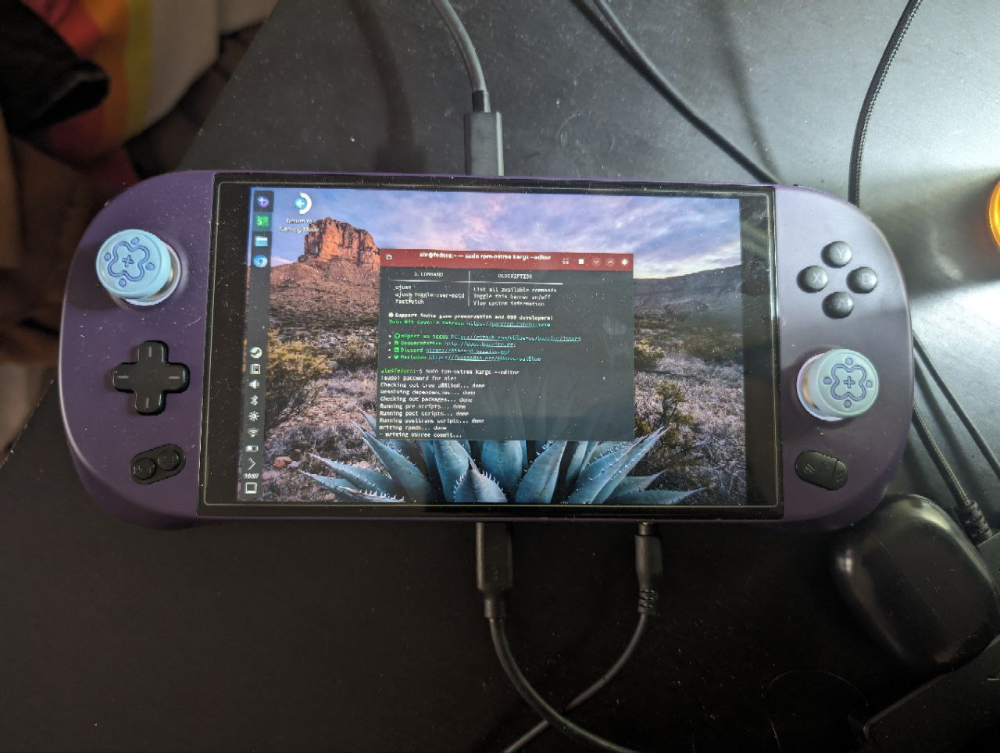

<!-- ANCHOR: METADATA -->
<!--{"url_discourse": "https://universal-blue.discourse.group/docs?topic=2417", "fetched_at": "2024-09-03 16:43:20.646543+00:00"}-->
<!-- ANCHOR_END: METADATA -->

# Ayaneo Geek 1S


**Status**: Silver

**You will need this command for functional HHD**:
```command
sudo systemctl enable --now hhd@$(whoami)
```
## Post-Installation Setup

- Complete the Bazzite Portal
- Login to Steam
- Reboot device
- Configure the HHD Overlay by opening it with QAM button
-  Virtual keyboard is Steam's keyboard, but needs to be setup in Steam's settings in Desktop Mode (See "Desktop Controls" section below)
- HHD's support of both LEDs and Gyroscope is fine out of the box (with bmi260 from [ublue-os/akmod].

## Workarounds / Known Issues
- Screen rotation is fixed with `rpm-ostree kargs --append-if-missing=video=eDP-1:panel_orientation=right_side_up` or editing the kernel command line with `rpm-ostree kargs --editor`.
- Audio driver does  work but needs to adjusted to support the 3.5mm jack.
  - Either install [this rpm package](https://drive.google.com/drive/folders/1ShnESXQ1aFQjbe0mVW5b6VBrfrgDA2O6?usp=sharing) that was created using [this guide](https://www.reddit.com/r/Fedora/comments/wir3cq/guide_adding_custom_files_to_the_root_filesystem/).
  - Alternatively, since ALC269VB is an audio chipset that has been around for years, it just need its pins to be rerouted with `hdajackretask` (part of fedora's alsa-tools) package. (You basically need to reroute the auto-generated "green headset" and "black headset" devices to "Channel 30 & 31").
  - External audio works over both HDMI and eGPU.
- **Suspend does not work without a workaround**!
  - see suspend workaround [here](https://universal-blue.discourse.group/t/ayaneo-handheld-compatibility/2417#p-5599-suspend-workaround-5)
- VRAM size option is missing from BIOS as it's controlled by AYASPACE application under windows. 

## External Graphics:

- eGPU Thunderbolt 3/4 over USB4 is supported.  USB4 enclosure needs proper testing but there is no reason to suspect it should not work.
  - **AMD**: 
      - Automatic switch at boot with [all-ways-egpu](https://github.com/ewagner12/all-ways-egpu/tree/main) works fine using method 2 and 3 at boot, unfortunately method 1 is not supported but seems to be related to Steam Gaming Mode.
        - The script needs to be installed with [Steam Deck/User Installation](https://github.com/ewagner12/all-ways-egpu/tree/main?tab=readme-ov-file#steam-deckuser-installation).
    - In order to boot with eGPU attached you need to add a kernel parameter, seems to be related to [this kernel issue](https://lore.kernel.org/lkml/20240415163056.GP223006@ziepe.ca/).  There are many other issues opened and according to [this](https://gitlab.freedesktop.org/drm/amd/-/issues/3182) it could be potentially fixed in kernel 6.9. As a temporary solution booting with eGPU connected works when launching the command `rpm-ostree kargs --append-if-missing=video=pci=nommconf` or editing the kernel command line with `rpm-ostree kargs --editor`.
  - **NVIDIA**: currently untested and probably doesn't work.

### Suspend workaround

> Thanks to ChimeraOS for the [original suspend workaround](https://github.com/ChimeraOS/chimeraos/wiki/Community-Guides#enabling-modern-sleep-on-7000-series-amd-hardware), and SteamFork for the [updated writeup](https://wiki.steamfork.org/troubleshooting/#enabling-modern-sleep-on-7000-series-amd-based-devices) of this workaround.

7000 series and newer AMD APU's no longer support S3 sleep, and unfortunately many handheld manufacturers don't configure their firmware to take advantage of modern standby by default. Fortunately, modern standby can be configured manually with Smokeless UMAF.

> **Warning!**
>
> The Smokeless UMAF tool has been known to brick devices even by reading values in the BIOS.
>
> **There is a good chance that setting something incorrectly in the BIOS with this tool will brick your device and void your warranty.**
>
> Bazzite takes no responsibility for any harm caused by following these steps. By following this guide you acknowledge that you are solely responsible for the outcome.

#### Modern Standby Enablement Methods

* Enter your bios/firmware settings to see if you already have the options listed in the steps for the [Enabling Modern Standby](https://universal-blue.discourse.group/t/ayaneo-handheld-compatibility/2417#p-5599-enabling-modern-standby-7) section of this guide. If so, skip the rest of this section.
* If the options are not available, follow the next few steps to create boot media.
* Format a USB stick with FAT32.
* Download [Smokeless UMAF](https://github.com/DavidS95/Smokeless_UMAF/raw/main/UMAF_BETA.zip).
* Extract `UMAF_Beta.zip` and copy the contents into the root of the usb stick.
* Boot your device and select the USB stick from the boot menu.
* Navigate to the `Front Page` tab and select `Device Manager`.

#### Enabling Modern Standby

1. Select `AMD PBS` then `Power Saving Configurations`.
2. Under `S3/Modern Standby Support` change the entry to `Modern Standby` (or `Modern Standby Enable` on some devices).
3. Under `Modern Standby Type` select `Modern Standby + S0i2 + S0i3`.
4. Save changes and exit, allowing the device to reboot.

Note: The first restart after this change may take longer than usual.

## External Resource

Check out the [original thread](https://universal-blue.discourse.group/t/ayaneo-geek-1s-2s-linux-bazzite-support-is-already-almost-there-lets-add-them-to-the-officially-supported-devices/1046) for more information and updates on this device.

<hr>

# TDP Controls


There are a few options for TDP Controls that work with Bazzite:

* The [HHD-overlay](https://github.com/hhd-dev/hhd/blob/master/readme.md) supports TDP controls.
  * Also has a desktop app that is pre-installed, look for the Handheld Daemon app in Desktop Mode.
* [SimpleDeckyTDP](https://github.com/aarron-lee/SimpleDeckyTDP) supports TDP, GPU, Power Governor, and among other settings.
  * Also has a [graphical application](https://github.com/aarron-lee/SimpleDeckyTDP-Desktop), but needs to be manually installed.
* [PowerControl](https://github.com/mengmeet/PowerControl) supports TDP, GPU, and fan controls on select devices.

# How do I open the HHD Overlay?


Press, hold, or double-tap the Quick Access Menu button.

# Controller Information

For most handheld hardware, besides the Steam Deck, emulation of a DualSense controller is used for full functionality. Double tap or hold the side menu button to access settings for controller emulation including switching to an Xbox controller with reduced functionality.

If your device has paddles, you will want to use the DualSense Edge controller. It’s disabled by default because some games do not map it correctly.

Some games and emulators may need Steam Input **disabled** to work correctly with your controls.

## Desktop Controls

Desktop Mode Controller Layout:  It may not exist by default if Steam doesn't setup your handheld controller properly.  This can be fixed in Steam's controller settings.


Make sure to **apply** the desktop controls when you select them.

<hr>

# Contributing

This page is a **wiki**, edit it to add any relevant information you may have regarding the handheld and your experience with Bazzite on it.  Make sure to follow proper [documentation guidelines](https://universal-blue.discourse.group/docs?topic=890) and [contributing guidelines](https://universal-blue.discourse.group/docs?topic=81) before adding any edits.

**See also**: [Steam Gaming Mode Overview](../Steam_Gaming_Mode.md)

**<-- Back to [Handheld Wiki](./index.md)**