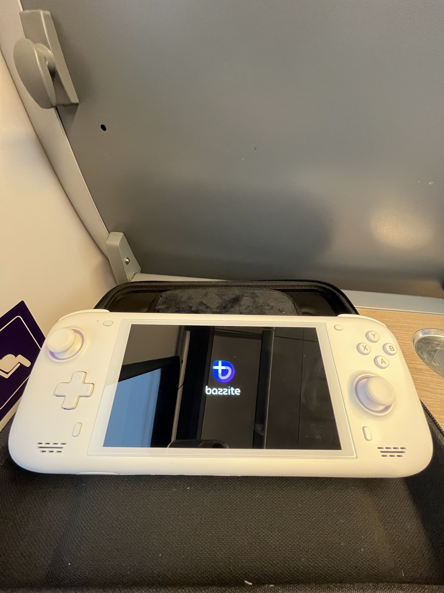
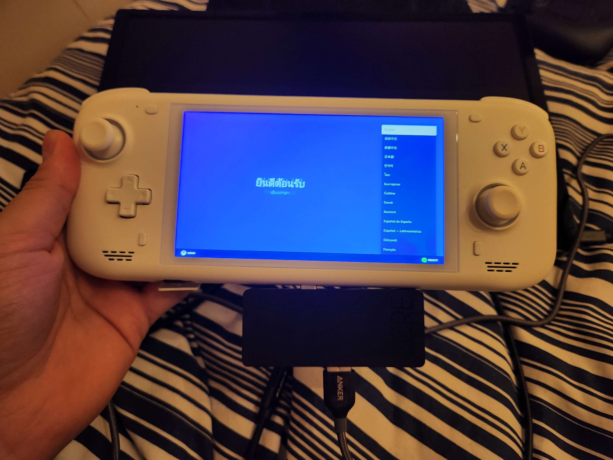
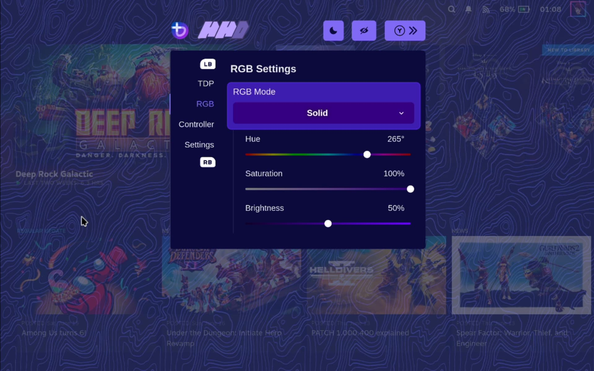

<!-- ANCHOR: METADATA -->
<!--{"url_discourse": "https://universal-blue.discourse.group/docs?topic=2416", "fetched_at": "2024-09-03 16:43:21.928758+00:00"}-->
<!-- ANCHOR_END: METADATA -->

# Ayn Loki Max



**Status**: Platinum

## Post-Installation Setup

- Complete the Bazzite Portal
- Login to Steam
- Reboot device
- Configure the HHD Overlay by opening it with QAM button
-  Virtual keyboard is Steam's keyboard, but needs to be setup in Steam's settings in Desktop Mode (See "Desktop Controls" section below)

## Optional Tweaks

- Adjust RGB with Steam Gaming Mode under `Settings > Controller >  Calibration & Advanced > LED Settings` or in Handheld Daemon
- Adjust the scaling of the UI in the Display Settings
- Set a charge limit in HHD with Handheld Daemon
- Install Decky + the [CSS Loader plugin](https://deckthemes.com/download/deck) and then in Desktop Mode, open the "Terminal" application and enter:
```
ujust install-hhd-controller-glyph-theme
``` 

## Workarounds / Known Issues

- Games can sometimes default to 800p resolution.
  - * Manually change the resolution per game in the `Steam Settings > Properties > Game Resolution` to either "Native" or other higher resolutions.
- Back buttons are hard mapped to L3 and R3.
  - This is also an issue on Windows.

# Ayn Loki Mini Pro



**Status**: Silver

## Post-Installation Setup

- Complete the Bazzite Portal
- Login to Steam
- Reboot device
- Configure the HHD Overlay by opening it with QAM button
-  Virtual keyboard is Steam's keyboard, but needs to be setup in Steam's settings in Desktop Mode (See "Desktop Controls" section below)

## Optional Tweaks

- Adjust RGB with Steam Gaming Mode under `Settings > Controller >  Calibration & Advanced > LED Settings` or in Handheld Daemon
- Adjust the scaling of the UI in the Display Settings
- Set a charge limit in HHD with Handheld Daemon
- Install Decky + the [CSS Loader plugin](https://deckthemes.com/download/deck) and then in Desktop Mode, open the "Terminal" application and enter:
```
ujust install-hhd-controller-glyph-theme
``` 

## Workarounds / Known Issues
- Games can sometimes default to 800p resolution.
  - * Manually change the resolution per game in the `Steam Settings > Properties > Game Resolution` to either `Native` or other higher resolutions.
- Audio driver does not currently work.
  - No internal audio in either Gaming Mode or Desktop Mode.
     - External audio is reported to have low sound quality.
- Rotation is wrong in Desktop Mode for KDE images.
- Mouse input may break in Desktop Mode.

<hr>

# TDP Controls


There are a few options for TDP Controls that work with Bazzite:

* The [HHD-overlay](https://github.com/hhd-dev/hhd/blob/master/readme.md) supports TDP controls.
  * Also has a desktop app that is pre-installed, look for the Handheld Daemon app in Desktop Mode.
* [SimpleDeckyTDP](https://github.com/aarron-lee/SimpleDeckyTDP) supports TDP, GPU, Power Governor, and among other settings.
  * Also has a [graphical application](https://github.com/aarron-lee/SimpleDeckyTDP-Desktop), but needs to be manually installed.

# How do I open the HHD Overlay?




Press, hold, or double-tap the Quick Access Menu button.

# Controller Information

For most handheld hardware, besides the Steam Deck, emulation of a DualSense controller is used for full functionality. Double tap or hold the side menu button to access settings for controller emulation including switching to an Xbox controller with reduced functionality.

If your device has paddles, you will want to use the DualSense Edge controller (**excluding the Ayn Loki**). It’s disabled by default because some games do not map it correctly.

Some games and emulators may need Steam Input **disabled** to work correctly with your controls.

## Desktop Controls

Desktop Mode Controller Layout:  It may not exist by default if Steam doesn't setup your handheld controller properly.  This can be fixed in Steam's controller settings.


Make sure to **apply** the desktop controls when you select them.

<hr>

# Contributing

This page is a **wiki**, edit it to add any relevant information you may have regarding the handheld and your experience with Bazzite on it.  Make sure to follow proper [documentation guidelines](https://universal-blue.discourse.group/docs?topic=890) and [contributing guidelines](https://universal-blue.discourse.group/docs?topic=81) before adding any edits.

**See also**: [Steam Gaming Mode Overview](https://universal-blue.discourse.group/docs?topic=37)

**<-- Back to [Handheld Wiki](https://universal-blue.discourse.group/docs?topic=1038)**