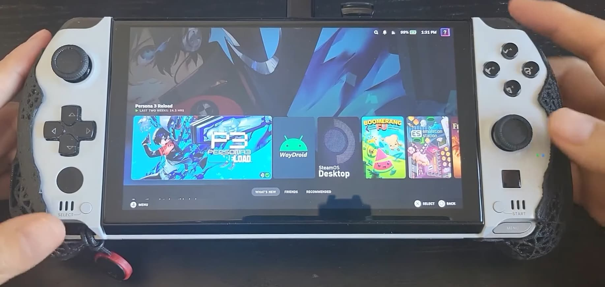
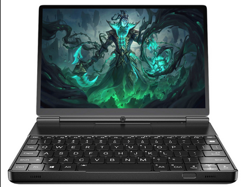
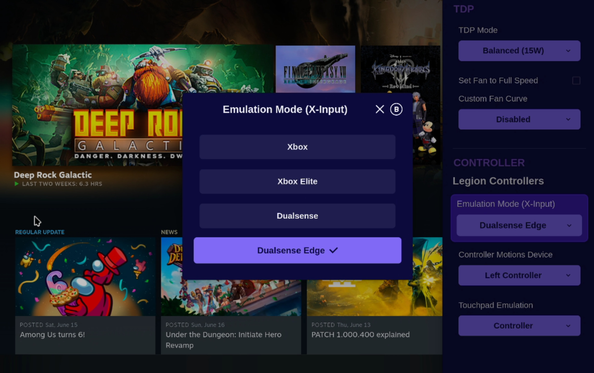

<!-- ANCHOR: METADATA -->
<!--{"url_discourse": "https://universal-blue.discourse.group/docs?topic=2418", "fetched_at": "2024-09-03 16:43:21.260488+00:00"}-->
<!-- ANCHOR_END: METADATA -->

# GPD Win 4




**Status**: Gold

## Post-Installation Setup

- Complete the Bazzite Portal
- Login to Steam
- Reboot device
- Configure the HHD Overlay by opening it with QAM button
-  Virtual keyboard is Steam's keyboard, but needs to be setup in Steam's settings in Desktop Mode (See "Desktop Controls" section below)
   - <kbd>Xbox</kbd> + <kbd>X</kbd> (This can be remapped)
    - GPD devices also have a physical switch you can toggle to enable a separate desktop/mouse mode.

## Optional Tweaks

- Adjust RGB with Steam Gaming Mode in Handheld Daemon
- Adjust the scaling of the UI in the Display Settings
- Set a charge limit in HHD with Handheld Daemon
- Install Decky + the [CSS Loader plugin](https://deckthemes.com/download/deck) and then in Desktop Mode, open the "Terminal" application and enter:
```
ujust install-hhd-controller-glyph-theme
``` 

## Workarounds / Known Issues

- Games can sometimes default to 800p resolution.
    - Manually change the resolution per game in the `Steam Settings > Properties > Game Resolution` to either `Native` or other higher resolutions.
- Fix controls and gyro after suspend-resume cycles (confirmed to work on both the 7840u and 6800u variants).
    - Run these [commands](https://github.com/aarron-lee/gpd-win-tricks/blob/df0cb72ee11cfd0ba30c8bcffe0e395b99b713d3/win4-gyro-suspend-fix/README.md) in a host terminal.
- Back buttons may need to be manually remapped before they are usable.
  - Watch this [video guide](https://www.youtube.com/watch?v=lnNfMY9kzjk) for a visual guide.

## External Resource

For more information, check out the [GPD Win Tips and Tricks guide](https://github.com/aarron-lee/gpd-win-tricks) which includes useful scripts for this handheld.

<hr>

# GPD Win Max 2




**Status**: Gold

## Post-Installation Setup
- Complete the Bazzite Portal
- Login to Steam
- Reboot device
- Configure the HHD Overlay by opening it with QAM button
-  Virtual keyboard is Steam's keyboard, but needs to be setup in Steam's settings in Desktop Mode (See "Desktop Controls" section below)
-  Virtual keyboard is Steam's keyboard, but needs to be setup in Steam's settings in Desktop Mode. (See "Desktop Controls" section below)
   - <kbd>Xbox</kbd> + <kbd>X</kbd> (This can be remapped)
    - GPD devices also have a physical switch you can toggle to enable a separate desktop/mouse mode
- Steam Gaming Mode **Display** settings that are recommended to be changed:
   - `Use Native Color Temperature` - Enabled

## Optional Tweaks

- Adjust RGB with Steam Gaming Mode in Handheld Daemon
- Adjust the scaling of the UI in the Display Settings
- Set a charge limit in HHD with Handheld Daemon
- Install Decky + the [CSS Loader plugin](https://deckthemes.com/download/deck) and then in Desktop Mode, open the "Terminal" application and enter:
```
ujust install-hhd-controller-glyph-theme
``` 

## Workarounds / Known Issues

- Suspend-resume works on the WM2 6800u model after disabling the fingerprint scanner, but 7840u and newer models have only partially working suspend-resume.
  - Read about the issue [here](https://gitlab.freedesktop.org/drm/amd/-/issues/3154) for details on suspend-resume issues for the newer WM2 devices.
- If you install your OS on an m2 2230 SSD in the secondary drive slot, it can cause suspend issues. 
  - You should install your OS onto the primary internal SSD only.
- Games can sometimes default to 800p resolution
    - Manually change the resolution per game in the `Steam Settings > Properties > Game Resolution` to either `Native` or other higher resolutions.
 - Gyro is non-functional.
 - Back buttons may need to be manually remapped before they are usable, 
   - Watch this [video guide](https://www.youtube.com/watch?v=lnNfMY9kzjk) for directions.

## External Resource

For more information, check out the [GPD Win Tips and Tricks guide](https://github.com/aarron-lee/gpd-win-tricks) which includes useful scripts for this handheld.

<hr>

# TDP Controls


There are a few options for TDP Controls that work with Bazzite:

* The [HHD-overlay](https://github.com/hhd-dev/hhd/blob/master/readme.md) supports TDP controls.
  * Also has a desktop app that is pre-installed, look for the Handheld Daemon app in Desktop Mode.
* [SimpleDeckyTDP](https://github.com/aarron-lee/SimpleDeckyTDP) supports TDP, GPU, Power Governor, and among other settings.
  * Also has a [graphical application](https://github.com/aarron-lee/SimpleDeckyTDP-Desktop), but needs to be manually installed.
* [PowerControl](https://github.com/mengmeet/PowerControl) supports TDP, GPU, and fan controls on select devices.

# How do I open the HHD Overlay?




Press, hold, or double-tap the Quick Access Menu button.

>**Note**: GPD devices do not support double-tapping the QAM button!

# Controller Information

For most handheld hardware, besides the Steam Deck, emulation of a DualSense controller is used for full functionality. Double tap or hold the side menu button to access settings for controller emulation including switching to an Xbox controller with reduced functionality.

If your device has paddles, you will want to use the DualSense Edge controller. It's disabled by default because some games do not map it correctly.

Some games and emulators may need Steam Input **disabled** to work correctly with your controls.

## Desktop Controls

Desktop Mode Controller Layout:  It may not exist by default if Steam doesn't setup your handheld controller properly.  This can be fixed in Steam's controller settings.


Make sure to **apply** the desktop controls when you select them.

<hr>

# Contributing

This page is a **wiki**, edit it to add any relevant information you may have regarding the handheld and your experience with Bazzite on it.  Make sure to follow proper [documentation guidelines](https://universal-blue.discourse.group/docs?topic=890) and [contributing guidelines](https://universal-blue.discourse.group/docs?topic=81) before adding any edits.

**See also**: [Steam Gaming Mode Overview](https://universal-blue.discourse.group/docs?topic=37)

**<-- Back to [Handheld Wiki](https://universal-blue.discourse.group/docs?topic=1038)**