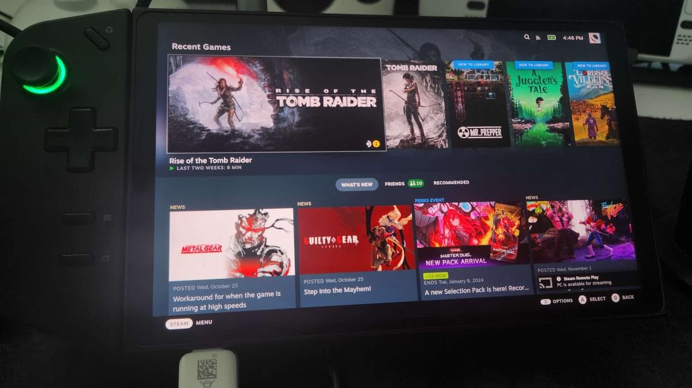

# Lenovo Legion Go [x]



**Status**: Platinum

## Post-Installation Setup

Open a host terminal and enter the following **commands**:

- Complete the Bazzite Portal
- Login to Steam
- Reboot device
- Configure the HHD Overlay by opening it with <kbd>Legion R</kbd>
- **Optional**: Adjust RGB with Steam Gaming Mode under `Settings > Controller >  Calibration & Advanced > LED Settings`

## Workarounds / Known Issues

- Games can sometimes default to 800p resolution.
  - Manually change the resolution per game in the `Steam Settings > Properties > Game Resolution` to either `Native` or other higher resolutions.
- Performance overlay might be reporting inaccurate power consumption.
- Adaptive/auto display brightness is currently broken.
  - Manual brightness slider in Steam's UI works without issues.
- BIOS and controller firmware **require** Windows to update them.
- Virtual keyboard is Steam's keyboard, but needs to be setup in Steam's settings in Desktop Mode. (See "Desktop Controls" section below)
  - <kbd>**Legion L**</kbd> + <kbd>**X**/**Square**</kbd> (This can be remapped)
- Try not to change the resolution in Desktop Mode!
  - Connecting to an external monitor may also cause issues.
    - If your screen doesn't display the correct output or looks grainy/noisy, then you will have to **ssh into it and enter this command**:

```command
mv ~/.config/kwinoutputconfig.json ~/.config/kwinoutputconfig.json.old
```

## BIOS Update Information

<https://universal-blue.discourse.group/docs?topic=3064>

## External Resource

For more information, check out the [Legion Go Tips and Tricks guide](https://github.com/aarron-lee/legion-go-tricks) which includes useful scripts for this handheld.

<hr>

# TDP Controls


There are a few options for TDP Controls that work with Bazzite:

- The [HHD-overlay](https://github.com/hhd-dev/hhd/blob/master/readme.md) supports TDP controls.
  - Also has a desktop app that is pre-installed, look for the Handheld Daemon app in Desktop Mode.
- [SimpleDeckyTDP](https://github.com/aarron-lee/SimpleDeckyTDP) supports TDP, GPU, Power Governor, and among other settings.
  - Also has a [graphical application](https://github.com/aarron-lee/SimpleDeckyTDP-Desktop), but needs to be manually installed.
- [PowerControl](https://github.com/mengmeet/PowerControl) supports TDP, GPU, and fan controls on select devices.

# How do I open the HHD Overlay?


Press, hold, or double-tap the Quick Access Menu button.

> **Example**: <kbd>Legion R</kbd> for the Lenovo Legion Go.

# Controller Information

For most handheld hardware, besides the Steam Deck, emulation of a DualSense controller is used for full functionality. Double tap or hold the side menu button to access settings for controller emulation including switching to an Xbox controller with reduced functionality.

If your device has paddles, you will want to use the DualSense Edge controller. It’s disabled by default because some games do not map it correctly.

Some games and emulators may need Steam Input **disabled** to work correctly with your controls.

## Desktop Controls

Desktop Mode Controller Layout: It may not exist by default if Steam doesn't setup your handheld controller properly. This can be fixed in Steam's controller settings.


Make sure to **apply** the desktop controls when you select them.

# Force reboot device to prevent drive corruption if Steam crashes

> **Note**: This is only for the ASUS ROG Ally and Lenovo Legion Go.

Hold down the "**select**" button on your device to force a reboot. This feature can be disabled in the overlay settings.

<hr>

# Contributing

This page is a **wiki**, edit it to add any relevant information you may have regarding the handheld and your experience with Bazzite on it. Make sure to follow proper [documentation guidelines](https://universal-blue.discourse.group/docs?topic=890) and [contributing guidelines](https://universal-blue.discourse.group/docs?topic=81) before adding any edits.

**See also**: [Steam Gaming Mode Overview](../Steam_Gaming_Mode/index.md)

**<-- Back to [Handheld Wiki](./)**
