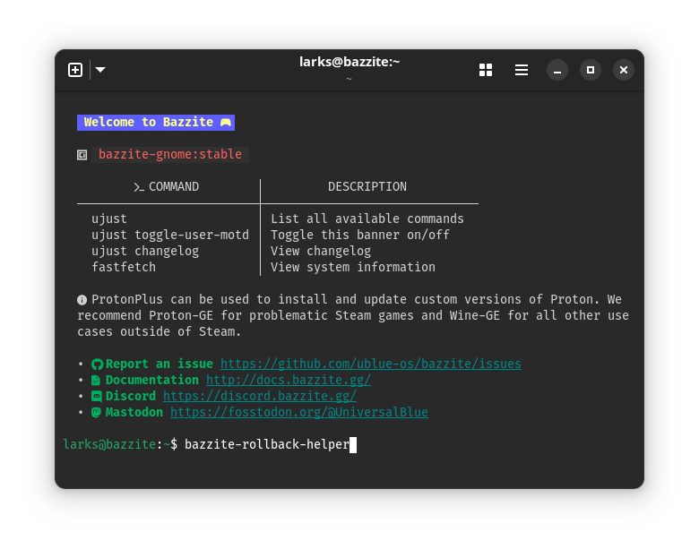

> Click the link under "**Full Documentation**" for more information on each topic.

# Updates

> Updates are automatic on Desktop images and manually done on Handheld/HTPC images, and both Bazzite variants upgrade everything at both a system-level and user-installed applications during the updating process.

**Full Documentation**:
<https://universal-blue.discourse.group/docs?topic=2637>

# Rollbacks

> Swap back to a previous system update if there are major issues after updating via the GRUB menu or the `rpm-ostree rollback` command.

**Full Documentation**:
<https://universal-blue.discourse.group/docs?topic=2644>

# Rebasing

> Rebase to Bazzite builds from the last 90 days, change Bazzite update channels, swap between the Desktop and Handheld/HTPC images, or move completely to a different Fedora Atomic Desktop image.

> **Important**: Do **not** rebase to a different desktop environment than the one you are currently using, please backup and reinstall instead.

**Full Documentation**:
<https://universal-blue.discourse.group/docs?topic=2646>

## Rollback Helper

> Utility to assist with rolling back and rebasing to older Bazzite images.

**Full Documentation**:
<https://universal-blue.discourse.group/docs?topic=2647>

