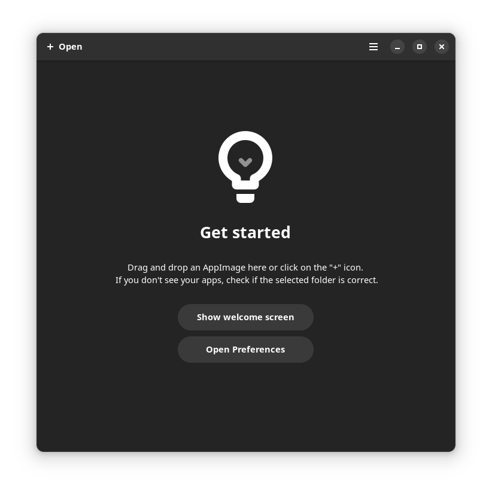

<!-- ANCHOR: METADATA -->
<!--{"url_discourse": "https://universal-blue.discourse.group/docs?topic=2641", "fetched_at": "2024-09-03 16:43:10.114605+00:00"}-->
<!-- ANCHOR_END: METADATA -->

>**Note**: AppImages may not be supported if rebasing to other Fedora Atomic Desktop images.

AppImage is a universal package format that attempts to bundle every dependency that an application needs into one portable file.  They can be installed by downloading any file with a `.AppImage` extension and then giving it executable permissions in the file's properties so the application can run properly. Like Windows executable files, they are usually found on the project's website to download.

# Gear Lever

Applications installed as an AppImage can integrate with your desktop and be managed with [Gear Lever](https://github.com/mijorus/gearlever) which is pre-installed on Bazzite.

# Project Website

https://appimage.org/

[**<-- Back to Installing and Managing Software on Bazzite**](https://universal-blue.discourse.group/docs?topic=35)