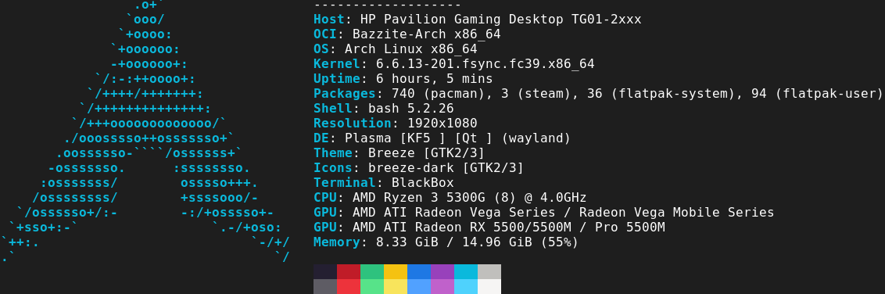
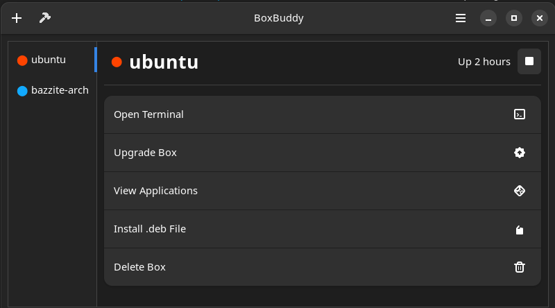

<!-- ANCHOR: METADATA -->
<!--{"url_discourse": "https://universal-blue.discourse.group/docs?topic=2640", "fetched_at": "2024-09-03 16:43:09.168054+00:00"}-->
<!-- ANCHOR_END: METADATA -->

## What is Distrobox?


Run other minimal variants of popular Linux distributions in Bazzite inside of a container, and access each distribution's packages without any of their dependencies and libraries affecting the host machine.

**Important Notes**:

- Containers are **not** virtual machines.
- Containers are intended to be **disposable** and may run into issues where they need to be recreated.
- Using this method to obtain software **requires knowledge of how traditional Linux operating systems install packages**.
  - Create a test container to familiarize yourself with basic Linux commands before diving in further.

Distrobox containers run sub-systems of other popular [Linux distributions](https://distrobox.it/compatibility/#containers-distros) with access to their package managers (`apt`, `dnf`, `pacman`, etc.) and their package formats (`.deb`/`.rpm`) and any additional repositories like the [AUR](https://aur.archlinux.org/).



**Linux Distribution Examples**:

| OS                                  | Package Manager    | Search for Packages                                                       |
| ----------------------------------- | ------------------ | ------------------------------------------------------------------------- |
| [Fedora][fedora]                    | [`dnf`][dnf]       | [Fedora Packages][fedora_pkgs] / [COPR Packages][copr]                    |
| [Arch Linux][arch]                  | [`pacman`][pacman] | [Arch Linux Packages][arch_pkgs] / [AUR Packages][aur_pkgs]               |
| [Debian][debian] / [Ubuntu][ubuntu] | [`apt`][apt]       | [Debian Packages][deb_pkgs] / [Ubuntu Packages][ubuntu_pkgs] ([PPA][ppa]) |
| [openSUSE][osuse]                   | [`zypper`][zypper] | [openSUSE Packages][osuse_pkgs]                                           |
| [Void Linux][void]                  | [`xbps`][xbps]     | [Void Linux Packages][void_pkgs]                                          |
| [Alpine Linux][alpine]              | [`apk`][apk]       | [Alpine Linux Packages][alpine_pkgs]                                      |

## Use Cases

Distrobox containers can be used for both **development environments** and **installing applications that are not available in any of the other installation methods** which can be exclusive to specific package managers.

### Distrobox Graphical Interface



Distrobox containers can be created and managed graphically with [BoxBuddy](https://github.com/Dvlv/BoxBuddyRS) which is pre-installed.

## Desktop Integration

Applications with a graphical user interface can integrate with your system with an application shortcut **entering this command inside of the container**:

```bash
distrobox-export --app <package>
```

> [Read Bluefin's documentation on how containers integrate with your system](https://docs.projectbluefin.io/bluefin-dx#pet-containers).

## Manually Create Pre-Configured Distrobox Containers

```command
ujust distrobox-assemble
```

Select the container that you want to use.

> **Advanced users**: Declare your own custom Distrobox containers following the [`distrobox-assemble` documentation](https://distrobox.it/usage/distrobox-assemble/).

### Entering The Container

Swap between different containers in your host with the terminal or alternatively **enter**:

```
distrobox enter <container>
```

### Removing Distrobox Containers

Delete containers graphically with BoxBuddy.

Alternatively, use the command line:

```command
distrobox stop <container_name>
```

```commmand
distrobox rm -f <container_name>
```

## Distrobox Video Guide

https://youtu.be/5m0YfIiypwA

## Project Website

https://distrobox.it/

<hr>

[**<-- Back to Installing and Managing Software on Bazzite**](https://universal-blue.discourse.group/docs?topic=35)

[fedora]: https://fedoraproject.org/
[dnf]: https://docs.fedoraproject.org/en-US/quick-docs/dnf/
[fedora_pkgs]: https://packages.fedoraproject.org/index-static.html
[copr]: https://copr.fedorainfracloud.org/
[arch]: https://archlinux.org/
[pacman]: https://wiki.archlinux.org/title/Pacman
[arch_pkgs]: https://archlinux.org/packages/
[aur_pkgs]: https://aur.archlinux.org/packages?SB=l&SO=d
[debian]: https://www.debian.org/
[ubuntu]: https://ubuntu.com/
[apt]: https://ubuntu.com/server/docs/package-management
[deb_pkgs]: https://packages.debian.org/stable/
[ubuntu_pkgs]: https://packages.ubuntu.com/
[ppa]: https://launchpad.net/ubuntu/+ppas
[osuse]: https://get.opensuse.org/
[zypper]: https://documentation.suse.com/smart/systems-management/html/concept-zypper/index.html
[osuse_pkgs]: https://search.opensuse.org/packages/
[void]: https://voidlinux.org/
[xbps]: https://docs.voidlinux.org/xbps/index.html
[void_pkgs]: https://voidlinux.org/packages/
[alpine]: https://www.alpinelinux.org/
[apk]: https://wiki.alpinelinux.org/wiki/Alpine_Package_Keeper
[alpine_pkgs]: https://pkgs.alpinelinux.org/packages
