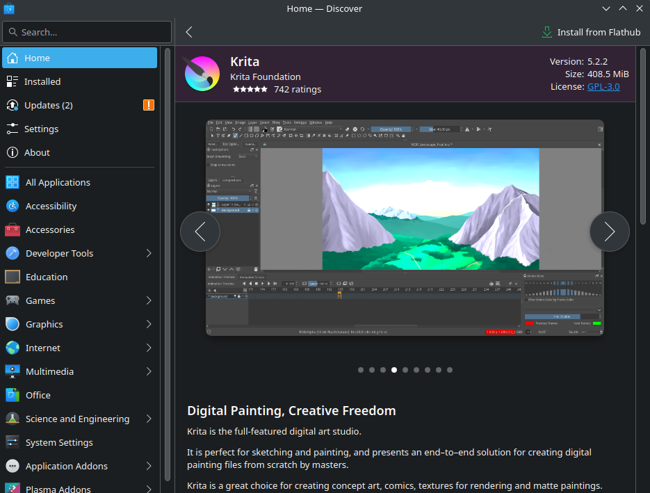
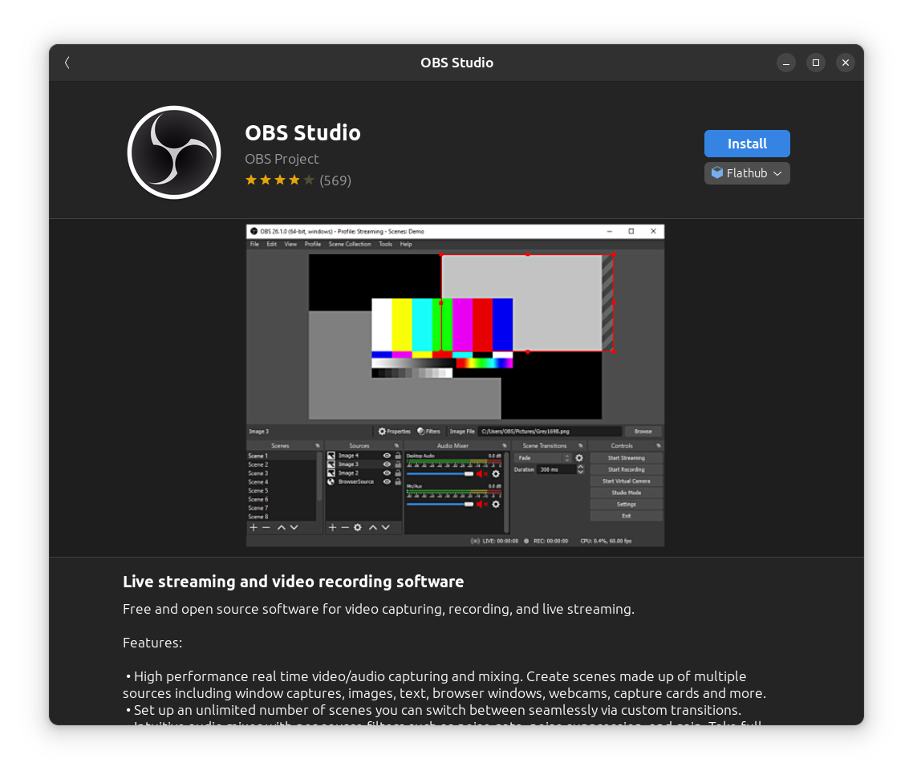
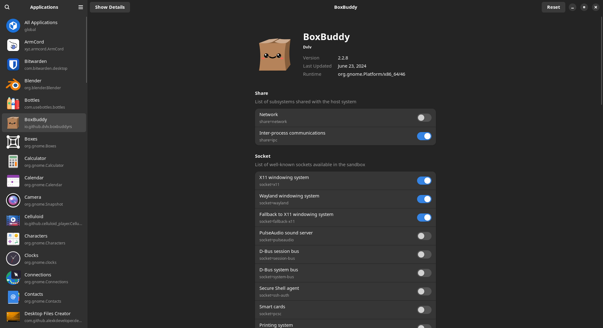
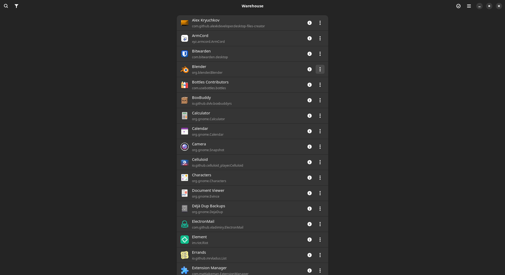

<!-- ANCHOR: METADATA -->
<!--{"url_discourse": "https://universal-blue.discourse.group/docs?topic=2636", "fetched_at": "2024-09-03 16:43:08.564302+00:00"}-->
<!-- ANCHOR_END: METADATA -->

# What is Flatpak?


Flatpak is a universal containerized package format that tries to sandbox applications through flexible permissions that the application has access to on your system.  


> Flatpak is the **primary method of installing applications on Bazzite** and is recommended to use Flatpak over other formats for most software when possible.

# Installing Flatpaks

Flatpaks can be installed via the software center of the desktop environment you chose.

 
**KDE**: *Discover*

 
**GNOME**: *GNOME Software* 





**Alternatively open a host terminal and enter**:
```
flatpak install <application>
```

# Flatpak Remotes

Flatpaks can be hosted anywhere, but by default Bazzite ships with the [Flathub](https://flathub.org/) remote which is a centralized repository of Linux applications.

The Flathub App Store is the definitive Linux app store and several Linux operating systems like SteamOS and Linux Mint ship with full support for it.

### System & User Flathub Remotes

Flathub has different remotes, Bazzite enables both "**system**" and "**user**" Flathub by default.  Bazzite pre-installs default applications with the system remote, and is mainly intended for multi-user systems.  Some applications may require the system remote however.

Read more about system versus user Flathub remotes in the [upstream documentation](https://docs.flathub.org/docs/for-users/user-vs-system-install/).

# Manage Flatpaks

Manage Flatpaks with [Flatseal](https://github.com/tchx84/Flatseal) and [Warehouse](https://github.com/flattool/warehouse) which are both pre-installed.

## Flatseal



**Flatseal** is for changing [application permissions](https://github.com/tchx84/Flatseal/blob/92e675e5ad2129f2aabf324261570eef442494f6/DOCUMENTATION.md) if necessary.

Alternatively, use KDE Plasma's system settings which has application permissions to adjust as well on KDE Plasma images.

Sometimes a project's website or [Github repository](https://github.com/flathub/com.discordapp.Discord/wiki/Rich-Precense-(discord-rpc)#flatpak-applications) contain information on what permissions need to be changed to perform certain functionality.

## Warehouse



**Warehouse** is a utility that gives users a graphical interface to downgrade applications, add other Flatpak sources outside of Flathub, and backup application user data.  Its also a helpful tool for installing Flatpaks outside of Flathub, **at your own risk**.


# Project Website

https://www.flatpak.org/


<hr>

[**<-- Back to Installing and Managing Software on Bazzite**](./index.md)