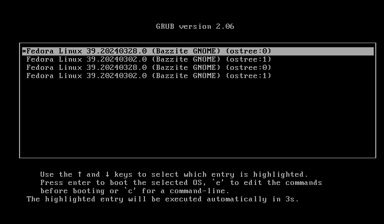

<!-- ANCHOR: METADATA -->
<!--{"url_discourse": "https://universal-blue.discourse.group/docs?topic=2644", "fetched_at": "2024-09-03 16:43:14.300522+00:00"}-->
<!-- ANCHOR_END: METADATA -->



# How do I rollback a system update?

A rollback to the previous system deployment can be done by **entering this command in a host terminal**: 
```command
rpm-ostree rollback
``` 
Rollback can also be done in the GRUB menu (the menu you see before booting into Bazzite on Desktop images) by choosing the previous boot entry before booting to the desktop.  It shows your current (`:0`) and your previous (`:1`) deployments, but due to a bug upstream there may be duplicates below them.  Your personal files will **not** be affected by this, and you can still update to the newest builds after rolling back.

>If you need to rollback to a different OS image, use the [`bazzite-rollback-helper`](https://universal-blue.discourse.group/docs?topic=2647) to do so.

## Unhide The GRUB Menu on Handheld/HTPC Images

Handheld/HTPC images may **not** show the GRUB menu at boot by default, and controls may vary with different handheld or HTPC hardware to unhide the menu.

Unhide GRUB on Handheld/HTPC images with this **command**:

```
ujust configure-grub
```
Select the "**unhide**" opiton to have GRUB appear on boot.

# How do I save my **current** deployment?

You can pin your **current** deployment with this **command**:
```command
sudo ostree admin pin 0
``` 
In a host terminal for a backup save state of your **current** deployment to rollback to if a new system update causes issues. 

# How do I save my **previous** deployment?

You can pin your **previous** deployment with this **command**:
```command
sudo ostree admin pin 1
``` 
In a host terminal for a backup save state of your **previous** deployment to rollback if the current deployment has issues.

# How do I unpin a deployment if I saved it?


Unpin saved **current** deployment:
```command
sudo ostree admin pin --unpin 0
```

Unpin saved **previous** deployment:

```command
sudo ostree admin pin --unpin 1
```

View all deployment index numbers:

```command
rpm-ostree status -v
```

Unpin **saved** deployment:
```command
sudo ostree admin pin --unpin <index number>
```

# Application Update Downgrades

**Read about the pre-installed Warehouse application to downgrade applications in this doc**:

https://universal-blue.discourse.group/docs?topic=2636

<hr>

[**<-- Back to Updates, Rollback, and Rebasing Guide**](https://universal-blue.discourse.group/docs?topic=36)