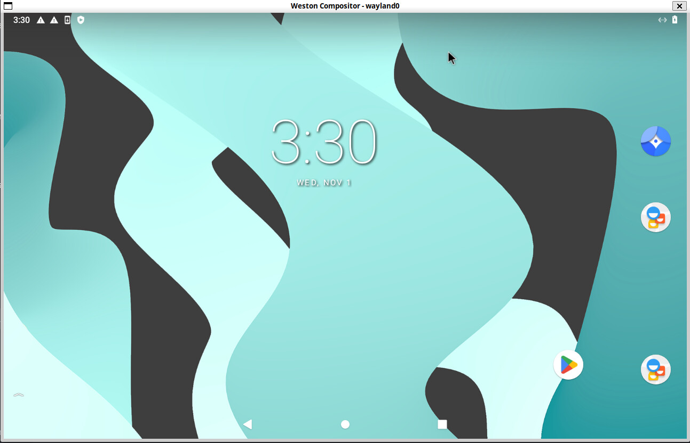
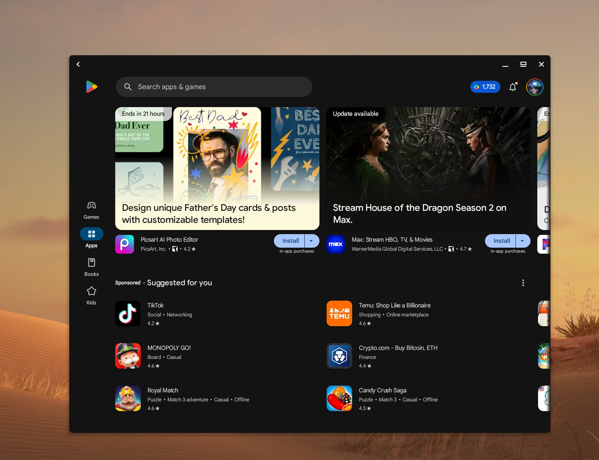

nicknamenamenick | 2024-07-26 23:57:00 UTC | #1





> **Note**: Waydroid does **not** work on Nvidia's proprietary drivers, and requires an AMD or Intel GPU for the best results.

# What is Waydroid?

[Waydroid](https://waydro.id/) is an Android container that runs on Linux. Bazzite users can run Android applications using this method.

# First Time Setup

Open a host terminal and **enter this command to setup Waydroid**:

```bash
ujust setup-waydroid
```

## Initialize Waydroid

Waydroid requires users to initialize it for the first time which can be done by selecting:
`Initialize Waydroid`

Make sure this worked by entering this **command**:

```bash
/usr/bin/waydroid-launcher
```

This will launch Waydroid for the first time.

## Configure Waydroid

### Part 1: Stop Waydroid Session

Waydroid needs to stop running to configure properly.

Open a host terminal and enter this **command**:

```command
waydroid session stop
```

### Part 2: Configuration

Open a host terminal and enter this **command**:

```
ujust setup-waydroid
```

Selecting `Configure Waydroid` will allow users to install additional Android tweaks with the [Waydroid Extras Scripts.](https://github.com/casualsnek/waydroid_script#waydroid-extras-script)

1. Select Android Version (**_Android 11_ recommended**)
2. Select items to install
   a) [GApps](https://github.com/opengapps/opengapps/wiki/FAQ) (Default Android applications including the **Google Play Store)** or [microG](https://microg.org/) (Free alternatives to Google applications)
   b) ARM Translation (_libndk_ for **AMD CPUs only** & _libhoudini_ for **Intel CPUs only**)
   c) [Magisk](https://github.com/topjohnwu/Magisk) (Android power user suite)
   d) [Logitech Smartdock Support](https://support.logi.com/hc/en-us/articles/360023201574-What-is-SmartDock) (Currently broken)
   e) [F-Droid Privileged Extension](https://f-droid.org/packages/org.fdroid.fdroid.privileged/) (Proper [F-Droid](https://f-droid.org/en/packages/) support)
   f) [widevine](https://widevine.com/) (Support for video streaming DRM)

### Get Google Device ID to Get Certified

1. Launch Waydroid
   (**Waydroid must be running**)

2. After selecting your current Android version, select `Get Google Device ID to Get Certified` especially if you plan to use the Google Play Store (GApps).

3. Follow the instructions in the terminal output.

After verification has happened, it will usually take a while before your device is verified.

# Add as a Non-Steam Shortcut

> This is useful for [Bazzite images that use Steam Gaming Mode.](../Handheld_and_HTPC_edition/Steam_Gaming_Mode/index.md)

Make sure to add the shortcut in `/usr/bin/waydroid-launcher` for Waydroid to work properly in Steam Gaming Mode.

<hr>

# Disable Inputs to Waydroid When Unfocused

Waydroid has an [issue](https://github.com/waydroid/waydroid/issues/135) where it will register inputs from controllers, keyboards, and other input devices even when the window is not focused.

Disable this functionality:

> Note: **Waydroid must be running**!

In a host terminal, **run this command**:

```command
waydroid prop set persist.waydroid.uevent false
```

If you ever want to undo this change, run the same steps but set `true` instead of `false` with the same command.

# Resolution & Density Options

> **Note**: This is intended for users who have issues with Waydroid's resolution, scaling, or running Waydroid nested. This is **optional**.

Open a host terminal and enter the following **commands**:

```bash
sudoedit /etc/default/waydroid-launcher
```

```bash
sudoedit /etc/default/steamos-nested-desktop
```

Save the text files when done.

# Waydroid Hybrid Graphics Fix

> **Note**: This is only intended for users who have multiple GPUs in their hardware who experience graphical corruptions in Waydroid.

**Enter in a host terminal**:

```
ujust setup-waydroid
```

Then `Select GPU for Waydroid` which will give the option on what GPU to utilize for Waydroid to fix graphical corruptions.

<hr>

# Reset Waydroid

> **Warning**: You will lose all of your Waydroid data.

If you experience issues or want a fresh Waydroid container, then select `Reset Waydroid` after **entering**:

```
ujust setup-waydroid
```

<hr>

**Documentation Contributors**: [Kyle Gospo](https://github.com/KyleGospo), [Gecked-Deck](https://github.com/Gecked-Deck), [Nathaniel Warburton](https://github.com/storyaddict), and [Jorge Castro](https://github.com/castrojo)

**See also**: [Upstream documentation](https://docs.waydro.id/)

<-- [**View all Bazzite documentation**](https://universal-blue.discourse.group/docs?topic=561)
